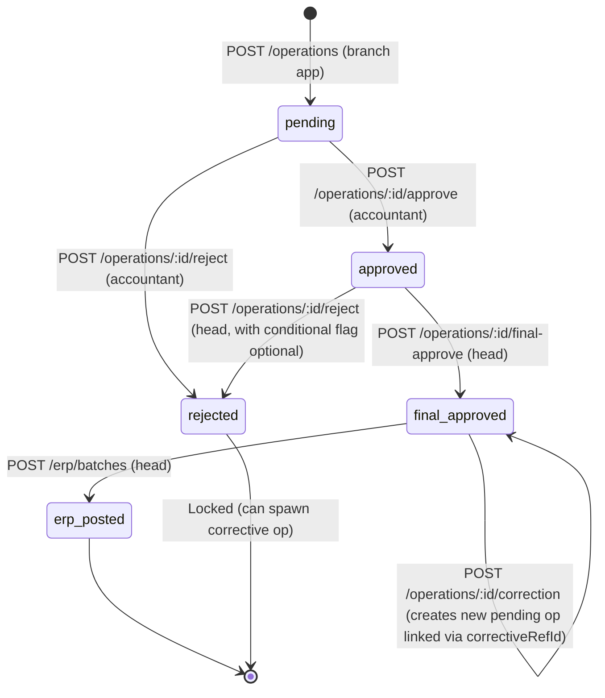

# ASAB Backend API Specification
> الداشبورد الرئيسي — مواصفات الباك إند الكاملة لنظام عصب (ASAB)
>
> Generated from `artifacts/mockup-sandbox/src/components/mockups/asab/ASABPrototype.tsx` (13,115 lines) and supporting modules.

---

## Table of Contents
1. [Overview](#1-overview)
2. [Conventions](#2-conventions)
3. [Data Model](#3-data-model-drizzle-schemas)
4. [Authentication & Session](#4-authentication--session-endpoints)
5. [Approval Pipeline (Core Workflow)](#5-approval-pipeline-core-workflow)
6. [Endpoints by Role](#6-endpoints-by-role)
   - [6.1 Admin (أمين النظام)](#61-admin-أمين-النظام)
   - [6.2 Head Accountant (رئيس الحسابات)](#62-head-accountant-رئيس-الحسابات)
   - [6.3 Accountant (المحاسب)](#63-accountant-المحاسب)
   - [6.4 Branch Manager (مدير الفرع)](#64-branch-manager-مدير-الفرع)
   - [6.5 Procurement Manager (مدير المشتريات)](#65-procurement-manager-مدير-المشتريات)
   - [6.6 Supplier (المورد)](#66-supplier-المورد)
7. [Cross-cutting Endpoints](#7-cross-cutting-endpoints)
8. [Real-time (WebSocket)](#8-real-time-websocket)
9. [Suggested Backend File Structure](#9-suggested-backend-file-structure)
10. [Open Questions for Product Team](#10-open-questions-for-product-team)

---

## 1. Overview

ASAB (عصب) is a **multi-tenant restaurant financial management SaaS** servicing restaurant groups (شركات) that own multiple **brands** (علامات تجارية) — each brand has multiple **restaurants** (مطاعم) — each restaurant has multiple **branches** (فروع). The platform orchestrates a **6-stage approval pipeline** from data capture (branch mobile app) through accounting review, head-accountant final approval, ERP export, and ERP reporting.

### Tech stack (already scaffolded)
- **Runtime:** Node.js 20 LTS
- **Framework:** Express 5 (`artifacts/api-server/`)
- **ORM:** Drizzle ORM
- **Database:** PostgreSQL 16
- **Validation:** Zod v3
- **Auth:** JSON Web Tokens (access + refresh), bcrypt for password hashing
- **File storage:** S3-compatible (uploads via presigned URLs)
- **Email/SMS:** SendGrid / Twilio
- **Queue:** BullMQ + Redis (auto-reminders, ERP exports, notifications)
- **WebSocket:** native `ws` or Socket.IO for real-time notifications

### Base URL
```
https://api.asab.sa/api/v1
```

### Multi-tenancy model
- **Hierarchy:** `company → brand → restaurant → branch`.
- Every non-admin endpoint is **tenant-scoped** by `companyId` (resolved from the JWT). The middleware automatically appends `WHERE company_id = $JWT.companyId` to every query.
- Cross-company queries are admin-only.
- Sub-scoping: a user can additionally be limited to specific `brandIds[]`, `restaurantIds[]`, or `branchIds[]` (set in `user_roles.scope`).

### The 6 roles
| Role ID | Arabic | Responsibility |
|---|---|---|
| `admin` | أمين النظام | Platform admin: users, subscriptions, brands, permissions matrix |
| `head` | رئيس الحسابات | Final approver; oversees accountants; runs ERP batches |
| `accountant` | المحاسب | Reviews ops uploaded from branches; converts expenses to assets |
| `branch` | مدير الفرع | Uploads daily reports from branch; confirms assets |
| `procurement` | مدير المشتريات | Consolidates purchase orders; sends to suppliers |
| `supplier` | المورد | Accepts/rejects supply orders; manages catalog & pricing |

---

## 2. Conventions

### Request/response format
- **Content-Type:** `application/json` (unless noted: file upload uses `multipart/form-data`)
- **Casing:** camelCase for JSON keys; PascalCase for TypeScript types.
- **Direction:** All Arabic strings are UTF-8 NFC normalized. RTL is a UI concern only.

### Pagination
```http
GET /api/v1/operations?page=1&pageSize=20
```
Response envelope:
```json
{
  "data": [ /* array of resources */ ],
  "meta": {
    "page": 1,
    "pageSize": 20,
    "total": 187,
    "totalPages": 10
  }
}
```
- `page` is 1-indexed. Default `page=1`, `pageSize=20`, max `pageSize=100`.

### Sorting
```http
?sort=createdAt:desc
?sort=amount:asc,createdAt:desc
```

### Filtering (per-endpoint)
Common filter query params:
- `?branchId=<uuid>`
- `?status=pending,approved` (comma-separated)
- `?moduleKey=sales`
- `?dateFrom=2025-10-01&dateTo=2025-10-31`
- `?search=العليا`
- `?brandId=<uuid>`

### Standard error format
```json
{
  "error": {
    "code": "OP_NOT_PENDING",
    "message": "Operation is not in pending status",
    "messageAr": "العملية ليست في حالة معلقة",
    "details": { "currentStatus": "approved", "requiredStatus": "pending" }
  },
  "requestId": "req_01HF8N9JX2Y3Z"
}
```

| HTTP | Standard codes |
|---|---|
| 400 | `VALIDATION_ERROR`, `INVALID_INPUT` |
| 401 | `UNAUTHORIZED`, `TOKEN_EXPIRED`, `INVALID_TOKEN` |
| 403 | `FORBIDDEN`, `INSUFFICIENT_PERMISSION`, `WRONG_TENANT`, `WRONG_ROLE` |
| 404 | `NOT_FOUND` |
| 409 | `CONFLICT`, `ALREADY_EXISTS`, `OP_NOT_PENDING`, `OP_ALREADY_FINAL`, `ERP_ALREADY_POSTED` |
| 422 | `BUSINESS_RULE_VIOLATION` (e.g., reject without reason) |
| 429 | `RATE_LIMIT_EXCEEDED` |
| 500 | `INTERNAL_ERROR` |
| 503 | `ERP_UNAVAILABLE` |

### Date/time & money
- **Dates:** ISO 8601 UTC, e.g. `"2025-10-14T08:15:00.000Z"`.
- **Display dates:** the UI shows Arabic relative-time strings (`قبل ساعة`, `أمس`); the backend always returns the absolute timestamp — the client computes the relative label.
- **Money:** stored as integer **halalas** (1 SAR = 100 halalas); the UI converts. All `amount` fields are integers in halalas unless explicitly marked.
- **Currency:** `"SAR"` (single currency for v1).

### Soft delete vs hard delete
- All entities have `deletedAt: timestamp | null` (soft delete). Hard delete is admin-only via `?hardDelete=true` query param.
- Approved/locked operations cannot be deleted; only **corrective operations** can offset them.

### Idempotency keys
- All POST/PATCH/DELETE mutations accept `Idempotency-Key: <client-uuid>` header. Server stores `idempotency_keys` table for 24 h.

### Rate limits
- **Unauthenticated:** 30 req/min/IP
- **Authenticated (default):** 600 req/min/user
- **Heavy reports/exports:** 10 req/min/user
- **File uploads:** 60/hour/user

### Localization
- `Accept-Language: ar` (default) or `en`. Affects only `messageAr`/`message` selection in errors and notification body text.

---

## 3. Data Model (Drizzle schemas)

> All tables include `id (uuid primary key, default gen_random_uuid())`, `createdAt`, `updatedAt`, `deletedAt`, and `companyId` (tenant scope) unless noted.

### 3.1 Tenancy & Identity

#### `companies` — Tenants (B2B subscribers)
```typescript
// lib/db/src/schema/companies.ts
import { pgTable, uuid, varchar, integer, timestamp, jsonb } from "drizzle-orm/pg-core";
export const companies = pgTable("companies", {
  id:            uuid("id").primaryKey().defaultRandom(),
  name:          varchar("name", { length: 200 }).notNull(),       // "مجموعة التاج للمطاعم"
  logo:          varchar("logo", { length: 16 }),                  // emoji or URL
  contactName:   varchar("contact_name", { length: 200 }).notNull(),
  contactEmail:  varchar("contact_email", { length: 255 }).notNull(),
  contactPhone:  varchar("contact_phone", { length: 32 }),
  city:          varchar("city", { length: 80 }),
  plan:          varchar("plan", { length: 32 }).notNull(),         // "Basic"|"Professional"|"Enterprise"
  status:        varchar("status", { length: 16 }).notNull(),       // "active"|"warning"|"danger"|"suspended"|"trial"
  maxBranches:   integer("max_branches").notNull().default(5),
  maxUsers:      integer("max_users").notNull().default(15),
  monthlyRevenue:integer("monthly_revenue").notNull().default(0),   // halalas
  startDate:     timestamp("start_date").notNull(),
  nextBilling:   timestamp("next_billing"),
  modules:       jsonb("modules").$type<string[]>().default([]),    // ["مبيعات","مصروفات",...]
  adminEmail:    varchar("admin_email", { length: 255 }),
  createdAt:     timestamp("created_at").notNull().defaultNow(),
  updatedAt:     timestamp("updated_at").notNull().defaultNow(),
  deletedAt:     timestamp("deleted_at"),
});
export type Company = typeof companies.$inferSelect;
export type NewCompany = typeof companies.$inferInsert;
```
وصف: شركة عميل (مستأجر) — كل شركة تشتري اشتراك ASAB وتدير علاماتها التجارية ومطاعمها.

#### `users`
```typescript
export const users = pgTable("users", {
  id:           uuid("id").primaryKey().defaultRandom(),
  companyId:    uuid("company_id").references(()=>companies.id).notNull(),
  name:         varchar("name", { length: 200 }).notNull(),        // "أحمد محمد الشهري"
  email:        varchar("email", { length: 255 }).notNull().unique(),
  phone:        varchar("phone", { length: 32 }),
  passwordHash: varchar("password_hash", { length: 255 }).notNull(),
  avatar:       varchar("avatar", { length: 16 }),                  // 1-2 char like "أم"
  status:       varchar("status", { length: 16 }).notNull().default("active"), // active|inactive|suspended
  reportsToId:  uuid("reports_to_id").references(()=>users.id),
  lastLoginAt:  timestamp("last_login_at"),
  createdAt:    timestamp("created_at").notNull().defaultNow(),
  updatedAt:    timestamp("updated_at").notNull().defaultNow(),
  deletedAt:    timestamp("deleted_at"),
}, t=>({
  emailIdx: uniqueIndex("users_email_idx").on(t.email),
  companyIdx: index("users_company_idx").on(t.companyId),
}));
```
وصف: المستخدم النهائي للنظام (محاسب، مدير فرع، رئيس، إلخ).

#### `roles`
```typescript
export const roles = pgTable("roles", {
  id:    uuid("id").primaryKey().defaultRandom(),
  key:   varchar("key", { length: 32 }).notNull().unique(),  // "admin"|"head"|"accountant"|"branch"|"procurement"|"supplier"
  nameAr:varchar("name_ar", { length: 80 }).notNull(),
  nameEn:varchar("name_en", { length: 80 }).notNull(),
});
```

#### `user_roles` — assignment + scope
```typescript
export const userRoles = pgTable("user_roles", {
  id:        uuid("id").primaryKey().defaultRandom(),
  userId:    uuid("user_id").references(()=>users.id).notNull(),
  roleKey:   varchar("role_key", { length: 32 }).notNull(),
  scope:     varchar("scope", { length: 16 }).notNull(), // "all"|"brand"|"restaurant"|"branch"
  brandIds:    jsonb("brand_ids").$type<string[]>().default([]),
  restaurantIds:jsonb("restaurant_ids").$type<string[]>().default([]),
  branchIds:    jsonb("branch_ids").$type<string[]>().default([]),
  moduleKeys:   jsonb("module_keys").$type<string[]>().default([]), // ["sales","expenses",...]
  createdAt:    timestamp("created_at").notNull().defaultNow(),
}, t=>({ userRoleIdx: uniqueIndex("user_role_idx").on(t.userId, t.roleKey) }));
```
وصف: ربط المستخدم بدور ونطاق (علامة/مطعم/فرع) — مرجعها `AdminUserData` (ASABPrototype.tsx:17–23).

#### `sessions`
```typescript
export const sessions = pgTable("sessions", {
  id:           uuid("id").primaryKey().defaultRandom(),
  userId:       uuid("user_id").references(()=>users.id).notNull(),
  refreshToken: varchar("refresh_token", { length: 512 }).notNull().unique(),
  userAgent:    text("user_agent"),
  ip:           varchar("ip", { length: 45 }),
  expiresAt:    timestamp("expires_at").notNull(),
  revokedAt:    timestamp("revoked_at"),
  createdAt:    timestamp("created_at").notNull().defaultNow(),
});
```

### 3.2 Organizational Structure

#### `brands` — العلامات التجارية
Reference: `BRANDS_CATALOG` (ASABPrototype.tsx:1004–1021).
```typescript
export const brands = pgTable("brands", {
  id:        uuid("id").primaryKey().defaultRandom(),
  companyId: uuid("company_id").references(()=>companies.id).notNull(),
  name:      varchar("name", { length: 120 }).notNull(),  // "علامة الريم"
  abbr:      varchar("abbr", { length: 4 }),              // "ر"
  color:     varchar("color", { length: 16 }),            // "#7C3AED"
  owner:     varchar("owner", { length: 200 }),
  ownerEmail:varchar("owner_email", { length: 255 }),
  plan:      varchar("plan", { length: 32 }),              // "فضي"|"ذهبي"|"بلاتيني"
  subStatus: varchar("sub_status", { length: 16 }),        // "active"|"warning"|"danger"|"expired"
  expires:   timestamp("expires"),
  daysLeft:  integer("days_left"),
  modules:   jsonb("modules").$type<string[]>().default([]),
  status:    varchar("status", { length: 16 }).default("active"),
  createdAt: timestamp("created_at").notNull().defaultNow(),
  updatedAt: timestamp("updated_at").notNull().defaultNow(),
});
```

#### `restaurants` — المطاعم
```typescript
export const restaurants = pgTable("restaurants", {
  id:        uuid("id").primaryKey().defaultRandom(),
  brandId:   uuid("brand_id").references(()=>brands.id).notNull(),
  companyId: uuid("company_id").notNull(),
  name:      varchar("name", { length: 200 }).notNull(),  // "مطعم الريم — العليا"
  city:      varchar("city", { length: 80 }),
  accountantCount: integer("accountant_count").default(0),
  status:    varchar("status", { length: 16 }).default("active"),
  createdAt: timestamp("created_at").notNull().defaultNow(),
});
```

#### `branches` — الفروع
```typescript
export const branches = pgTable("branches", {
  id:           uuid("id").primaryKey().defaultRandom(),
  restaurantId: uuid("restaurant_id").references(()=>restaurants.id).notNull(),
  brandId:      uuid("brand_id").notNull(),
  companyId:    uuid("company_id").notNull(),
  name:         varchar("name", { length: 200 }).notNull(),  // "فرع الرياض - العليا"
  manager:      varchar("manager", { length: 200 }),         // "أحمد الشمري"
  managerUserId:uuid("manager_user_id").references(()=>users.id),
  address:      text("address"),
  city:         varchar("city", { length: 80 }),
  phone:        varchar("phone", { length: 32 }),
  status:       varchar("status", { length: 16 }).default("active"),
  createdAt:    timestamp("created_at").notNull().defaultNow(),
});
```

#### `subscriptions` — اشتراكات الفروع (per-restaurant tiered subs)
Reference: `restSubs` (ASABPrototype.tsx:9962–9978), `subscriptions` model is per-restaurant with plan (فضي/ذهبي/بلاتيني):
```typescript
export const subscriptions = pgTable("subscriptions", {
  id:            uuid("id").primaryKey().defaultRandom(),
  restaurantId:  uuid("restaurant_id").references(()=>restaurants.id),
  brandId:       uuid("brand_id").references(()=>brands.id),
  plan:          varchar("plan", { length: 32 }).notNull(),        // "فضي"|"ذهبي"|"بلاتيني"
  status:        varchar("status", { length: 16 }).notNull(),      // "active"|"warning"|"danger"|"expired"
  expiresAt:     timestamp("expires_at").notNull(),
  daysLeft:      integer("days_left"),
  monthlyPrice:  integer("monthly_price").notNull(),               // halalas
  autoRenew:     boolean("auto_renew").default(false),
  reminderEnabled:boolean("reminder_enabled").default(true),
  createdAt:     timestamp("created_at").notNull().defaultNow(),
});
```

### 3.3 Operations (Core)

#### `operations` — العمليات (parent table for all module ops)
Reference: `Op` interface (ASABPrototype.tsx:30–59) and `INITIAL_OPS` (ASABPrototype.tsx:309–328).

> **Design decision:** Use a single `operations` parent table with a `moduleKey` discriminator, plus per-module child tables (`sales_details`, `expenses_details`, etc.) holding the module-specific JSON payload. This keeps the approval pipeline state machine uniform across modules and lets the same endpoints (`/operations/:id/approve`, `/reject`, `/final-approve`) work for any module.

```typescript
export const operations = pgTable("operations", {
  id:              uuid("id").primaryKey().defaultRandom(),
  publicId:        varchar("public_id", { length: 16 }).notNull().unique(), // "OPS-2401"
  companyId:       uuid("company_id").notNull(),
  branchId:        uuid("branch_id").references(()=>branches.id).notNull(),
  moduleKey:       varchar("module_key", { length: 16 }).notNull(),         // sales|expenses|purchases|inventory|shifts|employees|cash|waste
  amount:          integer("amount").notNull(),                              // halalas
  match:           varchar("match", { length: 8 }).notNull(),                // "exact"|"review"|"diff"
  diffNote:        varchar("diff_note", { length: 255 }),                    // "فرق في الكمية: 5 كجم"
  origin:          varchar("origin", { length: 16 }).notNull(),              // "mobile"|"procurement"|"system"
  attachmentCount: integer("attachment_count").default(0),
  status:          varchar("status", { length: 16 }).notNull(),              // pending|approved|rejected|final-approved
  rejectReason:    varchar("reject_reason", { length: 500 }),
  // Audit trail timestamps + actors
  submittedById:   uuid("submitted_by_id").references(()=>users.id),
  submittedAt:     timestamp("submitted_at").notNull(),
  reviewedById:    uuid("reviewed_by_id").references(()=>users.id),
  reviewedAt:      timestamp("reviewed_at"),
  approvedById:    uuid("approved_by_id").references(()=>users.id),
  approvedAt:      timestamp("approved_at"),
  finalApprovedById:uuid("final_approved_by_id").references(()=>users.id),
  finalApprovedAt: timestamp("final_approved_at"),
  rejectedById:    uuid("rejected_by_id").references(()=>users.id),
  rejectedAt:      timestamp("rejected_at"),
  // Conditional approval (head accountant) — ASABPrototype.tsx:8139–8141
  isConditional:   boolean("is_conditional").default(false),
  conditionalNote: text("conditional_note"),
  // Corrective operations — ASABPrototype.tsx:43–48
  isCorrection:    boolean("is_correction").default(false),
  correctiveRefId: uuid("corrective_ref_id").references(()=>operations.id),
  // ERP posting (separate step after final-approval)
  erpPosted:       boolean("erp_posted").default(false),
  erpBatchId:      varchar("erp_batch_id", { length: 64 }),                  // "ERP-BATCH-20251014-001"
  erpPostedAt:     timestamp("erp_posted_at"),
  // Operation date (business date — separate from createdAt)
  operationDate:   timestamp("operation_date").notNull(),
  createdAt:       timestamp("created_at").notNull().defaultNow(),
  updatedAt:       timestamp("updated_at").notNull().defaultNow(),
  deletedAt:       timestamp("deleted_at"),
}, t => ({
  branchStatusIdx: index("ops_branch_status_idx").on(t.branchId, t.status),
  companyModuleIdx: index("ops_company_module_idx").on(t.companyId, t.moduleKey),
  publicIdIdx: uniqueIndex("ops_public_id_idx").on(t.publicId),
}));
```

#### Zod schemas
```typescript
import { z } from "zod";
export const insertOperationSchema = createInsertSchema(operations, {
  publicId: z.string().regex(/^(OPS|EXP|PUR|INV|SHF|EMP|CSH|WD|FA)-\d{3,6}$/),
  moduleKey: z.enum(["sales","expenses","purchases","inventory","shifts","employees","cash","waste"]),
  amount: z.number().int().nonnegative(),
  match: z.enum(["exact","review","diff"]),
  status: z.enum(["pending","approved","rejected","final-approved"]),
  origin: z.enum(["mobile","procurement","system"]),
});
export const selectOperationSchema = createSelectSchema(operations);
export type Operation = z.infer<typeof selectOperationSchema>;
```

### 3.4 Module-specific detail tables

#### `sales_details` — تفاصيل المبيعات
Mirrors `AccSalesDetail` (ASABPrototype.tsx:3688–...). Reconciliation: cash + bank + delivery apps = total collected; variance assigned to employees.
```typescript
export const salesDetails = pgTable("sales_details", {
  operationId:        uuid("operation_id").references(()=>operations.id).primaryKey(),
  totalSales:         integer("total_sales").notNull(),
  cashAmount:         integer("cash_amount").notNull().default(0),
  bankAmount:         integer("bank_amount").notNull().default(0),
  deliveryApps:       jsonb("delivery_apps").$type<{ app:string; icon:string; amount:number; original:number }[]>().default([]),
  totalCollected:     integer("total_collected").notNull(),
  variance:           integer("variance").notNull().default(0),
  varianceReason:     varchar("variance_reason", { length: 80 }),
  varianceAllocations:jsonb("variance_allocations").$type<{ empId:string; empName:string; amount:number }[]>().default([]),
});
```

#### `expense_invoices` — فواتير المصروفات (multi-invoice per operation)
Reference: `INVOICES` (ASABPrototype.tsx:3336–3342) and `AccExpensesPage` (ASABPrototype.tsx:3304).
```typescript
export const expenseInvoices = pgTable("expense_invoices", {
  id:            uuid("id").primaryKey().defaultRandom(),
  operationId:   uuid("operation_id").references(()=>operations.id).notNull(),
  invNum:        varchar("inv_num", { length: 64 }).notNull(),
  vendor:        varchar("vendor", { length: 200 }).notNull(),
  vendorTaxId:   varchar("vendor_tax_id", { length: 32 }),
  description:   text("description"),
  category:      varchar("category", { length: 80 }),         // "مواد تنظيف", "صيانة", "إيجار", "فواتير خدمات", "متنوع"
  amountBeforeTax:integer("amount_before_tax").notNull(),
  vatAmount:     integer("vat_amount").notNull(),
  amountAfterTax:integer("amount_after_tax").notNull(),
  invoiceDate:   timestamp("invoice_date").notNull(),
  attachmentCount:integer("attachment_count").default(0),
  invoiceMatch:  varchar("invoice_match", { length: 16 }).default("matched"), // matched|mismatch|missing
  verifiedAt:    timestamp("verified_at"),
  verifiedById:  uuid("verified_by_id").references(()=>users.id),
  convertedToAssetDraftId: uuid("converted_to_asset_draft_id"),
});
```

#### `purchase_orders` & `purchase_items`
Reference: `PurRecord`/`PurItem` (ASABPrototype.tsx:4100–4149) and `PROC_ITEMS` (ASABPrototype.tsx:11864–11906).
```typescript
export const purchaseOrders = pgTable("purchase_orders", {
  id:           uuid("id").primaryKey().defaultRandom(),
  operationId:  uuid("operation_id").references(()=>operations.id),
  publicId:     varchar("public_id", { length: 16 }).notNull().unique(), // "PO-101"
  branchId:     uuid("branch_id").references(()=>branches.id).notNull(),
  supplierId:   uuid("supplier_id").references(()=>suppliers.id).notNull(),
  invNum:       varchar("inv_num", { length: 64 }),  // "INV-D001"
  urgency:      varchar("urgency", { length: 16 }).default("normal"),  // normal|urgent
  status:       varchar("status", { length: 16 }).notNull(),  // pending|approved|sent|confirmed|delivered|rejected|partial_reject
  rejectionReason: text("rejection_reason"),
  total:        integer("total").notNull(),
  notes:        text("notes"),
  deliveryDate: timestamp("delivery_date"),
  consolidatedGroupId: uuid("consolidated_group_id"),
  createdAt:    timestamp("created_at").notNull().defaultNow(),
});

export const purchaseItems = pgTable("purchase_items", {
  id:            uuid("id").primaryKey().defaultRandom(),
  purchaseOrderId:uuid("purchase_order_id").references(()=>purchaseOrders.id).notNull(),
  itemId:        uuid("item_id").references(()=>items.id),
  name:          varchar("name", { length: 200 }).notNull(),
  unit:          varchar("unit", { length: 16 }).notNull(),  // "كجم","لتر","قطعة","علبة"
  orderedQty:    integer("ordered_qty").notNull(),
  receivedQty:   integer("received_qty").default(0),
  unitPrice:     integer("unit_price").notNull(),
  historicPrice: integer("historic_price"),
  dailyAvg:      integer("daily_avg"),
  recommendedQty:integer("recommended_qty"),
  total:         integer("total").notNull(),
  verifiedAt:    timestamp("verified_at"),
});
```

#### `inventory_items`, `inventory_counts`, `waste_records`
```typescript
export const inventoryItems = pgTable("inventory_items", {
  id:          uuid("id").primaryKey().defaultRandom(),
  brandId:     uuid("brand_id").references(()=>brands.id).notNull(), // brand-wide catalog
  name:        varchar("name", { length: 200 }).notNull(),           // "دجاج طازج"
  category:    varchar("category", { length: 80 }).notNull(),        // "بروتين","خضروات","ألبان","مخبوزات","صوصات","زيوت","مشروبات","حبوب","فواكه","توابل"
  unit:        varchar("unit", { length: 16 }).notNull(),
  status:      varchar("status", { length: 16 }).default("active"),
  createdAt:   timestamp("created_at").notNull().defaultNow(),
});

// per-branch daily inventory item selection (set by accountant)
export const branchInventoryLists = pgTable("branch_inventory_lists", {
  id:           uuid("id").primaryKey().defaultRandom(),
  branchId:     uuid("branch_id").references(()=>branches.id).notNull(),
  inventoryItemId:uuid("inventory_item_id").references(()=>inventoryItems.id).notNull(),
  isFlagged:    boolean("is_flagged").default(false),  // ⚡ items with >25% monthly variance
  addedById:    uuid("added_by_id").references(()=>users.id),
  addedAt:      timestamp("added_at").notNull().defaultNow(),
}, t=>({ uniq: uniqueIndex().on(t.branchId, t.inventoryItemId) }));

export const inventoryCounts = pgTable("inventory_counts", {
  id:            uuid("id").primaryKey().defaultRandom(),
  operationId:   uuid("operation_id").references(()=>operations.id),
  branchId:      uuid("branch_id").references(()=>branches.id).notNull(),
  countType:     varchar("count_type", { length: 16 }).notNull(), // "daily"|"monthly"
  items:         jsonb("items").$type<{ item:string; cat:string; unit:string; prev:number; curr:number; flagged?:boolean }[]>().notNull(),
  flaggedItemIndices: jsonb("flagged_item_indices").$type<number[]>().default([]), // accountant-flagged for branch reconfirm
  branchConfirmedAt: timestamp("branch_confirmed_at"),
  // Daily formula values
  openingBalance: integer("opening_balance"),
  purchases:      integer("purchases"),
  sales:          integer("sales"),
  transfersIn:    integer("transfers_in"),
  transfersOut:   integer("transfers_out"),
  waste:          integer("waste"),
  computedClose:  integer("computed_close"),
  actualClose:    integer("actual_close"),
  deficit:        integer("deficit"),
  varianceAllocations: jsonb("variance_allocations").$type<{ empId:string; empName:string; amount:number }[]>().default([]),
  createdAt:      timestamp("created_at").notNull().defaultNow(),
});

export const wasteRecords = pgTable("waste_records", {
  id:           uuid("id").primaryKey().defaultRandom(),
  operationId:  uuid("operation_id").references(()=>operations.id),
  publicId:     varchar("public_id", { length: 16 }).notNull(), // "WD-001"
  branchId:     uuid("branch_id").references(()=>branches.id).notNull(),
  status:       varchar("status", { length: 16 }).notNull(),
  products:     jsonb("products").$type<{
    name:string; qty:number; unit:string; unitPrice:number;
    classification:"هدر"|"تالف";    // waste vs damaged
    responsibility:"موظف"|"مطعم"; // employee vs restaurant
    hasImg:boolean;
    empAllocs:{ empId:string; empName:string; amount:number }[];
  }[]>().notNull(),
});
```

#### `inventory_movements` — حركة المخزون (transfers/adjustments)
```typescript
export const inventoryMovements = pgTable("inventory_movements", {
  id:            uuid("id").primaryKey().defaultRandom(),
  branchId:      uuid("branch_id").references(()=>branches.id).notNull(),
  itemId:        uuid("item_id").references(()=>inventoryItems.id).notNull(),
  movementType:  varchar("movement_type", { length: 16 }).notNull(), // "in"|"out"|"transfer"|"adjustment"|"waste"
  quantity:      integer("quantity").notNull(),
  unitCost:      integer("unit_cost"),
  destinationBranchId: uuid("destination_branch_id").references(()=>branches.id),
  refOperationId: uuid("ref_operation_id").references(()=>operations.id),
  note:          text("note"),
  createdById:   uuid("created_by_id").references(()=>users.id),
  createdAt:     timestamp("created_at").notNull().defaultNow(),
});
```

#### `suppliers` & `supplier_items`
```typescript
export const suppliers = pgTable("suppliers", {
  id:           uuid("id").primaryKey().defaultRandom(),
  companyId:    uuid("company_id").notNull(),
  brandId:      uuid("brand_id").references(()=>brands.id), // optional (some are brand-scoped)
  name:         varchar("name", { length: 200 }).notNull(),
  category:     varchar("category", { length: 80 }),         // "دواجن ولحوم","دقيق ومخبوزات","خضار وفواكه"
  contactName:  varchar("contact_name", { length: 200 }),
  contactPhone: varchar("contact_phone", { length: 32 }),
  contactEmail: varchar("contact_email", { length: 255 }),
  commercialReg: varchar("commercial_reg", { length: 32 }),
  paymentTerms: varchar("payment_terms", { length: 80 }),
  userId:       uuid("user_id").references(()=>users.id), // for supplier portal login
  rating:       integer("rating").default(0),               // 0-50 (4.8 stored as 48)
  status:       varchar("status", { length: 16 }).default("active"),
  createdAt:    timestamp("created_at").notNull().defaultNow(),
});

export const supplierItems = pgTable("supplier_items", {
  id:           uuid("id").primaryKey().defaultRandom(),
  supplierId:   uuid("supplier_id").references(()=>suppliers.id).notNull(),
  code:         varchar("code", { length: 32 }).notNull(),   // "DJJ-001"
  name:         varchar("name", { length: 200 }).notNull(),
  unit:         varchar("unit", { length: 16 }).notNull(),
  price:        integer("price").notNull(),                  // halalas
  minQty:       integer("min_qty"),
  status:       varchar("status", { length: 16 }).default("active"),
});

export const supplierRatings = pgTable("supplier_ratings", {
  id:           uuid("id").primaryKey().defaultRandom(),
  supplierId:   uuid("supplier_id").references(()=>suppliers.id).notNull(),
  ratedById:    uuid("rated_by_id").references(()=>users.id).notNull(),
  rating:       integer("rating").notNull(), // 1-5
  comment:      text("comment"),
  createdAt:    timestamp("created_at").notNull().defaultNow(),
});
```

#### `assets`, `asset_drafts`, `asset_transfers`
Reference: `AssetEntry`, `AssetDraft` (ASABPrototype.tsx:72–104, 6506–6539).
```typescript
export const assetCategories = pgTable("asset_categories", {
  key:    varchar("key", { length: 16 }).primaryKey(),  // "معدات","تقنية","أثاث","مركبات","أخرى"
  nameAr: varchar("name_ar", { length: 32 }).notNull(),
  nameEn: varchar("name_en", { length: 32 }).notNull(),
  icon:   varchar("icon", { length: 8 }),
});

export const assets = pgTable("assets", {
  id:           uuid("id").primaryKey().defaultRandom(),
  companyId:    uuid("company_id").notNull(),
  publicId:     varchar("public_id", { length: 16 }).notNull().unique(), // "FA-001"
  name:         varchar("name", { length: 200 }).notNull(),
  category:     varchar("category", { length: 16 }).references(()=>assetCategories.key).notNull(),
  branchId:     uuid("branch_id").references(()=>branches.id).notNull(),
  cost:         integer("cost").notNull(),                              // halalas
  bookValue:    integer("book_value").notNull(),
  usefulLifeMonths: integer("useful_life_months").notNull(),            // 24,36,48,60,72,84,96,120
  case_:        varchar("case", { length: 24 }).notNull(),               // "branch_upload"|"acc_register"
  status:       varchar("status", { length: 24 }).notNull(),             // "pending_branch"|"pending_accountant"|"confirmed"|"registered"
  invNum:       varchar("inv_num", { length: 64 }),
  submittedById:uuid("submitted_by_id").references(()=>users.id),
  submittedByLabel: varchar("submitted_by_label", { length: 200 }),     // free-text label
  custodian:    varchar("custodian", { length: 200 }),                  // current custodian
  custodianUserId: uuid("custodian_user_id").references(()=>users.id),
  purchasedAt:  timestamp("purchased_at"),
  createdAt:    timestamp("created_at").notNull().defaultNow(),
});

export const assetTransfers = pgTable("asset_transfers", {
  id:           uuid("id").primaryKey().defaultRandom(),
  assetId:      uuid("asset_id").references(()=>assets.id).notNull(),
  fromCustodian:varchar("from_custodian", { length: 200 }),
  toCustodian:  varchar("to_custodian", { length: 200 }).notNull(),
  note:         text("note"),
  byUserId:     uuid("by_user_id").references(()=>users.id).notNull(),
  transferredAt:timestamp("transferred_at").notNull().defaultNow(),
});

export const assetDrafts = pgTable("asset_drafts", {
  id:           uuid("id").primaryKey().defaultRandom(),
  draftId:      varchar("draft_id", { length: 64 }).notNull().unique(),  // "DRAFT-INV-001-1697..."
  expenseOpId:  uuid("expense_op_id").references(()=>operations.id).notNull(),
  invNum:       varchar("inv_num", { length: 64 }).notNull(),
  vendor:       varchar("vendor", { length: 200 }).notNull(),
  desc:         text("desc"),
  amount:       integer("amount").notNull(),
  expenseBranch:varchar("expense_branch", { length: 200 }).notNull(),
  expenseDate:  timestamp("expense_date"),
  assetName:    varchar("asset_name", { length: 200 }).notNull(),
  category:     varchar("category", { length: 16 }).notNull(),
  usefulLifeMonths: integer("useful_life_months").notNull(),
  targetBranches: jsonb("target_branches").$type<string[]>().notNull(),
  custodian:    varchar("custodian", { length: 200 }).notNull(),
  qty:          integer("qty").notNull(),
  notes:        text("notes"),
  status:       varchar("status", { length: 16 }).notNull(),  // "draft"|"confirmed"|"discarded"
  convertedAt:  timestamp("converted_at"),
  createdById:  uuid("created_by_id").references(()=>users.id).notNull(),
  createdAt:    timestamp("created_at").notNull().defaultNow(),
});

export const assetDepreciation = pgTable("asset_depreciation", {
  id:           uuid("id").primaryKey().defaultRandom(),
  assetId:      uuid("asset_id").references(()=>assets.id).notNull(),
  month:        timestamp("month").notNull(),
  amount:       integer("amount").notNull(),
  bookValueAfter:integer("book_value_after").notNull(),
});
```

### 3.5 Shifts, Employees, Cash Custody

#### `shifts`
Reference: `liveShifts`, `shiftHistory`, brand/restaurant shift config (ASABPrototype.tsx:5380–5908).
```typescript
export const brandShiftConfigs = pgTable("brand_shift_configs", {
  id:           uuid("id").primaryKey().defaultRandom(),
  brandId:      uuid("brand_id").references(()=>brands.id).notNull(),
  numShifts:    integer("num_shifts").notNull(),       // 1–5
  durationHours: integer("duration_hours").notNull(),  // 4,6,8,10,12
  firstShiftStart: varchar("first_shift_start", { length: 8 }).notNull(), // "08:00"
  shifts:       jsonb("shifts").$type<{ name:string; start:string; end:string; durH:number }[]>().notNull(),
  createdAt:    timestamp("created_at").notNull().defaultNow(),
});

export const restaurantShiftOverrides = pgTable("restaurant_shift_overrides", {
  id:           uuid("id").primaryKey().defaultRandom(),
  restaurantId: uuid("restaurant_id").references(()=>restaurants.id).notNull().unique(),
  useOverride:  boolean("use_override").default(false),
  numShifts:    integer("num_shifts"),
  durationHours: integer("duration_hours"),
  firstShiftStart: varchar("first_shift_start", { length: 8 }),
  shifts:       jsonb("shifts"),
});

export const shifts = pgTable("shifts", {
  id:            uuid("id").primaryKey().defaultRandom(),
  branchId:      uuid("branch_id").references(()=>branches.id).notNull(),
  supervisorUserId: uuid("supervisor_user_id").references(()=>users.id),
  supervisorName: varchar("supervisor_name", { length: 200 }),
  startedAt:     timestamp("started_at").notNull(),
  endedAt:       timestamp("ended_at"),
  status:        varchar("status", { length: 16 }).default("active"),  // active|late|closed
  ordersCount:   integer("orders_count").default(0),
  salesAmount:   integer("sales_amount").default(0),
  cashExpected:  integer("cash_expected"),
  cashActual:    integer("cash_actual"),
  variance:      integer("variance"),
  notes:         text("notes"),
});
```

#### `employees` (branch staff)
```typescript
export const employees = pgTable("employees", {
  id:            uuid("id").primaryKey().defaultRandom(),
  branchId:      uuid("branch_id").references(()=>branches.id).notNull(),
  empNumber:     varchar("emp_number", { length: 16 }).notNull(),   // "1001"
  name:          varchar("name", { length: 200 }).notNull(),         // "أحمد الشمري"
  nationalId:    varchar("national_id", { length: 16 }),
  role:          varchar("role", { length: 80 }).notNull(),          // "مشرف الشفت","كاشير رئيسي","طباخ","عامل نظافة"
  monthlySalary: integer("monthly_salary").notNull(),
  shiftType:     varchar("shift_type", { length: 16 }),               // "صباحي"|"مسائي"
  hireDate:      timestamp("hire_date").notNull(),
  status:        varchar("status", { length: 16 }).default("active"),
  createdAt:     timestamp("created_at").notNull().defaultNow(),
}, t=>({ uniq: uniqueIndex().on(t.branchId, t.empNumber) }));

export const employeeAccountMovements = pgTable("employee_account_movements", {
  id:           uuid("id").primaryKey().defaultRandom(),
  employeeId:   uuid("employee_id").references(()=>employees.id).notNull(),
  movementDate: timestamp("movement_date").notNull(),
  description:  varchar("description", { length: 255 }).notNull(),
  movementType: varchar("movement_type", { length: 8 }).notNull(),  // "credit"|"debit"
  amount:       integer("amount").notNull(),
  refOperationId: uuid("ref_operation_id").references(()=>operations.id),
  createdById:  uuid("created_by_id").references(()=>users.id),
  createdAt:    timestamp("created_at").notNull().defaultNow(),
});
```

#### `cash_custody` & `cash_transactions`
```typescript
export const cashCustody = pgTable("cash_custody", {
  id:                 uuid("id").primaryKey().defaultRandom(),
  branchId:           uuid("branch_id").references(()=>branches.id).notNull(),
  custodianUserId:    uuid("custodian_user_id").references(()=>users.id),
  custodianName:      varchar("custodian_name", { length: 200 }).notNull(),
  amount:             integer("amount").notNull(),       // initial deposit
  used:               integer("used").notNull().default(0),
  daysSinceSettlement: integer("days_since_settlement").default(0),
  lastSettlementAt:   timestamp("last_settlement_at"),
  status:             varchar("status", { length: 16 }).default("active"),
  createdAt:          timestamp("created_at").notNull().defaultNow(),
});

export const cashTransactions = pgTable("cash_transactions", {
  id:           uuid("id").primaryKey().defaultRandom(),
  custodyId:    uuid("custody_id").references(()=>cashCustody.id).notNull(),
  txnDate:      timestamp("txn_date").notNull(),
  description:  varchar("description", { length: 255 }).notNull(),
  txnType:      varchar("txn_type", { length: 8 }).notNull(),   // "credit"|"debit"
  amount:       integer("amount").notNull(),
  status:       varchar("status", { length: 16 }).default("approved"),
  createdById:  uuid("created_by_id").references(()=>users.id),
  createdAt:    timestamp("created_at").notNull().defaultNow(),
});

export const settlementRequests = pgTable("settlement_requests", {
  id:           uuid("id").primaryKey().defaultRandom(),
  custodyId:    uuid("custody_id").references(()=>cashCustody.id).notNull(),
  requestedById:uuid("requested_by_id").references(()=>users.id).notNull(),
  status:       varchar("status", { length: 16 }).default("pending"),
  requestedAt:  timestamp("requested_at").notNull().defaultNow(),
  approvedAt:   timestamp("approved_at"),
});
```

### 3.6 Workflow audit & support tables

#### `approval_steps` — full audit trail per operation
```typescript
export const approvalSteps = pgTable("approval_steps", {
  id:          uuid("id").primaryKey().defaultRandom(),
  operationId: uuid("operation_id").references(()=>operations.id).notNull(),
  stageId:     varchar("stage_id", { length: 16 }).notNull(),  // "submit"|"review"|"approved"|"final"|"erp"|"reports"|"rejected"
  action:      varchar("action", { length: 80 }).notNull(),    // "أُنشئ السجل"|"رُفع للمراجعة"|...
  actorUserId: uuid("actor_user_id").references(()=>users.id),
  actorLabel:  varchar("actor_label", { length: 200 }),         // fallback if user removed
  note:        text("note"),
  meta:        jsonb("meta"),  // additional data (reject reason, batch id, etc.)
  occurredAt:  timestamp("occurred_at").notNull().defaultNow(),
});
```

#### `notifications`
```typescript
export const notifications = pgTable("notifications", {
  id:           uuid("id").primaryKey().defaultRandom(),
  userId:       uuid("user_id").references(()=>users.id).notNull(),
  type:         varchar("type", { length: 32 }).notNull(),  // op.approved, op.rejected, reminder.sent, sub.expiring, asset.confirm_needed, ...
  title:        varchar("title", { length: 200 }).notNull(),
  body:         text("body"),
  link:         varchar("link", { length: 255 }),
  refType:      varchar("ref_type", { length: 32 }),  // "operation"|"asset"|"reminder"|"subscription"
  refId:        uuid("ref_id"),
  readAt:       timestamp("read_at"),
  createdAt:    timestamp("created_at").notNull().defaultNow(),
}, t=>({ userReadIdx: index().on(t.userId, t.readAt) }));

export const notificationPreferences = pgTable("notification_preferences", {
  userId:           uuid("user_id").references(()=>users.id).primaryKey(),
  emailEnabled:     boolean("email_enabled").default(true),
  smsEnabled:       boolean("sms_enabled").default(false),
  pushEnabled:      boolean("push_enabled").default(true),
  approvalEnabled:  boolean("approval_enabled").default(true),
  reminderEnabled:  boolean("reminder_enabled").default(true),
  subscriptionEnabled: boolean("subscription_enabled").default(true),
});
```

#### `audit_logs`
```typescript
export const auditLogs = pgTable("audit_logs", {
  id:           uuid("id").primaryKey().defaultRandom(),
  companyId:    uuid("company_id").notNull(),
  actorUserId:  uuid("actor_user_id").references(()=>users.id),
  action:       varchar("action", { length: 80 }).notNull(),  // "user.create","op.approve","sub.renew","perm.update", etc.
  entityType:   varchar("entity_type", { length: 32 }),
  entityId:     uuid("entity_id"),
  description:  text("description"),
  ip:           varchar("ip", { length: 45 }),
  userAgent:    text("user_agent"),
  before:       jsonb("before"),
  after:        jsonb("after"),
  occurredAt:   timestamp("occurred_at").notNull().defaultNow(),
}, t=>({ companyTimeIdx: index().on(t.companyId, t.occurredAt) }));
```

#### `reminders` & `auto_reminder_rules`
Reference: `AccReminders`, `AutoReminderRules` (ASABPrototype.tsx:7649–7965).
```typescript
export const reminders = pgTable("reminders", {
  id:              uuid("id").primaryKey().defaultRandom(),
  publicId:        varchar("public_id", { length: 16 }).notNull(),   // "R001"
  branchId:        uuid("branch_id").references(()=>branches.id).notNull(),
  reportType:      varchar("report_type", { length: 80 }).notNull(),  // "جرد المخزون اليومي"
  moduleKey:       varchar("module_key", { length: 32 }).notNull(),   // "inventory_daily","sales","purchases","expenses","waste","inventory_monthly"
  requiredBy:      timestamp("required_by").notNull(),
  daysMissing:     integer("days_missing"),
  urgency:         varchar("urgency", { length: 8 }).notNull(),       // "high"|"medium"|"low"
  reminderStatus:  varchar("reminder_status", { length: 16 }).notNull(), // "not_sent"|"sent"|"responded"
  response:        varchar("response", { length: 80 }),               // "سيرسل لاحقاً","لا مشتريات اليوم", etc.
  sentAt:          timestamp("sent_at"),
  respondedAt:     timestamp("responded_at"),
  message:         text("message"),
  createdAt:       timestamp("created_at").notNull().defaultNow(),
});

export const autoReminderRules = pgTable("auto_reminder_rules", {
  id:           uuid("id").primaryKey().defaultRandom(),
  companyId:    uuid("company_id").notNull(),
  module:       varchar("module", { length: 32 }).notNull(),
  triggerHour:  varchar("trigger_hour", { length: 8 }).notNull(),  // "22:00"
  repeatHours:  integer("repeat_hours").notNull(),                 // 2,3,4
  active:       boolean("active").default(true),
  createdAt:    timestamp("created_at").notNull().defaultNow(),
});
```

#### `attachments`
```typescript
export const attachments = pgTable("attachments", {
  id:           uuid("id").primaryKey().defaultRandom(),
  ownerType:    varchar("owner_type", { length: 32 }).notNull(),   // "operation"|"expense_invoice"|"purchase_order"|"asset"|"sales_detail"
  ownerId:      uuid("owner_id").notNull(),
  filename:     varchar("filename", { length: 255 }).notNull(),
  mimeType:     varchar("mime_type", { length: 80 }).notNull(),
  size:         integer("size").notNull(),
  storageKey:   varchar("storage_key", { length: 500 }).notNull(), // S3 key
  publicUrl:    varchar("public_url", { length: 500 }),
  label:        varchar("label", { length: 80 }),  // "صورة الفاتورة الأمامية","صورة الباركود","صورة الختم والتوقيع"
  verifiedAt:   timestamp("verified_at"),
  verifiedById: uuid("verified_by_id").references(()=>users.id),
  uploadedById: uuid("uploaded_by_id").references(()=>users.id),
  uploadedAt:   timestamp("uploaded_at").notNull().defaultNow(),
}, t=>({ ownerIdx: index().on(t.ownerType, t.ownerId) }));
```

#### `erp_export_batches`
```typescript
export const erpExportBatches = pgTable("erp_export_batches", {
  id:              uuid("id").primaryKey().defaultRandom(),
  batchId:         varchar("batch_id", { length: 64 }).notNull().unique(), // "ERP-BATCH-20251014-001"
  companyId:       uuid("company_id").notNull(),
  initiatedById:   uuid("initiated_by_id").references(()=>users.id).notNull(),
  operationCount:  integer("operation_count").notNull(),
  totalAmount:     integer("total_amount").notNull(),
  status:          varchar("status", { length: 16 }).notNull(),  // "queued"|"success"|"partial"|"failed"
  filters:         jsonb("filters"),
  branchCount:     integer("branch_count"),
  erpResponse:     jsonb("erp_response"),
  startedAt:       timestamp("started_at").notNull().defaultNow(),
  completedAt:     timestamp("completed_at"),
});

export const erpExportBatchOperations = pgTable("erp_export_batch_operations", {
  batchId:      uuid("batch_id").references(()=>erpExportBatches.id).notNull(),
  operationId:  uuid("operation_id").references(()=>operations.id).notNull(),
}, t=>({ pk: primaryKey({ columns:[t.batchId, t.operationId] }) }));
```

#### `permission_matrix` — صلاحيات الأدوار
Reference: `AdminPermissions` (ASABPrototype.tsx:11412–11628).
```typescript
export const permissionMatrix = pgTable("permission_matrix", {
  id:        uuid("id").primaryKey().defaultRandom(),
  companyId: uuid("company_id").notNull(),
  roleKey:   varchar("role_key", { length: 32 }).notNull(),       // accountant|head|branch|procurement|supplier|admin
  module:    varchar("module", { length: 64 }).notNull(),          // "المبيعات","المصروفات",..."تصدير ERP","إدارة المستخدمين"
  permission:varchar("permission", { length: 16 }).notNull(),      // "view"|"submit"|"review"|"approve"|"final"|"none"
  updatedById:uuid("updated_by_id").references(()=>users.id),
  updatedAt:  timestamp("updated_at").notNull().defaultNow(),
}, t=>({ uniq: uniqueIndex().on(t.companyId, t.roleKey, t.module) }));
```

#### `idempotency_keys`
```typescript
export const idempotencyKeys = pgTable("idempotency_keys", {
  key:         varchar("key", { length: 128 }).primaryKey(),
  userId:      uuid("user_id").references(()=>users.id),
  method:      varchar("method", { length: 8 }).notNull(),
  path:        varchar("path", { length: 255 }).notNull(),
  responseHash: varchar("response_hash", { length: 64 }),
  responseBody:jsonb("response_body"),
  status:      integer("status"),
  expiresAt:   timestamp("expires_at").notNull(),
  createdAt:   timestamp("created_at").notNull().defaultNow(),
});
```

#### `module_aggregations` — حالة جاهزية الموديول للتصدير
Reference: `ModuleAggregationGrid`, `getModuleAggState` (ASABPrototype.tsx:639–653, 1999–2241). This is a **derived view** — can be a materialized view or computed at query-time:
```typescript
// Computed; exposed via GET /api/v1/modules/aggregation
// state: "empty"|"incomplete"|"ready_consolidation"|"consolidated"|"ready_erp"|"exported"|"erp_imported"
```

---

## 4. Authentication & Session Endpoints

### POST /api/v1/auth/login
> Login with email + password; returns access + refresh tokens.

- **Auth:** none
- **Request body:**
  ```typescript
  { email: string; password: string; rememberMe?: boolean }
  ```
  Example:
  ```json
  { "email": "ahmed@asab.sa", "password": "•••••••", "rememberMe": true }
  ```
- **Response 200:**
  ```json
  {
    "accessToken": "eyJhbGc...",
    "refreshToken": "eyJhbGc...",
    "expiresIn": 900,
    "user": {
      "id": "u_01H...",
      "name": "أحمد محمد الشهري",
      "email": "ahmed@asab.sa",
      "avatar": "أم",
      "roles": [
        { "key": "accountant", "scope": "restaurant", "brandIds": ["..."], "restaurantIds": ["..."] }
      ],
      "companyId": "c_01H...",
      "defaultPage": "acc-dashboard"
    }
  }
  ```
- **Errors:** 401 `INVALID_CREDENTIALS`, 403 `USER_INACTIVE`, 429 `RATE_LIMIT`.

### POST /api/v1/auth/refresh
- **Body:** `{ refreshToken: string }`
- **Response 200:** new `{ accessToken, refreshToken, expiresIn }`.
- Old refresh token rotated and revoked.

### POST /api/v1/auth/logout
- **Auth:** Bearer
- **Body:** `{ refreshToken?: string }` (omit to revoke current session only)
- **Response 204.**

### GET /api/v1/auth/me
- **Auth:** Bearer
- **Response 200:** same `user` object as login plus `permissions: { [moduleKey]: Permission }` derived from `permission_matrix`.

### POST /api/v1/auth/change-password
- **Body:** `{ currentPassword: string; newPassword: string }`
- **Response 204.** Revokes all other sessions.

### POST /api/v1/auth/forgot-password
- **Body:** `{ email: string }`
- **Response 204** (always 204 regardless of email existence — prevents enumeration).
- Side effect: emails 1-hour reset link `https://app.asab.sa/reset?token=...`.

### POST /api/v1/auth/reset-password
- **Body:** `{ token: string; newPassword: string }`
- **Response 200:** `{ message: "Password reset" }`.

### GET /api/v1/auth/sessions
- **Auth:** Bearer
- **Response 200:** `{ data: Session[] }` — list of active sessions for current user.

### DELETE /api/v1/auth/sessions/:id
- **Auth:** Bearer
- **Response 204** — revoke a specific session.

---

## 5. Approval Pipeline (Core Workflow)

This is the **heart of ASAB**. Every operation moves through 6 stages.

### 5.1 State diagram



### 5.2 Stage matrix (6 stages)

Source: `PIPELINE_STAGES` (ASABPrototype.tsx:459–467) and `getPipelineStage` (ASABPrototype.tsx:470–477).

| # | Stage | Label AR | Label EN | Who advances | Status after | Color |
|---|---|---|---|---|---|---|
| 1 | submit  | رُفع من الفرع       | Submitted from Branch | branch (mobile app POST /operations) | pending         | blue    |
| 2 | review  | قيد المراجعة        | Under Review          | accountant approveOp/rejectOp        | approved/rejected | amber |
| 3 | approved| موافق عليه          | Approved              | head finalApproveOp                  | final-approved  | sky     |
| 4 | final   | معتمد نهائياً       | Final Approved        | head triggers ERP batch              | final-approved + erpPosted | emerald |
| 5 | erp     | مُرحَّل لـ ERP      | Posted to ERP         | system/ERP webhook                   | erpPosted=true  | indigo  |
| 6 | reports | تقارير ERP (قراءة)  | ERP Reports (Read)    | n/a — read-only reference layer      | n/a             | slate   |

### 5.3 Transition endpoints

#### POST /api/v1/operations/:id/approve — accountant approves
- **Used on page:** `acc-dashboard` (OpRow), `acc-sales`, `acc-expenses`, `acc-purchases`, `acc-inventory`, `acc-sales-detail`, etc. (ASABPrototype.tsx:1546, 2824, 3464, 4047)
- **Auth:** `accountant` (or head as fallback). Must be scoped to the operation's branch/restaurant.
- **Path param:** `id` (operation UUID or publicId like `OPS-2401`)
- **Body:** none (or `{ note?: string }`)
- **Response 200:** updated `Operation` object with `status: "approved"`, `approvedById`, `approvedAt`.
- **Errors:** 409 `OP_NOT_PENDING`, 403 `WRONG_TENANT`.
- **Side effects:**
  - Insert `approval_steps` row: `{ stageId:"approved", action:"راجعه المحاسب ووافق عليه — أُرسل لرئيس الحسابات", actorUserId:<accountant> }`
  - Notify head accountant(s) with scope matching this op: `notifications` `type:"op.awaiting_final"`, `link:"/head-pending?opId=..."`.
  - Invalidate module aggregation cache.
  - WebSocket emit `operation.status_changed` to all subscribed users in the same brand.

#### POST /api/v1/operations/bulk-approve — bulk approve
- **Used on page:** `acc-dashboard` bulk button (ASABPrototype.tsx:2816), `head-pending` group approve (ASABPrototype.tsx:8104, 8242, 8341).
- **Auth:** `accountant` or `head`.
- **Body:**
  ```typescript
  { operationIds: string[]; note?: string }
  ```
  Example: `{ "operationIds": ["OPS-2401","OPS-2400","OPS-2399"] }`
- **Response 200:**
  ```json
  {
    "approved": ["OPS-2401","OPS-2400"],
    "failed": [{ "id":"OPS-2399", "code":"OP_NOT_PENDING" }]
  }
  ```
- **Side effects:** one approval step per op; bundled notifications grouped per accountant.

#### POST /api/v1/operations/:id/reject — reject
- **Used on page:** `acc-*` modules via `RejectModal` (ASABPrototype.tsx:958–999, 4050), `head-pending` reject menu (ASABPrototype.tsx:8198–8208).
- **Auth:** `accountant` (when status=pending) or `head` (when status=approved).
- **Body:**
  ```typescript
  {
    reason: "بيانات غير مكتملة" | "فاتورة مفقودة أو غير واضحة" | "تناقض في المبالغ" | "فرق في الكميات" | "مورد غير معتمد" | "تاريخ غير صحيح" | "أخرى" | string;
    notes?: string
  }
  ```
  (Reasons list: ASABPrototype.tsx:960–961.)
- **Response 200:** Op with `status:"rejected"`, `rejectReason`, `rejectedById`, `rejectedAt`.
- **Errors:** 422 `REASON_REQUIRED`, 409 if op is final-approved or already rejected.
- **Side effects:**
  - `approval_steps`: `{ stageId:"rejected", action:"مرفوض — السبب: <reason>", actorUserId, note:notes }`.
  - Notify branch manager and submitter: `type:"op.rejected"`, with reason.

#### POST /api/v1/operations/:id/final-approve — head accountant final approval
- **Used on page:** `head-pending` (ASABPrototype.tsx:8192), `head-dashboard` HeadApprovalTab (ASABPrototype.tsx:8118), `head-<module>` HeadModulePage (ASABPrototype.tsx:8582).
- **Auth:** `head` only. Must be scoped to op's brand.
- **Body:**
  ```typescript
  { isConditional?: boolean; conditionalNote?: string }
  ```
- **Response 200:** Op with `status:"final-approved"`, `finalApprovedById`, `finalApprovedAt`, `isConditional`, `conditionalNote`.
- **Errors:** 409 `OP_NOT_APPROVED` (must be in `approved` status).
- **Side effects:**
  - `approval_steps`: `{ stageId:"final", action:"اعتمده رئيس الحسابات نهائياً — سجل مُغلق", actorUserId, meta:{ isConditional, conditionalNote } }`.
  - Lock op — no further edits except corrective op.
  - Notify accountant + branch.
  - Update module aggregation state.

#### POST /api/v1/operations/:id/correction — create corrective op
- **Used on page:** `acc-sales-detail` "إنشاء عملية تعديل مرتبطة" button (ASABPrototype.tsx:4040).
- **Auth:** `accountant`.
- **Body:**
  ```typescript
  {
    // same shape as create-operation, plus:
    correctiveRefId: string;   // the original op id being corrected
    correctionReason: string;
  }
  ```
- **Response 201:** new `Operation` with `isCorrection:true`, `correctiveRefId:<orig>`, fresh `status:"pending"`.
- **Side effects:** Notification to head accountant; `approval_steps` linked to both ops.

#### POST /api/v1/erp/batches — create ERP export batch (post final-approved ops)
- **Used on page:** `head-erp` step 3 confirm button (ASABPrototype.tsx:9063, 9082).
- **Auth:** `head` only.
- **Body:**
  ```typescript
  {
    operationIds?: string[];           // explicit list, OR
    filters?: {
      moduleKey?: string | "all";
      dateFrom?: string; dateTo?: string;
      restaurantId?: string; branchId?: string;
      status?: "approved-only" | "all";
    }
  }
  ```
- **Response 201:**
  ```json
  {
    "id": "b_01H...",
    "batchId": "ERP-BATCH-20251014-001",
    "operationCount": 9,
    "totalAmount": 12345600,
    "status": "queued",
    "startedAt": "2025-10-14T08:15:00Z"
  }
  ```
- **Side effects:**
  - Bulk-update operations: `erpPosted=true`, `erpBatchId=<id>`, `erpPostedAt=now`.
  - Insert `approval_steps` `stageId:"erp"` per op.
  - Insert audit log `action:"erp.batch.create"`.
  - Async job pushes to ERP via configured connector.

#### GET /api/v1/erp/batches/:batchId/status — check ERP batch status
- **Response 200:**
  ```json
  {
    "batchId":"ERP-BATCH-20251014-001",
    "status":"success" | "partial" | "failed" | "queued",
    "completedAt":"2025-10-14T08:16:23Z",
    "operationCount":9,
    "totalAmount":12345600,
    "erpResponse":{...}
  }
  ```

#### GET /api/v1/operations/:id/audit-trail
- Returns array of `AuditEvent` (see `buildAuditTrail`, ASABPrototype.tsx:812–874):
  ```json
  [
    { "icon":"📋", "action":"أُنشئ السجل: OPS-2401", "by":"مدير الفرع", "time":"2025-10-14T08:00:00Z", "isTerminal":false },
    { "icon":"📤", "action":"رُفع للمراجعة المحاسبية", "by":"مدير الفرع", "time":"2025-10-14T08:15:00Z" },
    { "icon":"✓",  "action":"راجعه المحاسب ووافق عليه — أُرسل لرئيس الحسابات", "by":"أحمد محمد الشهري", "time":"2025-10-14T09:30:00Z" },
    { "icon":"🔒","action":"اعتمده رئيس الحسابات نهائياً — سجل مُغلق", "by":"خالد العمري", "time":"2025-10-14T16:42:00Z", "isTerminal":true }
  ]
  ```

### 5.4 Notification side-effect summary

| Transition | Notify | Type |
|---|---|---|
| Branch submits op | scoped accountant(s) | `op.new_pending` |
| Accountant approves | head accountant(s) | `op.awaiting_final` |
| Accountant rejects | branch manager (submitter) | `op.rejected` |
| Head final-approves | accountant + branch + procurement if applicable | `op.final_approved` |
| Head rejects | accountant who approved | `op.head_rejected` |
| ERP batch posted | head + accountants whose ops are in batch | `op.erp_posted` |
| Corrective op created | head + original-op's actors | `op.correction_created` |

---

## 6. Endpoints by Role

> **General rule:** Every endpoint below is tenant-scoped. The role's scope (`all|brand|restaurant|branch`) is enforced by middleware on every list/read/write.

---

### 6.1 Admin (أمين النظام)

Default page: `admin-overview`. Sidebar (ASABPrototype.tsx:375–389):
- نظرة عامة (admin-overview)
- المستخدمون (admin-users) [badge: pending user requests]
- المطاعم والفروع (admin-restaurants)
- الاشتراكات (admin-subscriptions) [badge: expiring]
- اشتراكات الشركات (admin-companies) [badge: trial+suspended]
- الصلاحيات (admin-permissions)
- مدير التقارير (admin-reports)
- سجل النشاطات (admin-audit)
- إعدادات النظام (admin-settings)

#### 6.1.1 Pages — Admin Overview (admin-overview)
**UI description:** نظرة عامة على المنصة — KPI cards (brands count, restaurants/branches, active users, brands needing renewal), brand hierarchy list, quick actions, subscription alerts. (ASABPrototype.tsx:9100–9184)

##### GET /api/v1/admin/overview
- **Auth:** `admin`
- **Response 200:**
  ```typescript
  {
    kpis: {
      brandCount: number;
      restaurantCount: number;
      branchCount: number;
      activeUserCount: number;
      brandsNeedingRenewal: number;
      uptime: string;  // "99.9%"
    },
    brandHierarchy: Array<{
      id: string; name: string; abbr: string; color: string;
      restaurantCount: number; branchCount: number;
      plan: "فضي"|"ذهبي"|"بلاتيني";
      subStatus: "active"|"warning"|"danger"|"expired";
      daysLeft: number;
    }>,
    expiringBrands: Array<{ id, name, abbr, color, subStatus, daysLeft }>,
    accountantsByRole: {
      "محاسب": number;
      "رئيس حسابات": number;
      "مدير فرع": number;
      "أدمن": number;
    }
  }
  ```

#### 6.1.2 Pages — Users (admin-users)
ASABPrototype.tsx:9186–9930. Two tabs: List + Distribute.

##### GET /api/v1/admin/users
- **Auth:** `admin`
- **Query:** `?page=&pageSize=&search=&roleFilter=&brandFilter=&status=`
- **Response 200:**
  ```typescript
  { data: AdminUserData[], meta: PaginationMeta }
  // AdminUserData per ASABPrototype.tsx:17–23:
  {
    id: string; name: string; email: string; phone: string;
    role: "محاسب"|"رئيس حسابات"|"مدير فرع"|"مدير مشتريات"|"مورد"|"أدمن";
    brands: string[]; restaurants: string[]; branches: string[];
    modules: string[]; reportsTo: string;
    scope: "all"|"brand"|"restaurant"|"branch";
    status: "active"|"inactive";
    createdAt: string;
  }
  ```
- **Example:**
  ```json
  {
    "data":[{
      "id":"u_01H...","name":"أحمد محمد الشهري","email":"ahmed@asab.sa","phone":"0501234567",
      "role":"محاسب","brands":["علامة الريم"],
      "restaurants":["مطعم الريم — العليا","مطعم الريم — جدة"],
      "branches":[],"modules":["المبيعات","المصروفات","المشتريات","المخزون"],
      "reportsTo":"خالد العمري","scope":"restaurant","status":"active"
    }],
    "meta":{"page":1,"pageSize":20,"total":7,"totalPages":1}
  }
  ```

##### POST /api/v1/admin/users — create user
- **Used on page:** `AddUserModal` (ASABPrototype.tsx:1025–1249).
- **Auth:** `admin`
- **Body:**
  ```typescript
  {
    name: string;
    email: string;
    phone?: string;
    role: "محاسب"|"رئيس حسابات"|"مدير فرع"|"مدير مشتريات"|"مورد"|"أدمن";
    brands: string[];        // brand names or ids
    restaurants: string[];   // restaurant names or ids (single for مدير فرع)
    branches: string[];      // branch names or ids (single for مدير فرع)
    modules: string[];       // ["المبيعات","المصروفات",...]
    reportsTo?: string;      // user id of supervisor
    scope: "all"|"brand"|"restaurant"|"branch";  // auto-computed
    status: "active"|"inactive";
    sendLoginEmail?: boolean;  // default true — emails password reset link
  }
  ```
- **Response 201:** new `AdminUserData`.
- **Errors:** 409 `EMAIL_EXISTS`, 422 `MISSING_SCOPE_FOR_BRANCH_MANAGER`.
- **Side effects:** creates user, role assignment, sends activation email (24h token), audit log.

##### PATCH /api/v1/admin/users/:id — update user
##### DELETE /api/v1/admin/users/:id — soft delete
- **Used on page:** Delete button (ASABPrototype.tsx:9287).
- **Side effects:** revoke all sessions; audit log.

##### POST /api/v1/admin/users/:id/activate
##### POST /api/v1/admin/users/:id/deactivate
- Toggle `status`. Sends notification email.

##### POST /api/v1/admin/users/import — CSV import
- **Used on page:** Import CSV button (ASABPrototype.tsx:9300).
- **Auth:** `admin`
- **Request:** `multipart/form-data` with file field `file`.
- **Response 200:** `{ imported: number; skipped: number; errors: Array<{row:number; field:string; message:string}> }`.

##### Distribution endpoints (User-Restaurant-Module assignments) — ASABPrototype.tsx:9315–9930
###### GET /api/v1/admin/distribution
- Returns heads, accountants, available unassigned restaurants, and current `accModules` mapping.
- **Response:**
  ```typescript
  {
    heads: Array<{ id, name, avatar, color, accountantCount, restaurantCount }>,
    accountants: Array<{ id, name, avatar, headId, restaurants: string[] }>,
    allRestaurants: string[],
    assignedRestaurants: string[],
    freeRestaurants: string[],
    accModules: Record<accId, Record<restName, string[]>>  // module names
  }
  ```

###### POST /api/v1/admin/distribution/assign-restaurant
- **Body:** `{ accountantId: string; restaurantId: string }` — assigns + grants all modules
- **Effect:** sets `user_roles.restaurantIds += [restaurantId]`, `moduleKeys = [...DIST_MODULES]`.

###### DELETE /api/v1/admin/distribution/assign-restaurant
- **Body:** `{ accountantId: string; restaurantId: string }` — un-assigns.

###### POST /api/v1/admin/distribution/assign-modules
- **Body:** `{ accountantId: string; restaurantId: string; modules: string[] }` — sets specific modules per restaurant for an accountant.

###### POST /api/v1/admin/distribution/move-to-head
- **Body:** `{ accountantId: string; headId: string }` — moves an accountant to a different head; updates `reportsToId`.

#### 6.1.3 Pages — Restaurants & Branches (admin-restaurants)
ASABPrototype.tsx:9933–10438. Tabs: Structure + Upload Data.

##### GET /api/v1/admin/brands
- **Response 200:** Array of brand objects with nested `restaurants[].branches[]`.

##### POST /api/v1/admin/brands
- **Body:** `{ name: string; abbr?: string; color?: string; ownerEmail?: string; plan: "فضي"|"ذهبي"|"بلاتيني"; modules: string[] }`
- **Response 201:** new brand.

##### PATCH /api/v1/admin/brands/:id
##### DELETE /api/v1/admin/brands/:id (cascade soft-delete restaurants+branches; require confirmation)

##### POST /api/v1/admin/brands/:brandId/restaurants
- **Body:** `{ name: string; city: string; status?: "active"|"suspended" }`
- **Response 201:** new restaurant.

##### POST /api/v1/admin/restaurants/:restaurantId/branches
- **Body:** `{ name: string; manager?: string; managerUserId?: string; city?: string; address?: string; phone?: string }`
- **Response 201:** new branch.

##### PATCH /api/v1/admin/restaurants/:id
##### PATCH /api/v1/admin/branches/:id
##### DELETE /api/v1/admin/restaurants/:id
##### DELETE /api/v1/admin/branches/:id

##### Upload data per brand (Upload tab)
- **Endpoints map to UploadCard component (ASABPrototype.tsx:10019–10047):**

###### POST /api/v1/admin/brands/:brandId/upload/sales-items
- **multipart/form-data** with `file` (Excel/CSV) containing columns: `رمز الصنف, اسم الصنف, الفئة, وحدة البيع, السعر`.
- **Response 200:** `{ uploadedCount: number, errors: Array<{row:number;message:string}> }`.

###### POST /api/v1/admin/brands/:brandId/upload/raw-materials
- Columns: `رمز المادة, اسم المادة, الفئة, وحدة القياس, التكلفة`.

###### POST /api/v1/admin/brands/:brandId/upload/suppliers
- Columns: `رقم المورد, اسم المورد, الفئة, جهة الاتصال, شروط الدفع`.

###### POST /api/v1/admin/restaurants/:restaurantId/upload/employees
- Columns: `الاسم, رقم الهوية, الوظيفة, الراتب, تاريخ التعيين`.

###### POST /api/v1/admin/branches/:branchId/upload/fixed-assets
- Excel format per `ExcelImportModal` (ASABPrototype.tsx:6232–6497):
  - Columns: `اسم الأصل, الفئة, اسم الفرع, رقم الفاتورة, التكلفة (ر.س), العمر الافتراضي (شهر), أمين العهدة, ملاحظات`
- **Response 200:** `{ assetCount, branchGroups: Record<branchId,number>, notifications: number }`.

###### GET /api/v1/admin/upload/templates/:type
- Download Excel template; `type` ∈ `sales-items|raw-materials|suppliers|employees|fixed-assets`.

###### GET /api/v1/admin/brands/:brandId/upload-status
- **Response:** `{ shared:{ sales:boolean; materials:boolean; suppliers:boolean }, employees: Record<restaurantId,boolean>, assets: Record<branchId,boolean>, completionPct: number }`.

#### 6.1.4 Pages — Subscriptions (admin-subscriptions)
ASABPrototype.tsx:10440–10568. Brand-level subscriptions.

##### GET /api/v1/admin/subscriptions
- Returns brand-level subscriptions.

##### GET /api/v1/admin/restaurants/subscriptions
- Returns per-restaurant `RestSub` (ASABPrototype.tsx:9962–9978).
- **Response item:**
  ```typescript
  {
    id, restaurantId, restaurantName, brandId, brandName,
    plan: "فضي"|"ذهبي"|"بلاتيني",
    status: "active"|"warning"|"danger"|"expired",
    expiresAt: string,
    daysLeft: number,
    monthlyPrice: number,
    autoRenew: boolean,
    reminderEnabled: boolean
  }
  ```

##### POST /api/v1/admin/subscriptions/:id/renew
- **Body:** `{ months?: number }` (default 12)
- Sets `status:"active"`, recalculates `expiresAt`, `daysLeft=365`.
- Audit log `action:"sub.renew"`.

##### POST /api/v1/admin/subscriptions/:id/change-plan
- **Body:** `{ plan: "فضي"|"ذهبي"|"بلاتيني" }`
- Updates plan and `monthlyPrice`.

##### POST /api/v1/admin/subscriptions/:id/toggle-auto-reminder
- **Body:** `{ enabled: boolean }`

##### POST /api/v1/admin/subscriptions/:id/suspend
##### POST /api/v1/admin/subscriptions/:id/activate

#### 6.1.5 Pages — Companies (admin-companies)
ASABPrototype.tsx:10599–10929. B2B portal.

##### GET /api/v1/admin/companies
- **Query:** `?filter=all|Basic|Professional|Enterprise|trial|suspended&search=`
- **Response:** array of `CompanySub` (ASABPrototype.tsx:10574–10581).

##### POST /api/v1/admin/companies — create new company subscription
- **Body:**
  ```typescript
  {
    name: string; logo?: string;
    contactName: string; contactEmail: string; contactPhone: string;
    city: string;
    plan: "Basic"|"Professional"|"Enterprise";
    modules: string[];
    adminEmail: string;
  }
  ```
- **Response 201:** new company. Plan max users/branches are set from `COMPANY_PLANS_META`.

##### PATCH /api/v1/admin/companies/:id
##### POST /api/v1/admin/companies/:id/suspend
##### POST /api/v1/admin/companies/:id/activate
##### POST /api/v1/admin/companies/:id/upgrade
- **Body:** `{ plan: "Basic"|"Professional"|"Enterprise" }`
- Auto-applies limits and pricing.

#### 6.1.6 Pages — Permissions (admin-permissions)
ASABPrototype.tsx:11412–11628.

##### GET /api/v1/admin/permissions
- **Response 200:**
  ```typescript
  {
    matrix: Array<{
      module: string;  // "المبيعات","المصروفات",...,"تصدير ERP","إدارة المستخدمين","إدارة الاشتراكات"
      perms: Permission[]; // index aligned with roles: [accountant, head, branch, procurement, supplier, admin]
    }>,
    roles: string[],
    legend: Record<Permission, { labelAr: string; labelEn: string }>
  }
  // Permission = "view"|"submit"|"review"|"approve"|"final"|"none"
  ```

##### PUT /api/v1/admin/permissions
- **Body:** entire matrix replacement, or:
##### PATCH /api/v1/admin/permissions/cell
- **Body:** `{ module: string; roleKey: string; permission: Permission }`
- **Response 200:** updated cell. Audit log.

##### POST /api/v1/admin/permissions/clone
- **Body:** `{ fromRole: string; toRole: string }`
- Clones all permissions from one role to another. Audit log `action:"perm.clone"`.

#### 6.1.7 Pages — Audit Log (admin-audit)
ASABPrototype.tsx:11314–11410.

##### GET /api/v1/admin/audit-logs
- **Query:** `?page=&pageSize=&actorUserId=&action=&entityType=&dateFrom=&dateTo=&search=`
- **Response:** `{ data: AuditLog[], meta }`.
- AuditLog item shape:
  ```typescript
  {
    id, action, actorName, actorRole, entityType, entityId,
    description, ip, occurredAt,
    before?: any, after?: any
  }
  ```

#### 6.1.8 Pages — Reports (admin-reports)
ASABPrototype.tsx:10931–11313.

##### GET /api/v1/admin/reports/catalog — list available reports
##### POST /api/v1/admin/reports/generate
- **Body:** `{ reportKey: "pl"|"sales-channel"|"smart-compare"|"profit-cash"|"breakeven"|"op-profit"|"menu-eng"; period: {from:string;to:string}; brandIds?:string[]; restaurantIds?:string[]; format?:"json"|"pdf"|"xlsx" }`
- **Response 200:** report payload or downloadable file.

#### 6.1.9 Pages — System Settings (admin-settings)
ASABPrototype.tsx:11630–11655.

##### GET /api/v1/admin/settings
##### PATCH /api/v1/admin/settings
- **Body:**
  ```typescript
  {
    notifications: { approvalEnabled, subscriptionEnabled, dailyReportsEnabled },
    backup: { dailyAuto, weekly, encryption },
    api: { erpConnection: {...}, paymentGateway: {...}, mobileApp: {...} },
    security: { twoFactor, sessionDurationMinutes, passwordPolicy: {...} }
  }
  ```

---

### 6.2 Head Accountant (رئيس الحسابات)

Default page: `head-dashboard`. Sidebar (ASABPrototype.tsx:351–374):
- لوحة التحكم (head-dashboard)
- بانتظار الاعتماد (head-pending) [badge: count]
- المعتمدة نهائياً (head-approved)
- المرفوضة (head-rejected)
- 8 modules pages (head-sales, head-expenses, head-purchases, head-inventory, head-waste, head-assets, head-shifts, head-employees, head-cash)
- التذكيرات (head-reminders)
- أداء المحاسبين (head-accountants)
- التصدير لـ ERP (head-erp)
- التقارير (head-reports)

#### 6.2.1 Head Dashboard (head-dashboard)
**UI:** ASABPrototype.tsx:7994–8066. KPIs (awaiting approval, final approved, ERP-posted, rejected, performance rate), weekly performance chart, pipeline overview, exception panel, module aggregation grid, tabs (approval/performance/erp).

##### GET /api/v1/head/dashboard
- **Auth:** `head`
- **Response 200:**
  ```typescript
  {
    kpis: {
      awaitingApproval: number;
      finalApprovedAwaitingErp: number;
      erpPosted: number;
      rejected: number;
      performanceRate: number;       // 0-100
    },
    weeklyPerformance: Array<{ day:string; thisWeek:number; lastWeek:number }>,
    pipeline: Array<{ stageId:string; count:number }>,
    exceptions: ExceptionItem[],     // see /api/v1/exceptions endpoint
    moduleAggregation: Array<{
      moduleKey: string; label: string; icon: string;
      state: ModuleAggState; // "empty"|"incomplete"|"ready_consolidation"|"consolidated"|"ready_erp"|"exported"|"erp_imported"
      counts: { pending:number; approved:number; final:number; erp:number };
      totalAmount: number;
    }>
  }
  ```

#### 6.2.2 Pending Final Approval (head-pending)
**UI:** ASABPrototype.tsx:8131–8362. Supports grouping by `module|accountant|flat`, filters (accountant, brand, branch, match), conditional approval.

##### GET /api/v1/head/operations/pending
- **Query:** `?page=&pageSize=&groupBy=module|accountant|flat&accountantId=&brandId=&branchId=&match=exact|review|diff&search=`
- **Response 200:**
  ```typescript
  {
    data: Operation[],
    groups?: Array<{ key:string; label:string; ops:Operation[]; total:number; diffCount:number }>,
    summary: { total:number; totalAmount:number; diffCount:number; exactCount:number },
    meta: PaginationMeta
  }
  ```

(Approve/reject/bulk-approve endpoints documented in section 5.)

##### POST /api/v1/head/operations/:id/conditional-approve
- **Body:** `{ conditionalNote: string }`
- Sets `isConditional:true` and `conditionalNote`, then runs final-approve flow.

#### 6.2.3 Final Approved (head-approved)
**UI:** ASABPrototype.tsx:8364–8417.

##### GET /api/v1/head/operations/final-approved
- **Query:** `?page=&pageSize=&erpPosted=true|false&search=`
- **Response:** `{ data, summary:{ count, erpPostedCount, pendingErpCount }, meta }`.

#### 6.2.4 Rejected (head-rejected)
**UI:** ASABPrototype.tsx:8419–8445.

##### GET /api/v1/head/operations/rejected
- **Query:** standard filters.
- **Response 200:** `{ data: Operation[], meta }` where each `Operation` includes `rejectReason`.

#### 6.2.5 Module Pages (head-sales, head-expenses, …)
**UI:** ASABPrototype.tsx:8447–8603 (`HeadModulePage`).

##### GET /api/v1/head/operations
- **Query:** `?moduleKey=sales|expenses|purchases|inventory|shifts|employees|cash|waste&status=approved&accountantId=&brandId=&branchId=&match=&dateFrom=&dateTo=&search=`
- **Response 200:** `{ data, summary:{ total, totalAmount, diffCount, exactCount }, meta }`.

#### 6.2.6 Reminders (head-reminders)
Same endpoints as accountant — see Accountant section (6.3.11).

#### 6.2.7 Accountant Performance (head-accountants)
**UI:** ASABPrototype.tsx:8605–8755.

##### GET /api/v1/head/accountants/performance
- **Response 200:**
  ```typescript
  {
    accountants: Array<{
      id: string; name: string;
      branchesCount: number;
      reviewedCount: number;
      approvedCount: number;
      pendingCount: number;
      rate: number;            // 0-100
      prevMonthRate: number;
      rating: number;          // 0-5
      avgReviewTimeMinutes: number;
      level: "ممتاز"|"جيد"|"مقبول";
      recentActivities: Array<{ text:string; timeAgo:string; module:string }>
    }>,
    overall: { reviewed, approved, pending, avgTimeMinutes }
  }
  ```

##### GET /api/v1/head/accountants/:id/activities
- **Query:** `?dateFrom=&dateTo=&page=&pageSize=`
- Returns recent activities of an accountant.

##### GET /api/v1/head/accountants/performance.csv
##### GET /api/v1/head/accountants/performance.xlsx
- Export.

#### 6.2.8 ERP Export (head-erp)
**UI:** ASABPrototype.tsx:8757–9095. Two tabs: Export + Imported Reports.

##### GET /api/v1/head/erp/preflight
- Returns pre-export validation checklist (ASABPrototype.tsx:8901–8917).
- **Response 200:**
  ```typescript
  {
    checks: Array<{ ok: boolean; label: string; severity: "info"|"warning"|"error" }>,
    canProceed: boolean;
    warningCount: number;
  }
  ```

##### GET /api/v1/head/erp/batches
- **Query:** `?page=&pageSize=`
- **Response 200:** `{ data: ErpBatch[], meta }`.

(POST /api/v1/erp/batches and GET /api/v1/erp/batches/:batchId/status documented in section 5.)

##### GET /api/v1/head/erp/eligible-operations
- **Query:** `?moduleKey=all|<key>&period=day|week|month|range&dateFrom=&dateTo=&restaurantId=&branchId=&status=approved|all`
- Returns final-approved ops eligible for ERP batch.
- **Response:** `{ operations: Operation[], total:{ count, amount, branches: number } }`.

##### GET /api/v1/head/erp/imported-reports
- Returns ERP-posted ops grouped by module (Stage 6 read-only layer).
- **Response 200:**
  ```typescript
  {
    summary: { totalOps:number; totalAmount:number; batchCount:number },
    byModule: Array<{
      moduleKey: string; label: string;
      dominantOrigin: "mobile"|"procurement"|"system";
      count: number;
      total: number;
      batchIds: string[];
    }>
  }
  ```

#### 6.2.9 Head Reports (head-reports)
**UI:** ASABPrototype.tsx:2263–2644 (`OwnerReportsPage`). Two tabs: Internal vs Owner.

##### GET /api/v1/head/reports/internal
- Lists internal operational reports across all status stages.

##### GET /api/v1/head/reports/owner
- Returns Owner view (ERP-posted only).
- **Response 200:**
  ```typescript
  {
    period: { label: string; from: string; to: string },
    headline: {
      netPosition: number;
      salesPosted: number;
      expensesPosted: number;
      purchasesPosted: number;
      netPctChange: number | null;
    },
    categoryBreakdown: Array<{
      key: string; label: string; icon: string; color: string; isIncome: boolean;
      amount: number; prevAmount: number; pctChange: number | null;
    }>,
    periodComparison: Array<{ label: string; oct: number; sep: number; pctChange: number | null }>,
    branchRankings: Array<{ branch: string; amount: number; pct: number }>,
    commentary: Array<{ icon: string; text: string; color: string }>,
    batches: Array<{ batchId: string; total: number; modules: string[] }>
  }
  ```

---

### 6.3 Accountant (المحاسب)

Default page: `acc-dashboard`. Sidebar (ASABPrototype.tsx:334–350):
- لوحة التحكم (acc-dashboard) [badge: total pending]
- التذكيرات (acc-reminders) [badge: 3]
- 9 module pages (sales, expenses, purchases, inventory, waste, assets, shifts, employees, cash) [badges: per-module pending]
- التقارير (acc-reports)

#### 6.3.1 Accountant Dashboard (acc-dashboard)
**UI:** ASABPrototype.tsx:2660–2836.

##### GET /api/v1/accountant/dashboard
- **Auth:** `accountant`
- **Query:** `?period=today|week|month`
- **Response 200:**
  ```typescript
  {
    kpis: {
      awaitingReview: number;        // pending count
      iApproved: number;             // approved by me, awaiting head
      finalApproved: number;
      approvalRate: number;          // 0-100
      overdueCount: number;          // pending > 2 days
    },
    progress: {
      review:  { done:number; total:number; pct:number },
      approval:{ done:number; total:number; pct:number },
      documentation: { done:number; total:number; pct:number },
      completedBranches: { done:number; total:number; pct:number }
    },
    pipeline: PipelineStageCount[],
    exceptions: ExceptionItem[],
    modules: Array<{
      id:string; key:ModuleKey|null; label:string; icon:string;
      pendingCount: number; totalCount: number;
    }>,
    recentOperations: Operation[]   // last 8 matching default filter
  }
  ```

#### 6.3.2 Sales Module (acc-sales) — ASABPrototype.tsx:2880–3012

##### GET /api/v1/accountant/operations
- Generic operations list. **Query:** `?moduleKey=sales&branchId=&status=&match=&brandId=&dateFrom=&dateTo=&search=&day=today|d14|d13|d12|d11|d10|lastWeek|lastMonth&page=&pageSize=`
- **Response 200:** `{ data: Operation[], summary:{ totalUploaded, underReview, approved, rejected }, meta }`.

##### GET /api/v1/accountant/operations/days-summary
- **Query:** `?moduleKey=sales`
- **Response:**
  ```json
  [
    { "val":"all", "label":"الكل", "required":8, "done":5 },
    { "val":"today", "label":"اليوم", "required":3, "done":1 },
    { "val":"d14", "label":"أمس (14 أكت)", "required":4, "done":4 }
  ]
  ```

##### GET /api/v1/accountant/operations/:id — sales detail
- **Used on page:** `acc-sales-detail` (ASABPrototype.tsx:3688).
- **Response:** Operation + module-specific reconciliation:
  ```typescript
  {
    ...Operation,
    salesDetail: {
      totalSales: number;
      cashAmount: number;
      bankAmount: number;
      deliveryApps: Array<{ app:string; icon:string; amount:number; original:number }>;
      totalCollected: number;
      variance: number;
      varianceReason?: string;
      varianceAllocations: Array<{ empId:string; empName:string; amount:number }>;
    },
    auditTrail: AuditEvent[],
    attachments: Attachment[]
  }
  ```

##### PATCH /api/v1/accountant/operations/:id/reconciliation
- **Body:**
  ```typescript
  {
    cashAmount?: number;
    bankAmount?: number;
    deliveryApps?: Array<{ app:string; amount:number }>;
    varianceReason?: string;
    varianceAllocations?: Array<{ empId:string; amount:number }>;
  }
  ```
- **Response 200:** updated salesDetail.
- **Errors:** 409 if op is final-approved.

##### POST /api/v1/accountant/operations/:id/notes
- **Body:** `{ note: string }`

##### GET /api/v1/accountant/operations/export.xlsx
- **Query:** same filters; returns Excel file.

#### 6.3.3 Expenses Module (acc-expenses) — ASABPrototype.tsx:3304–3686

Multi-invoice per operation, asset draft conversion.

##### GET /api/v1/accountant/expenses
- Same as `/accountant/operations?moduleKey=expenses` plus extension to include invoices.

##### GET /api/v1/accountant/expenses/:operationId/invoices
- **Response 200:** `{ invoices: ExpenseInvoice[] }` with per-invoice attachments and verification status.

##### PATCH /api/v1/accountant/expense-invoices/:invoiceId
- **Body:**
  ```typescript
  {
    invNum?: string;
    vendor?: string;
    vendorTaxId?: string;
    description?: string;
    invoiceDate?: string;
    amountBeforeTax?: number;
    vatAmount?: number;
    amountAfterTax?: number;
  }
  ```

##### POST /api/v1/accountant/expense-invoices/:invoiceId/verify
- **Response 200:** `{ verifiedAt, verifiedById }`.

##### POST /api/v1/accountant/expense-invoices/:invoiceId/convert-to-asset
- **Used on page:** `ConvertToAssetModal` (ASABPrototype.tsx:3052–3302).
- **Body:**
  ```typescript
  {
    assetName: string;
    category: "معدات"|"تقنية"|"أثاث"|"مركبات"|"أخرى";
    usefulLifeMonths: 24|36|48|60|72|84|96|120;
    targetBranches: string[];
    custodian: string;
    qty: number;
    notes?: string;
  }
  ```
- **Response 201:**
  ```json
  { "draftId":"DRAFT-INV-001-1697...", "status":"draft" }
  ```
- **Side effects:** creates `asset_drafts` row; appears in `acc-assets` page; notification.

#### 6.3.4 Purchases Module (acc-purchases) — ASABPrototype.tsx:4231–4706

Dual-lens view: by supplier OR by branch.

##### GET /api/v1/accountant/purchases
- **Query:** `?viewMode=supplier|branch&supplierId=&branchId=&status=&match=&brandId=&search=`
- **Response 200:**
  ```typescript
  {
    data: PurchaseOrder[],          // each with items[]
    groups: Array<{
      key: string;                   // supplier name or branch name
      total: number;
      pendingCount: number;
      diffCount: number;
      orderCount: number;
      orders: PurchaseOrder[]
    }>,
    summary: { totalValue, pendingCount, diffCount, supplierCount }
  }
  ```

##### POST /api/v1/accountant/purchases/:id/approve
- **Body:** `{ note?: string }`

##### POST /api/v1/accountant/purchases/:id/reject
- **Body:** `{ reason: string; notes?: string }`

##### PATCH /api/v1/accountant/purchases/:id/items
- **Body:** `{ items: Array<{ id:string; name?:string; unitPrice?:number; receivedQty?:number }> }`

##### POST /api/v1/accountant/purchases/:id/verify-item
- **Body:** `{ itemId: string; verified: boolean }`

##### POST /api/v1/accountant/purchases/:id/request-price-adjustment
- **Used on page:** "طلب تعديل من المورد" (ASABPrototype.tsx:4404).
- **Body:** `{ items: Array<{ itemId:string; currentPrice:number; previousPrice:number }>; message?: string }`
- **Side effects:** sends notification to supplier portal.

#### 6.3.5 Inventory Module (acc-inventory) — ASABPrototype.tsx:4731–5109

Monthly + Daily views. Per-branch anomaly detection.

##### GET /api/v1/accountant/inventory
- **Query:** `?type=monthly|daily&branchId=&brandId=&search=`
- **Response 200:**
  ```typescript
  {
    branches: Array<{
      branchId, branchName,
      operationId?: string,    // current submission op
      status: "pending"|"approved"|"final-approved"|"rejected"|"not_submitted",
      items: Array<{ item:string; cat:string; unit:string; prev:number; curr:number; isAnomaly:boolean; pct:number }>,
      anomalyCount: number,
      isFlagged: boolean,           // accountant flagged for re-confirm
      branchConfirmed: boolean,
      sentToConfirm: boolean,
      flaggedItemIndices: number[]
    }>,
    summary: { totalSubmissions, pendingCount, anomalyCount, completedBranches }
  }
  ```

##### POST /api/v1/accountant/inventory/branches/:branchId/flag
- **Body:** `{ flagged: boolean }`

##### POST /api/v1/accountant/inventory/branches/:branchId/items/flag
- **Body:** `{ itemIndices: number[] }`

##### POST /api/v1/accountant/inventory/branches/:branchId/send-confirmation
- Sends mobile push to branch manager asking for reconfirmation of flagged items.

##### POST /api/v1/accountant/inventory/branches/:branchId/confirm
- Records that branch manager confirmed.

##### GET /api/v1/accountant/inventory/branches/:branchId/daily-reconciliation
- Returns the daily formula breakdown.

##### POST /api/v1/accountant/inventory/branches/:branchId/daily-variance-allocation
- **Body:**
  ```typescript
  {
    deficitAmount: number;
    allocations: Array<{ empId:string; empName:string; amount:number }>;
  }
  ```

##### GET /api/v1/accountant/inventory/export.xlsx
- **Query:** `?branchId=` (optional). Returns Excel per-branch or all.

#### 6.3.6 Inventory Items Selection (acc-inventory-items)
**UI:** `AccInventoryItems` (ASABPrototype.tsx:5111–5378).

##### GET /api/v1/accountant/inventory/catalog
- **Query:** `?brandId=&category=`
- **Response 200:**
  ```typescript
  {
    brand: { id, name },
    categories: string[],     // ["بروتين","خضروات","ألبان",...]
    items: Array<{ name:string; cat:string; unit:string }>,
    branches: Array<{
      id, name,
      dailyList: string[],    // currently selected items
      flaggedCount: number,
      monthlyDiffs: Record<itemName, { prev:number; curr:number; pct:number }>
    }>
  }
  ```

##### PUT /api/v1/accountant/inventory/branches/:branchId/daily-list
- **Body:** `{ items: string[] }`  (or item ids)
- Saves list; pushes to branch manager's mobile app.
- **Response 200:** `{ savedCount: number; pushedAt: string }`.

##### POST /api/v1/accountant/inventory/branches/:branchId/daily-list/add-flagged-all
- Auto-adds all flagged items.

#### 6.3.7 Waste & Damage (acc-waste) — ASABPrototype.tsx:7299–7644

##### GET /api/v1/accountant/waste
- **Query:** `?branchId=&status=&brandId=`
- **Response 200:** `{ data: WasteEntry[], summary, branchComparison: Array<{ branch:string; wasteAmount:number; salesAmount:number; pct:number }> }`.

##### PATCH /api/v1/accountant/waste/:entryId/products/:productIdx
- **Body:** `{ classification?: "هدر"|"تالف"; responsibility?: "موظف"|"مطعم" }`

##### PUT /api/v1/accountant/waste/:entryId/products/:productIdx/allocations
- **Body:** `{ empAllocs: Array<{ empId:string; amount:number }> }`

##### POST /api/v1/accountant/waste/:entryId/approve
##### POST /api/v1/accountant/waste/:entryId/reject

##### POST /api/v1/accountant/waste/bulk-approve
- **Body:** `{ entryIds: string[] }` (or `{ branchId: string }` to approve all in branch).

#### 6.3.8 Fixed Assets (acc-assets) — ASABPrototype.tsx:6500–7294

##### GET /api/v1/accountant/assets
- **Query:** `?viewMode=list|branch_report&status=pending_branch|pending_accountant|confirmed|all&category=&year=&branchId=&brandId=&search=`
- **Response 200:** `{ data: Asset[], summary:{ pendingAccountant, pendingBranch, confirmed, bookValueTotal }, drafts: AssetDraft[] }`.

##### POST /api/v1/accountant/assets — manual create
- **Body:**
  ```typescript
  {
    name: string;
    category: "معدات"|"تقنية"|"أثاث"|"مركبات"|"أخرى";
    branchId: string;
    invNum?: string;
    cost: number;
    usefulLifeMonths: number;
    custodian: string;
    notes?: string;
  }
  ```
- **Response 201:** new Asset with `status:"pending_branch"`.
- **Side effects:** mobile push to branch manager for confirmation.

##### POST /api/v1/accountant/assets/import — Excel import
- **Used on page:** `ExcelImportModal` (ASABPrototype.tsx:6232–6497).
- **Request:** `multipart/form-data` with file + optional `body: { confirmedRowIds: number[] }`.
- **Response 200:** `{ createdAssets: Asset[]; branchGroups: Record<branchName,number>; notificationsSent: number }`.

##### POST /api/v1/accountant/assets/:id/confirm
- **Used on page:** "تأكيد التسجيل" (ASABPrototype.tsx:7096).
- Marks `status:"confirmed"` from `pending_accountant`.

##### POST /api/v1/accountant/assets/:id/transfer-custody
- **Body:** `{ toCustodian: string; toCustodianUserId?: string; note?: string }`
- **Response 200:** new `AssetTransfer` log.

##### GET /api/v1/accountant/asset-drafts
- Lists active drafts.

##### POST /api/v1/accountant/asset-drafts/:draftId/confirm
- Converts a draft into one or more Asset rows (qty × targetBranches).
- **Response 201:** `{ createdAssets: Asset[] }`.

##### DELETE /api/v1/accountant/asset-drafts/:draftId
- Discard draft.

#### 6.3.9 Shifts (acc-shifts) — ASABPrototype.tsx:5495–5908

Tabs: Live, Setup, Close, History.

##### GET /api/v1/accountant/shifts/live
- **Response:** active shifts, overdue list.

##### POST /api/v1/accountant/shifts/:id/close
- **Body:** `{ cashInDrawer: number; salesSystem: number; notes?: string }`
- **Response 200:** closed shift with variance.

##### GET /api/v1/accountant/shifts/history
- **Query:** `?branchId=&dateFrom=&dateTo=&page=&pageSize=`

##### GET /api/v1/accountant/shifts/configs
- **Response:** `{ brands: BrandShiftConfig[]; restaurantOverrides: RestaurantShiftOverride[] }`.

##### PUT /api/v1/accountant/shifts/configs/brands/:brandId
- **Body:** `{ numShifts:number; durationHours:number; firstShiftStart:string; shifts?: ShiftSlot[] }`

##### PUT /api/v1/accountant/shifts/configs/restaurants/:restaurantId
- **Body:** `{ useOverride:boolean; numShifts?, durationHours?, firstShiftStart?, shifts?: ShiftSlot[] }`

##### POST /api/v1/accountant/shifts/configs/restaurants/:restaurantId/auto-generate
- Auto-generates shift slots from `numShifts*durationHours` starting at `firstShiftStart`.

#### 6.3.10 Employee Accounts (acc-employees) — ASABPrototype.tsx:5910–6028

##### GET /api/v1/accountant/employees
- **Query:** `?empNumber=&branchId=&brandId=`
- **Response:** `{ data: Employee[], meta }`.

##### GET /api/v1/accountant/employees/:id/statement
- **Response:**
  ```typescript
  {
    employee: Employee,
    balance: number,
    totalCredit: number,
    totalDebit: number,
    movements: EmployeeAccountMovement[]
  }
  ```

##### GET /api/v1/accountant/employees/:id/statement.xlsx
##### GET /api/v1/accountant/employees/:id/statement.pdf

#### 6.3.11 Cash Custody (acc-cash) — ASABPrototype.tsx:6030–6227

##### GET /api/v1/accountant/cash-custody
- **Query:** `?branchId=&brandId=&status=&search=`
- **Response:** `{ data: CashCustody[] with txns, summary:{ active, pendingRequests, lowBalance, overdueSettlements } }`.

##### POST /api/v1/accountant/cash-custody/:id/settlement-request
- Marks settlement requested.

##### POST /api/v1/accountant/cash-custody/:id/transactions
- **Body:** `{ txnType:"credit"|"debit"; amount:number; description:string; date?:string }`

#### 6.3.12 Reminders (acc-reminders) — ASABPrototype.tsx:7649–7892

##### GET /api/v1/reminders
- **Query:** `?moduleKey=&branchId=&urgency=&status=not_sent|sent|responded`
- **Response 200:** `{ data: MissingReport[], summary: { notSent, sent, responded, totalMissing } }`.

##### POST /api/v1/reminders/:id/send
- Sends mobile push + email to branch manager.

##### POST /api/v1/reminders/bulk-send
- **Body:** `{ ids?: string[] }` (omit to send all not_sent).

##### POST /api/v1/reminders/broadcast
- **Body:**
  ```typescript
  {
    target: "all" | { branchId: string };
    moduleKey: string;
    message: string;
  }
  ```

##### GET /api/v1/reminders/rules
##### POST /api/v1/reminders/rules
- **Body:** `{ module: string; triggerHour: string; repeatHours: number; active: boolean }`

##### PATCH /api/v1/reminders/rules/:id
##### DELETE /api/v1/reminders/rules/:id
##### POST /api/v1/reminders/rules/:id/toggle

##### POST /api/v1/reminders/:id/respond
- **Body:** `{ response: "سيرسل لاحقاً"|"لا مشتريات اليوم"|"تم الجرد — قيد الرفع"|"توضيح: لا يوجد هدر اليوم"|string }`

---

### 6.4 Branch Manager (مدير الفرع)

Default page: `branch-overview`. Sidebar (ASABPrototype.tsx:390–400):
- نظرة عامة (branch-overview)
- الموظفون (branch-employees)
- الأصناف (branch-items)
- الموردون (branch-suppliers)
- رفع البيانات (branch-upload)
- إعدادات الفرع (branch-settings)

> **Note:** the branch manager primarily uses the **mobile app**; this dashboard is a web companion. All branch endpoints are scoped to `branchId = user.branchId`.

#### 6.4.1 Branch Overview (branch-overview) — ASABPrototype.tsx:11660–11698

##### GET /api/v1/branch/overview
- **Response 200:**
  ```typescript
  {
    branch: { id, name, manager },
    kpis: {
      todaySales: number;
      todayOrders: number;
      activeEmployees: number;
      requiredReportsCount: number;
    },
    requiredReports: Array<{ id, name, deadline, urgent:boolean }>,
    currentShift: {
      supervisor: string;
      startedAt: string;
      duration: string;
      ordersCount: number;
      salesAmount: number;
      cashAmount: number;
    } | null
  }
  ```

#### 6.4.2 Branch Employees (branch-employees) — ASABPrototype.tsx:11700–11724

##### GET /api/v1/branch/employees
##### POST /api/v1/branch/employees
- **Body:** `{ empNumber, name, nationalId, role, monthlySalary, shiftType, hireDate }`
##### PATCH /api/v1/branch/employees/:id
##### DELETE /api/v1/branch/employees/:id

#### 6.4.3 Branch Items (branch-items) — ASABPrototype.tsx:11726–11747

##### GET /api/v1/branch/inventory-items
- Returns the daily-inventory list configured by the accountant for this branch.
- **Response:** `{ items: Array<{ name:string; cat:string; unit:string }>, configuredBy: { name:string; syncedAt:string } }`.

#### 6.4.4 Branch Suppliers (branch-suppliers) — ASABPrototype.tsx:11749–11765

##### GET /api/v1/branch/suppliers
- Returns brand-level suppliers visible to this branch.

#### 6.4.5 Branch Upload (branch-upload) — ASABPrototype.tsx:11767–11834

##### GET /api/v1/branch/upload/status
- **Response 200:**
  ```typescript
  {
    date: string;
    reports: Array<{
      id: string;             // "sales","inventory","cash","waste","purchases","expenses"
      name: string;
      description: string;
      required: boolean;
      lastUpload: string | null;
      lastStatus: "success"|"late"|"missing";
      todayDeadline: string;
      uploadedToday: boolean;
    }>
  }
  ```

##### POST /api/v1/branch/upload/:reportType
- `reportType` ∈ `sales|inventory|cash|waste|purchases|expenses`.
- **Body** (mobile app would supply structured data; web allows file upload):
  ```typescript
  // For sales:
  {
    totalSales: number;
    cashAmount: number;
    bankAmount: number;
    deliveryApps: Array<{ app:string; amount:number }>;
    attachmentIds?: string[];
  }
  // For inventory daily:
  {
    items: Array<{ name:string; current:number; unit:string }>;
    openingBalance?: number;
    purchases?: number; sales?: number; transfersIn?: number; transfersOut?: number; waste?: number;
    actualClose?: number;
  }
  // For purchases:
  {
    supplierId: string;
    items: Array<{ name:string; unit:string; orderedQty:number; unitPrice?:number }>;
    urgency?: "normal"|"urgent";
    deliveryDate?: string;
  }
  // For expenses:
  {
    invoices: Array<{
      invNum: string; vendor: string; vendorTaxId?: string; category: string;
      amountBeforeTax: number; vatAmount: number; amountAfterTax: number;
      invoiceDate: string; description?: string; attachmentIds?: string[];
    }>
  }
  ```
- **Response 201:** new `Operation` with `status:"pending"`, `origin:"mobile"`.

##### POST /api/v1/branch/shifts/close
- **Body:** `{ shiftId: string; cashInDrawer: number; salesSystem: number; notes?: string }`.

#### 6.4.6 Branch Settings (branch-settings) — ASABPrototype.tsx:12460–12551

##### GET /api/v1/branch/settings
##### PATCH /api/v1/branch/settings
- **Body:**
  ```typescript
  {
    workingHours?: { open:string; close:string };
    autoCloseShift?: boolean;
    deliveryAppsEnabled?: string[];
    cashAlertThreshold?: number;
    notificationPrefs?: { newReminders:boolean; opsApproved:boolean }
  }
  ```

#### 6.4.7 Branch — Asset Confirmation
##### POST /api/v1/branch/assets/:id/confirm
- Branch manager confirms an asset registered by the accountant.

##### POST /api/v1/branch/inventory/:id/reconfirm
- Branch manager reconfirms flagged inventory items.

---

### 6.5 Procurement Manager (مدير المشتريات)

Default page: `proc-overview`. Sidebar (ASABPrototype.tsx:401–412):
- لوحة التحكم (proc-overview)
- الطلبات الجديدة (proc-new) [badge: 45]
- الطلبات المجمعة (proc-grouped)
- المرسلة للموردين (proc-sent)
- الأصناف (proc-items)
- الموردون (proc-suppliers)
- التقارير (proc-reports)

#### 6.5.1 Procurement Overview (proc-overview) — ASABPrototype.tsx:11839–11861

##### GET /api/v1/procurement/overview
- **Response 200:**
  ```typescript
  {
    kpis: {
      newOrders: number;
      consolidated: number;
      sentToSuppliers: number;
      ordersValueThisWeek: number;
    },
    newOrders: Array<{ id:string; branch:string; itemCount:number; total:number; urgency:"عاجل"|"عادي" }>
  }
  ```

#### 6.5.2 New Orders (proc-new) — ASABPrototype.tsx:11908–12186

##### GET /api/v1/procurement/orders
- **Query:** `?status=pending|approved&groupBy=branch|supplier&city=&supplierId=&urgency=&page=&pageSize=`
- **Response:** `{ data: PurchaseOrder[], groups, summary }`.

##### GET /api/v1/procurement/orders/:id
- Returns full order with items and consumption intelligence:
  ```typescript
  {
    ...PurchaseOrder,
    items: Array<{
      name; unit; ordered; recommended; dailyAvg;
      price; historicPrice;
      qtyStatus: "ok"|"over"|"under"; priceStatus: "ok"|"high"
    }>,
    anomalies: { qtyOverCount: number; priceHighCount: number }
  }
  ```

##### POST /api/v1/procurement/orders/:id/approve
##### POST /api/v1/procurement/orders/bulk-approve
- **Body:** `{ orderIds: string[] }` OR `{ byBranch: string }` OR `{ bySupplier: string }`.

##### POST /api/v1/procurement/orders/:id/partial-reject
- **Used on page:** "رفض جزئي" (ASABPrototype.tsx:12142–12162).
- **Body:** `{ reason: string; rejectedItemIds: string[]; note?: string }`

##### POST /api/v1/procurement/orders/:id/reject
- Full rejection.

##### POST /api/v1/procurement/orders/:id/edit-items
- **Body:** `{ items: Array<{ id:string; name?:string; unitPrice?:number; orderedQty?:number }> }`

#### 6.5.3 Grouped Orders (proc-grouped) — ASABPrototype.tsx:12187–12342

##### GET /api/v1/procurement/orders/grouped
- **Query:** `?viewMode=supplier|city`
- **Response:**
  ```typescript
  {
    groups: Array<{
      key: string;             // supplier or city
      city: string;
      branchCount: number;
      items: Array<{ name:string; unit:string; totalQty:number; maxCapacity:number; price:number }>;
      total: number;
    }>
  }
  ```

##### POST /api/v1/procurement/orders/consolidate
- **Body:** `{ orderIds: string[]; supplierId: string }`
- **Response 201:** new consolidated PurchaseOrder with `consolidatedGroupId`.

##### POST /api/v1/procurement/orders/:groupId/send
- Sends consolidated order to supplier portal.

#### 6.5.4 Sent Orders (proc-sent) — ASABPrototype.tsx:12343–12373

##### GET /api/v1/procurement/orders/sent
- **Query:** `?status=sent|confirmed|delivered|rejected&supplierId=&page=`

#### 6.5.5 Items (proc-items) — ASABPrototype.tsx:12552–12622

##### GET /api/v1/procurement/items
##### POST /api/v1/procurement/items
##### PATCH /api/v1/procurement/items/:id

#### 6.5.6 Suppliers (proc-suppliers) — ASABPrototype.tsx:12623–12809

##### GET /api/v1/procurement/suppliers
##### POST /api/v1/procurement/suppliers
- **Body:** `{ name, category, contactName, contactEmail, contactPhone, commercialReg?, paymentTerms? }`

##### PATCH /api/v1/procurement/suppliers/:id
##### POST /api/v1/procurement/suppliers/:id/rate
- **Body:** `{ rating: 1|2|3|4|5; comment?: string }`

##### GET /api/v1/procurement/suppliers/:id/performance
- Returns supplier performance metrics: on-time rate, price stability, rating average.

##### POST /api/v1/procurement/suppliers/:id/invite-portal
- Creates supplier user account & sends activation email.

---

### 6.6 Supplier (المورد)

Default page: `sup-overview`. Sidebar (ASABPrototype.tsx:413–423):
- لوحة التحكم (sup-overview)
- الطلبات الجديدة (sup-new) [badge: 3]
- المقبولة (sup-accepted)
- المرفوضة (sup-rejected)
- الأصناف والأسعار (sup-items)
- تقارير المبيعات (sup-reports)

#### 6.6.1 Supplier Overview (sup-overview) — ASABPrototype.tsx:12375–12405

##### GET /api/v1/supplier/overview
- **Auth:** `supplier`
- **Response 200:**
  ```typescript
  {
    kpis: {
      newOrders: number;
      acceptedThisMonth: number;
      totalSalesThisMonth: number;
      activeItems: number;
      totalItems: number;
    },
    recentOrders: PurchaseOrder[]
  }
  ```

#### 6.6.2 New Orders (sup-new) — ASABPrototype.tsx:12406–12458

##### GET /api/v1/supplier/orders
- **Query:** `?status=pending|accepted|rejected|delivered&page=&pageSize=&search=`

##### POST /api/v1/supplier/orders/:id/accept
- **Body:** `{ deliveryDate: string; note?: string }`
- **Response 200:** PO with `status:"confirmed"`.
- **Side effects:** Notify procurement manager.

##### POST /api/v1/supplier/orders/:id/reject
- **Body:** `{ reason: string; note?: string }`
- Side effects: notify procurement.

##### POST /api/v1/supplier/orders/:id/mark-delivered
- **Body:** `{ deliveredAt?: string; deliveryNote?: string; attachmentIds?: string[] }`

##### POST /api/v1/supplier/orders/:id/respond-price-adjustment
- For "طلب تعديل" sent from accountant (ASABPrototype.tsx:4404).
- **Body:** `{ items: Array<{ itemId:string; newPrice:number; effectiveFrom?:string }>; note?: string }`

#### 6.6.3 Accepted Orders (sup-accepted) — ASABPrototype.tsx:12810–12851
##### GET /api/v1/supplier/orders?status=accepted

#### 6.6.4 Rejected Orders (sup-rejected) — ASABPrototype.tsx:12852–12889
##### GET /api/v1/supplier/orders?status=rejected

#### 6.6.5 Items & Pricing (sup-items) — ASABPrototype.tsx:12890–12938

##### GET /api/v1/supplier/items
##### POST /api/v1/supplier/items
- **Body:** `{ code, name, unit, price, minQty?, status? }`
##### PATCH /api/v1/supplier/items/:id
##### POST /api/v1/supplier/items/:id/toggle-active
##### DELETE /api/v1/supplier/items/:id

#### 6.6.6 Sales Reports (sup-reports) — ASABPrototype.tsx:12939–12989

##### GET /api/v1/supplier/reports
- **Query:** `?period=week|month|quarter|year&from=&to=`
- **Response 200:**
  ```typescript
  {
    totalRevenue: number;
    orderCount: number;
    averageOrderValue: number;
    topItems: Array<{ name; qty:number; revenue:number }>;
    topBranches: Array<{ branch:string; qty:number; revenue:number }>;
    monthly: Array<{ month:string; revenue:number; orderCount:number }>;
  }
  ```

##### GET /api/v1/supplier/reports/export.xlsx

---

## 7. Cross-cutting Endpoints

### 7.1 Notifications

##### GET /api/v1/notifications
- **Query:** `?unreadOnly=true|false&type=&page=&pageSize=`
- **Response:** `{ data: Notification[], unreadCount: number, meta }`.

##### POST /api/v1/notifications/:id/read
##### POST /api/v1/notifications/read-all
##### GET /api/v1/notifications/preferences
##### PATCH /api/v1/notifications/preferences
- **Body:** see `notificationPreferences` schema.

### 7.2 Audit Log

##### GET /api/v1/audit-logs
- Same as `/admin/audit-logs` but auto-scoped to allowed entities for non-admin users.

### 7.3 File Uploads

##### POST /api/v1/uploads/presigned-url
- **Body:** `{ filename:string; mimeType:string; size:number; ownerType:string; ownerId?:string; label?:string }`
- **Response 200:**
  ```json
  {
    "uploadUrl": "https://s3.amazonaws.com/asab-...?X-Amz-Signature=...",
    "storageKey": "company-id/operations/op-id/...uuid",
    "attachmentId": "att_01H...",
    "expiresIn": 600
  }
  ```
- Client uploads directly to S3, then POSTs to:

##### POST /api/v1/uploads/:attachmentId/confirm
- **Body:** `{}` — server verifies S3 object exists.
- **Response 200:** finalized `Attachment` record.

##### POST /api/v1/uploads/direct (small files <5MB)
- **multipart/form-data** with `file`, `ownerType`, `ownerId`, `label`.

##### GET /api/v1/attachments/:id
- Returns metadata.

##### GET /api/v1/attachments/:id/download
- Returns presigned download URL (302 redirect or JSON).

##### POST /api/v1/attachments/:id/verify
- Marks `verifiedAt`, `verifiedById`. (UI: `acc-expenses` invoice verify, `acc-purchases` item verify.)

##### DELETE /api/v1/attachments/:id

### 7.4 ERP Export

(Already documented in section 5.) Plus:

##### GET /api/v1/erp/batches/:batchId/download.csv
##### GET /api/v1/erp/batches/:batchId/download.xlsx
##### GET /api/v1/erp/batches/:batchId/download.json

### 7.5 Reports

##### POST /api/v1/reports/profit-loss
- **Body:** `{ from, to, brandIds?, restaurantIds?, branchIds? }`

##### POST /api/v1/reports/sales-summary
##### POST /api/v1/reports/expense-summary
##### POST /api/v1/reports/inventory-valuation
##### POST /api/v1/reports/payroll
##### POST /api/v1/reports/waste-analysis
##### POST /api/v1/reports/supplier-performance
##### POST /api/v1/reports/menu-engineering
##### POST /api/v1/reports/breakeven
##### POST /api/v1/reports/cash-flow

Each returns:
```typescript
{
  reportId: string;
  generatedAt: string;
  data: any;  // report-specific shape
  downloadUrl?: string;
}
```

### 7.6 Search

##### GET /api/v1/search
- **Query:** `?q=العليا&types=branches,operations,users,suppliers,assets&limit=10`
- **Response:**
  ```typescript
  {
    branches: Branch[];
    operations: Operation[];
    users: User[];
    suppliers: Supplier[];
    assets: Asset[];
    total: number;
  }
  ```

### 7.7 Lookups (dropdowns)

##### GET /api/v1/lookups/brands
##### GET /api/v1/lookups/restaurants?brandId=
##### GET /api/v1/lookups/branches?restaurantId=
##### GET /api/v1/lookups/suppliers?brandId=
##### GET /api/v1/lookups/items?brandId=
##### GET /api/v1/lookups/users?role=&brandId=&restaurantId=
##### GET /api/v1/lookups/employees?branchId=
##### GET /api/v1/lookups/modules
- Returns: `[{ key:"sales", labelAr:"المبيعات", labelEn:"Sales", icon:"💰" }, ...]`.

##### GET /api/v1/lookups/exceptions
- Used on dashboards.

### 7.8 Exceptions (Risk Panel)

Returns the same items as `deriveExceptions` (ASABPrototype.tsx:1717–1844).

##### GET /api/v1/exceptions
- **Query:** `?forRole=accountant|head`
- **Response 200:**
  ```typescript
  {
    items: Array<{
      severity: "critical"|"high"|"medium";
      icon: string;
      label: string;
      count: number;
      owner: string;
      action: string;
      age: string;
      impact: string;
      navTarget: string;
      navLabel: string;
      detail?: string;
    }>
  }
  ```
- Items computed server-side: stuck pendings (>2 days), unresolved diffs, pending ERP, corrective ops awaiting review, problem branches (≥2 rejections).

### 7.9 Module Aggregation State

##### GET /api/v1/modules/aggregation
- Returns the package readiness for each module per `getModuleAggState` (ASABPrototype.tsx:639–653).
- **Response 200:**
  ```typescript
  Array<{
    moduleKey: ModuleKey | null;
    label: string;
    icon: string;
    state: "empty"|"incomplete"|"ready_consolidation"|"consolidated"|"ready_erp"|"exported"|"erp_imported";
    counts: { pending:number; approved:number; final:number; erp:number };
    total: number;
    opsExcerpt: { included: Operation[]; pending: Operation[]; readyForErp: Operation[]; rejected: Operation[]; postedBatches: Array<{ batchId:string; total:number; count:number }> };
  }>
  ```

### 7.10 Pipeline Overview

##### GET /api/v1/pipeline/overview
- **Response 200:**
  ```typescript
  {
    stages: Array<{ stageId:string; label:string; count:number }>,
    rejectedCount: number,
    totalOperations: number
  }
  ```

---

## 8. Real-time (WebSocket)

### Connection
```
wss://api.asab.sa/ws?token=<accessToken>
```
- JWT authentication via query string on handshake.
- Heartbeat: server pings every 30s, client must respond within 10s.

### Subscription model
Client sends after connect:
```json
{ "op":"subscribe", "channels":["notifications.user.me","operations.brand.<brandId>","reminders.branch.<branchId>"] }
```

### Server-sent events

| Event | Payload | When |
|---|---|---|
| `notification.new` | full Notification object | new notification for user |
| `operation.status_changed` | `{ operationId, oldStatus, newStatus, actor }` | any state transition |
| `operation.created` | full Operation | new op submitted |
| `approval.pending` | `{ accountantId, count }` | head needs approvals |
| `erp.batch.completed` | `{ batchId, status }` | ERP batch finished |
| `reminder.responded` | `{ reminderId, response }` | branch responded to reminder |
| `asset.confirmation_needed` | `{ assetId, branchId }` | mobile push trigger |
| `subscription.expiring` | `{ subscriptionId, daysLeft }` | daily check fires |

### Unsubscribe
```json
{ "op":"unsubscribe", "channels":["..."] }
```

---

## 9. Suggested Backend File Structure

```
artifacts/api-server/src/
├── server.ts
├── app.ts                                  # Express app wiring
├── config/
│   ├── env.ts                              # zod-validated env vars
│   ├── db.ts                               # Drizzle client
│   └── redis.ts
├── middleware/
│   ├── auth.ts                             # JWT verification + scope loading
│   ├── tenant.ts                           # injects companyId, scope on req
│   ├── permission.ts                       # checks permission_matrix
│   ├── audit.ts                            # writes audit_logs after mutation
│   ├── idempotency.ts                      # honors Idempotency-Key
│   ├── pagination.ts
│   ├── rateLimit.ts
│   └── errorHandler.ts
├── routes/
│   ├── index.ts                            # composes all routers
│   ├── auth.ts
│   ├── admin/
│   │   ├── overview.ts
│   │   ├── users.ts
│   │   ├── distribution.ts
│   │   ├── brands.ts
│   │   ├── restaurants.ts
│   │   ├── branches.ts
│   │   ├── uploads.ts                      # bulk Excel uploads
│   │   ├── subscriptions.ts
│   │   ├── companies.ts
│   │   ├── permissions.ts
│   │   ├── auditLogs.ts
│   │   ├── reports.ts
│   │   └── settings.ts
│   ├── head/
│   │   ├── dashboard.ts
│   │   ├── pending.ts
│   │   ├── approved.ts
│   │   ├── rejected.ts
│   │   ├── modules.ts
│   │   ├── reminders.ts
│   │   ├── accountants.ts
│   │   ├── erp.ts
│   │   └── reports.ts
│   ├── accountant/
│   │   ├── dashboard.ts
│   │   ├── operations.ts                    # generic CRUD for all modules
│   │   ├── sales.ts                         # sales-specific reconciliation
│   │   ├── expenses.ts                      # invoices, asset conversion
│   │   ├── purchases.ts
│   │   ├── inventory.ts                     # daily/monthly + items selection
│   │   ├── waste.ts
│   │   ├── assets.ts                        # + drafts + transfers + Excel import
│   │   ├── shifts.ts                        # live/setup/close/history
│   │   ├── employees.ts
│   │   ├── cash.ts
│   │   ├── reminders.ts
│   │   └── reports.ts
│   ├── branch/
│   │   ├── overview.ts
│   │   ├── employees.ts
│   │   ├── items.ts
│   │   ├── suppliers.ts
│   │   ├── upload.ts                        # sales/inventory/cash/waste/purchases/expenses
│   │   ├── assets.ts                        # confirm
│   │   └── settings.ts
│   ├── procurement/
│   │   ├── overview.ts
│   │   ├── orders.ts                        # new/grouped/sent
│   │   ├── items.ts
│   │   └── suppliers.ts
│   ├── supplier/
│   │   ├── overview.ts
│   │   ├── orders.ts
│   │   ├── items.ts
│   │   └── reports.ts
│   ├── shared/
│   │   ├── notifications.ts
│   │   ├── attachments.ts
│   │   ├── uploads.ts                       # presigned URLs
│   │   ├── search.ts
│   │   ├── lookups.ts
│   │   ├── exceptions.ts
│   │   ├── pipeline.ts
│   │   ├── moduleAggregation.ts
│   │   └── erp.ts                           # batches, status, downloads
├── services/
│   ├── operationsService.ts                 # approve/reject/finalApprove/correction state machine
│   ├── approvalService.ts                   # writes approval_steps + notifications
│   ├── erpService.ts                        # batch creation, push to ERP via adapter
│   ├── reminderService.ts
│   ├── notificationService.ts               # WS + DB + email/SMS dispatch
│   ├── auditService.ts
│   ├── attachmentService.ts                 # S3 presigned URL gen
│   ├── reportService.ts                     # P&L, smart-compare, etc.
│   ├── permissionService.ts
│   ├── excelService.ts                      # parse uploads + generate exports
│   └── assetDraftService.ts                 # expense-to-asset conversion
├── workers/                                  # BullMQ workers
│   ├── erpBatchWorker.ts
│   ├── reminderWorker.ts                    # runs cron rules from auto_reminder_rules
│   ├── subscriptionExpiryWorker.ts
│   ├── notificationDispatchWorker.ts
│   └── monthlyDepreciationWorker.ts
├── websocket/
│   ├── server.ts
│   ├── channels.ts
│   └── auth.ts
└── utils/
    ├── publicId.ts                           # OPS-XXXX generator
    ├── batchId.ts                            # ERP-BATCH-YYYYMMDD-XXX generator
    ├── time.ts                               # Arabic relative time
    ├── money.ts                              # halalas <-> SAR conversion
    └── arabicNormalize.ts

lib/db/src/
├── schema/
│   ├── index.ts                              # re-exports all
│   ├── companies.ts
│   ├── users.ts
│   ├── roles.ts
│   ├── userRoles.ts
│   ├── sessions.ts
│   ├── brands.ts
│   ├── restaurants.ts
│   ├── branches.ts
│   ├── subscriptions.ts
│   ├── operations.ts
│   ├── salesDetails.ts
│   ├── expenseInvoices.ts
│   ├── purchaseOrders.ts
│   ├── purchaseItems.ts
│   ├── inventoryItems.ts
│   ├── inventoryCounts.ts
│   ├── inventoryMovements.ts
│   ├── branchInventoryLists.ts
│   ├── wasteRecords.ts
│   ├── suppliers.ts
│   ├── supplierItems.ts
│   ├── supplierRatings.ts
│   ├── assets.ts
│   ├── assetCategories.ts
│   ├── assetTransfers.ts
│   ├── assetDrafts.ts
│   ├── assetDepreciation.ts
│   ├── shifts.ts
│   ├── brandShiftConfigs.ts
│   ├── restaurantShiftOverrides.ts
│   ├── employees.ts
│   ├── employeeAccountMovements.ts
│   ├── cashCustody.ts
│   ├── cashTransactions.ts
│   ├── settlementRequests.ts
│   ├── approvalSteps.ts
│   ├── notifications.ts
│   ├── notificationPreferences.ts
│   ├── auditLogs.ts
│   ├── reminders.ts
│   ├── autoReminderRules.ts
│   ├── attachments.ts
│   ├── erpExportBatches.ts
│   ├── erpExportBatchOperations.ts
│   ├── permissionMatrix.ts
│   └── idempotencyKeys.ts
└── migrations/                               # drizzle-kit generated
```

---

## 10. Open Questions for Product Team

1. **Multi-currency:** v1 hard-codes SAR. Should `currency` be a column on `operations` for future expansion (USD/AED branches)?
2. **VAT rate:** UI hardcodes 15% (`Math.round(inv.amount / 1.15)` — ASABPrototype.tsx:3534). Should this be configurable per company or per category?
3. **Corrective ops semantics:** when a correction is created against a final-approved op, does the original op stay `final-approved` and ERP-posted, or is its ERP entry reversed? UI suggests the original stays locked and the correction is a new entry, but the financial netting rule needs confirmation.
4. **Conditional approval workflow:** when head accountant marks `isConditional=true`, who is responsible for clearing the condition? Does the op stay in a new "conditional" sub-state until cleared, or is the condition just a note attached to a final approval?
5. **ERP connector:** the UI just shows "post to ERP" — what's the actual integration target? SAP B1, Oracle NetSuite, Odoo, or custom REST? Spec assumes a generic adapter pattern (one of `services/erpService.ts`).
6. **Supplier portal authentication:** suppliers are users with role `supplier`. They are external. Should they get a separate JWT secret or be on the same auth system with restricted scope? Current spec uses same auth with scope enforcement.
7. **Branch mobile app endpoints:** this spec assumes the mobile app uses the same `/api/v1/branch/*` endpoints. Should there be separate `/api/v1/mobile/*` namespace for app-specific concerns (push tokens, app version checks)?
8. **Asset depreciation cadence:** assumed monthly (BullMQ `monthlyDepreciationWorker`). Confirm the formula: straight-line = cost/usefulLifeMonths each month?
9. **Soft delete cascade:** when a brand is soft-deleted, do its restaurants/branches/operations also get soft-deleted, or are they hidden via FK filtering only?
10. **Tenant isolation guarantee:** spec assumes Row-Level Security (RLS) is OFF and tenant scoping is enforced application-side. Consider adding PostgreSQL RLS policies for defense-in-depth.
11. **Cash custody settlement workflow:** when accountant clicks "request settlement", who acts on it? Is it a notification only, or does it open an approval workflow?
12. **Pre-export validation rules:** the checklist (ASABPrototype.tsx:8901–8907) shows hardcoded items. Are these business-configurable or system-defined?
13. **Daily inventory formula sync:** the daily reconciliation (`openingBalance + purchases - sales + transfersIn - transfersOut - waste = computedClose`) — should the backend auto-compute these fields from related modules, or does the branch manager enter them manually?
14. **Waste classification rules:** UI hardcodes "تالف = employee responsibility, هدر = restaurant responsibility" as a hint (ASABPrototype.tsx:7586). Should this be a strict rule enforced server-side or just a default the accountant can override?
15. **Approval rate calculation:** is it `(approved + final-approved) / total` (ASABPrototype.tsx:2668) computed across all time, or scoped to the selected period (today/week/month)?
16. **Module aggregation `erp_imported` state (★):** this is marked as a "future stage" in the UI. Is the ERP system expected to send a confirmation webhook to ASAB? If so, what endpoint?
17. **Auto-reminder rules scope:** are reminder rules global (per company) or per-brand/per-branch?
18. **Bulk approval atomicity:** if 1 of N ops in a bulk approve fails, does the whole batch roll back, or does it partially succeed (as currently designed in the spec)?
19. **File size limits:** what's the max attachment size? Spec says 10 MB for Excel imports but is silent for general attachments.
20. **Print/PDF generation:** UI calls `window.print()` for employee statements (ASABPrototype.tsx:6001). Should the backend provide a PDF endpoint instead for consistent output?

---

> **End of specification.** Total: **~110 endpoints**, **~50 entities**, covers all 6 roles and the 6-stage approval pipeline end-to-end. Cross-references to `ASABPrototype.tsx` line numbers are inline throughout for traceability.
