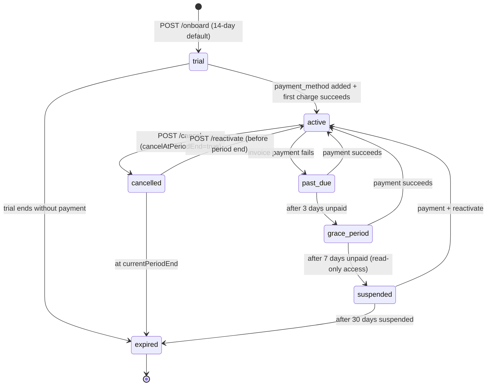

# ASAB Company Dashboard Backend API Specification
> بوابة الشركات — مواصفات الباك إند الكاملة
>
> Generated from `artifacts/mockup-sandbox/src/components/mockups/asab/CompanyDashboard.tsx` (4,684 lines).
>
> **Companion spec** to [`docs/BACKEND_API_SPEC.md`](./BACKEND_API_SPEC.md) (which covers `ASABPrototype.tsx` — the platform-side ASAB dashboard).
>
> Same conventions, auth, money handling, pagination, and core entity shapes apply **unless explicitly noted**.

---

## Table of Contents
1. [Overview](#1-overview)
2. [Differences from the Main Spec](#2-differences-from-the-main-spec)
3. [Additional Data Model (Drizzle schemas)](#3-additional-data-model-drizzle-schemas)
4. [Authentication & Onboarding](#4-authentication--onboarding)
5. [Endpoints by Role](#5-endpoints-by-role)
   - [5.1 Company Admin (أدمن الشركة)](#51-company-admin-أدمن-الشركة)
   - [5.2 Head Accountant (رئيس الحسابات)](#52-head-accountant-رئيس-الحسابات)
   - [5.3 Accountant (محاسب)](#53-accountant-محاسب)
   - [5.4 Branch Manager (مدير فرع)](#54-branch-manager-مدير-فرع)
   - [5.5 Procurement Manager (مدير مشتريات)](#55-procurement-manager-مدير-مشتريات)
6. [Subscription & Billing Workflow](#6-subscription--billing-workflow-critical)
7. [Cross-cutting (Company-scoped)](#7-cross-cutting-company-scoped)
8. [Real-time (WebSocket)](#8-real-time-websocket)
9. [Suggested Backend File Structure](#9-suggested-backend-file-structure)
10. [Open Questions for Product Team](#10-open-questions-for-product-team)

---

## 1. Overview

The **Company Dashboard** (`CompanyDashboard.tsx`) is the **B2B portal** used by *one* restaurant company (e.g., مجموعة التاج للمطاعم) within the multi-tenant ASAB SaaS. Every request issued from this surface is **scoped to a single `companyId`** which is resolved automatically from the authenticated user's JWT — there is no way for a Company-Dashboard user to address another tenant's data.

### 1.1 Login screen and roles

Source: `CompanyLoginScreen` (`CompanyDashboard.tsx:735–782`) and `ROLE_META` (`CompanyDashboard.tsx:719–725`).

| Role key | Arabic | Icon | Description | Approval power |
|----------|--------|------|-------------|----------------|
| `company-admin` | أدمن الشركة | 🏢 (Premium badge — `CompanyDashboard.tsx:767`) | إدارة الاشتراك والمستخدمين | none over operations; full over subscription/users/brands/settings |
| `head` | رئيس الحسابات | 👑 | الإشراف والاعتماد النهائي | Final approver (S3 → S4) + ERP batch posting |
| `accountant` | محاسب | 📊 | مراجعة العمليات المالية | Approves uploads (S2 → S3); converts expenses to fixed assets |
| `branch` | مدير فرع | 🏪 | رفع بيانات الفرع اليومية | Uploads daily data (creates S1 entries) |
| `procurement` | مدير مشتريات | 🛒 | أوامر الشراء والموردون | Creates POs; groups them; sends to suppliers |

### 1.2 Base URL & namespace strategy

```
https://api.asab.sa/api/v1/company/...
```

**Recommended strategy: separate namespace under `/api/v1/company/...`** for endpoints unique to this surface (subscription, billing, brands CRUD by company-admin, modules toggle, company-scoped users, support, settings). For shared workflow endpoints (operations approve/reject, sales/expenses/purchases/inventory/assets/shifts/cash/employees CRUD), **reuse the existing `/api/v1/operations/...` etc. from the main spec** — the tenant-scoping middleware (`WHERE company_id = $JWT.companyId`) automatically enforces the company boundary, so the same endpoint serves both ASABPrototype (platform admin sees all companies) and CompanyDashboard (each company sees only its own).

A single `/api/v1/company/me` resolves the implicit tenant (the JWT's company), eliminating the need to pass `companyId` in every path. **Path-based `:companyId` is reserved for platform admin endpoints only** (those in the main spec, never in this spec).

### 1.3 JWT claims (extension)

The JWT issued to a Company-Dashboard user carries:

```typescript
{
  sub:        string;          // user id
  companyId:  string;          // tenant id — every query auto-scopes by this
  roleKeys:   ("company-admin"|"head"|"accountant"|"branch"|"procurement")[];
  scope:      "company"|"brand"|"restaurant"|"branch";
  brandIds?:  string[];        // when scope=brand
  restaurantIds?: string[];
  branchIds?: string[];        // for branch managers
  moduleKeys?: string[];       // optional module-level scope
  planTier:   "basic"|"professional"|"enterprise";
  modulesEnabled: string[];    // from company_modules (toggle state)
  exp:        number;
  iat:        number;
}
```

The middleware reads `companyId` and forces `WHERE company_id = $companyId` on every query. Cross-company reads return `403 WRONG_TENANT`.

### 1.4 Plan limits (enforced server-side)

Source: `CADashboard` (`CompanyDashboard.tsx:1241–1306`), `CASubscription` (`CompanyDashboard.tsx:1308–1356`):

| Plan | Branches | Users | Storage | Modules | Price |
|------|----------|-------|---------|---------|-------|
| Basic (أساسي) | 5 | 15 | 2 GB | 4 modules | 199 SAR/mo · 1,990 SAR/yr |
| Professional (احترافي) | 20 | 50 | 10 GB | All modules | 400 SAR/mo · 4,800 SAR/yr (current company plan) |
| Enterprise (مؤسسي) | Unlimited | Unlimited | Custom | All modules + SLA 99.9% + Open API | Custom (Contact Sales) |

The middleware enforces these as `429`/`409 PLAN_LIMIT_EXCEEDED` when a write would violate the cap (e.g., creating a 21st branch on Professional).

---

## 2. Differences from the Main Spec

### 2.1 Reused from `docs/BACKEND_API_SPEC.md` (do not redefine)

| Entity / workflow | Reused section | Notes |
|---|---|---|
| `companies` table | §3.1 | One row is *the tenant* the user belongs to |
| `users`, `roles`, `user_roles`, `sessions` | §3.1 | Auth model identical |
| `brands`, `restaurants`, `branches` | §3.2 | Same shape; CompanyDashboard's `BRANDS` mock (`CompanyDashboard.tsx:123–156`) maps directly |
| `operations` (+ `sales_details`, `expense_invoices`, `purchase_orders`, `purchase_items`, `inventory_items`, `inventory_counts`, `waste_records`, `inventory_movements`) | §3.3, §3.4 | The 6-stage pipeline is identical |
| `suppliers`, `supplier_items`, `supplier_ratings` | §3.4 | Same shape — procurement sees them all; branch sees only those serving its branch |
| `assets`, `asset_drafts`, `asset_transfers`, `asset_depreciation`, `asset_categories` | §3.4 | The `ConvertToAssetModalCD` (`CompanyDashboard.tsx:226–325`) creates `asset_drafts` rows identically |
| `brandShiftConfigs`, `restaurantShiftOverrides`, `shifts` | §3.5 | Setup tab in `AccCompanyShifts` (`CompanyDashboard.tsx:3201–3231`) writes `brand_shift_configs` |
| `employees`, `employee_account_movements` | §3.5 | Same shape |
| `cash_custody`, `cash_transactions`, `settlement_requests` | §3.5 | Same shape |
| `approval_steps`, `notifications`, `audit_logs`, `reminders`, `attachments`, `erp_export_batches`, `permission_matrix`, `idempotency_keys` | §3.6 | Identical |
| Auth endpoints (`/auth/login`, `/refresh`, `/logout`, `/me`, `/change-password`, `/forgot-password`, `/reset-password`, `/sessions`) | §4 | Identical; the response just contains `companyId` claim |
| Approval pipeline endpoints (`/operations/:id/approve`, `/reject`, `/final-approve`, `/bulk-approve`, `/bulk-final-approve`) | §5 | Identical — JWT companyId scopes them |

### 2.2 New (unique to CompanyDashboard)

| Area | New entities / endpoints |
|---|---|
| Subscription & plans | `plans`, `plan_features`, `subscriptions` (rewritten — company-level), `subscription_changes`, `subscription_quota_usage` |
| Billing | `billing_invoices`, `billing_invoice_lines`, `payment_methods`, `billing_addresses`, `payment_transactions`, `webhook_events` |
| Modules toggle | `company_modules` (which modules the company has *enabled* — subset of plan entitlements) |
| Company users membership | `company_users` (membership + role within the company; layered over global `users` table) |
| Support | `support_tickets`, `ticket_messages`, `ticket_attachments`, `support_channels` |
| Settings | `company_settings` (logo, CR number, branding, timezone, defaults), `company_preferences` |
| Onboarding | `company_invitations` (admin invites users to join the company) |
| Brand-color metadata | extension of `brands` with `abbr`, `color` already in main spec |

### 2.3 Scoping rules

- **company-admin**: sees *all* of their own company's data. Cannot approve operations (no approval power in the UI — only management).
- **head**: sees all operations in the company; full final-approval power.
- **accountant**: sees all operations across the brands they're assigned to (`user_roles.brandIds`). Per the mock (`CompanyDashboard.tsx:2152`), a single accountant can cover multiple brands ("مسؤول عن X فروع").
- **branch**: sees data for *their one branch only* (`MY_BRANCH` mock at `CompanyDashboard.tsx:4045`).
- **procurement**: sees all suppliers, items, and POs across the whole company.

---

## 3. Additional Data Model (Drizzle schemas)

Below are the tables that are **new** to this surface or that **extend** main-spec entities. All tables include `companyId` (FK to `companies.id`), `createdAt`, `updatedAt`, `deletedAt` unless noted. Money is stored as integer halalas (1 SAR = 100). Dates are ISO 8601 UTC.

### 3.1 Plans & subscriptions (company-level)

> Note: The main spec defines a `subscriptions` table that is **per-restaurant** (silver/gold/platinum tiers — see `BACKEND_API_SPEC.md:311–327`). That table stays, but the Company Dashboard introduces a **separate company-level** `subscriptions` table for the platform-level Basic/Professional/Enterprise plan that drives feature gating, plan limits, and billing. Different concern, different table.

#### `plans` — كتالوج الخطط
```typescript
// lib/db/src/schema/plans.ts
import { pgTable, uuid, varchar, integer, timestamp, jsonb, boolean } from "drizzle-orm/pg-core";

export const plans = pgTable("plans", {
  id:             uuid("id").primaryKey().defaultRandom(),
  code:           varchar("code", { length: 32 }).notNull().unique(), // "basic"|"professional"|"enterprise"
  nameAr:         varchar("name_ar", { length: 80 }).notNull(),       // "أساسي"|"احترافي"|"مؤسسي"
  nameEn:         varchar("name_en", { length: 80 }).notNull(),       // "Basic"|"Professional"|"Enterprise"
  priceMonthly:   integer("price_monthly"),                            // halalas; null = custom (Enterprise)
  priceAnnual:    integer("price_annual"),                             // halalas; null = custom
  annualDiscountPct: integer("annual_discount_pct").default(17),
  maxBranches:    integer("max_branches"),                             // null = unlimited
  maxUsers:       integer("max_users"),
  maxBrands:      integer("max_brands"),
  maxRestaurants: integer("max_restaurants"),
  storageGb:      integer("storage_gb"),
  modulesIncluded:jsonb("modules_included").$type<string[]>().notNull(),  // ["sales","expenses",...]
  hasAccountManager: boolean("has_account_manager").default(false),
  hasAdvancedReports: boolean("has_advanced_reports").default(false),
  hasSla:         boolean("has_sla").default(false),
  slaUptimePct:   integer("sla_uptime_pct"),                           // 999 = 99.9%
  hasOpenApi:     boolean("has_open_api").default(false),
  sortOrder:      integer("sort_order").default(0),
  status:         varchar("status", { length: 16 }).default("active"), // active|deprecated
  createdAt:      timestamp("created_at").notNull().defaultNow(),
  updatedAt:      timestamp("updated_at").notNull().defaultNow(),
});
export type Plan = typeof plans.$inferSelect;
```
وصف: قائمة الخطط المتاحة للشركات (أساسي/احترافي/مؤسسي) مع الحدود والمميزات والأسعار.

#### `plan_features` — ميزات الخطة (الميزات المعروضة في صفحة المقارنة)
```typescript
export const planFeatures = pgTable("plan_features", {
  id:           uuid("id").primaryKey().defaultRandom(),
  planId:       uuid("plan_id").references(()=>plans.id).notNull(),
  labelAr:      varchar("label_ar", { length: 120 }).notNull(),  // "20 فرعاً"
  labelEn:      varchar("label_en", { length: 120 }).notNull(),  // "20 Branches"
  sortOrder:    integer("sort_order").default(0),
  isHighlighted: boolean("is_highlighted").default(false),
});
```
وصف: بنود الميزات التي تظهر تحت كل خطة في صفحة "الاشتراك والخطة" (`CompanyDashboard.tsx:1312–1314`).

#### `subscriptions` — اشتراك الشركة (يعيد تعريف اشتراك على مستوى الشركة)
```typescript
export const subscriptions = pgTable("subscriptions", {
  id:                uuid("id").primaryKey().defaultRandom(),
  companyId:         uuid("company_id").references(()=>companies.id).notNull().unique(), // ONE per company
  planId:            uuid("plan_id").references(()=>plans.id).notNull(),
  status:            varchar("status", { length: 16 }).notNull(),
    // "trial"|"active"|"past_due"|"grace_period"|"suspended"|"cancelled"|"expired"
  billingCycle:      varchar("billing_cycle", { length: 16 }).notNull(),  // "monthly"|"annual"
  currentPeriodStart:timestamp("current_period_start").notNull(),
  currentPeriodEnd:  timestamp("current_period_end").notNull(),           // = nextBilling
  trialEndsAt:       timestamp("trial_ends_at"),
  cancelAtPeriodEnd: boolean("cancel_at_period_end").default(false),
  cancelledAt:       timestamp("cancelled_at"),
  cancellationReason:text("cancellation_reason"),
  startDate:         timestamp("start_date").notNull(),
  daysRemaining:     integer("days_remaining"),  // derived; updated by daily cron
  autoRenew:         boolean("auto_renew").default(true),
  defaultPaymentMethodId: uuid("default_payment_method_id"),
  contractNumber:    varchar("contract_number", { length: 64 }),
  createdAt:         timestamp("created_at").notNull().defaultNow(),
  updatedAt:         timestamp("updated_at").notNull().defaultNow(),
});

export const insertSubscriptionSchema = createInsertSchema(subscriptions, {
  status: z.enum(["trial","active","past_due","grace_period","suspended","cancelled","expired"]),
  billingCycle: z.enum(["monthly","annual"]),
});
export type Subscription = typeof subscriptions.$inferSelect;
```
وصف: اشتراك الشركة الواحد في خطة عصب — مع تواريخ الفوترة والحالة. (`CompanyDashboard.tsx:1262–1278`, `1331–1340`).

#### `subscription_changes` — سجل تغييرات الخطة (للتحاسب التناسبي proration)
```typescript
export const subscriptionChanges = pgTable("subscription_changes", {
  id:                uuid("id").primaryKey().defaultRandom(),
  subscriptionId:    uuid("subscription_id").references(()=>subscriptions.id).notNull(),
  changeType:        varchar("change_type", { length: 16 }).notNull(),
    // "upgrade"|"downgrade"|"cycle_change"|"cancel"|"reactivate"|"trial_to_paid"|"renewal"
  fromPlanId:        uuid("from_plan_id").references(()=>plans.id),
  toPlanId:          uuid("to_plan_id").references(()=>plans.id),
  fromBillingCycle:  varchar("from_billing_cycle", { length: 16 }),
  toBillingCycle:    varchar("to_billing_cycle", { length: 16 }),
  prorationAmount:   integer("proration_amount"),     // halalas; +/-
  effectiveAt:       timestamp("effective_at").notNull(),
  invoiceId:         uuid("invoice_id"),               // FK → billing_invoices.id
  initiatedById:     uuid("initiated_by_id").references(()=>users.id),
  createdAt:         timestamp("created_at").notNull().defaultNow(),
});
```
وصف: كل تغيير على الاشتراك يُسجَّل لإمكانية المراجعة والمحاسبة بفارق سعر متناسب.

#### `subscription_quota_usage` — استهلاك الحصة (مقروء فقط — view مادي)
```typescript
// Computed live; can be a materialized view refreshed every 5 min, or computed at query time.
export const subscriptionQuotaUsage = pgTable("subscription_quota_usage", {
  companyId:        uuid("company_id").references(()=>companies.id).primaryKey(),
  usedBranches:     integer("used_branches").notNull(),
  usedUsers:        integer("used_users").notNull(),
  usedBrands:       integer("used_brands").notNull(),
  usedRestaurants:  integer("used_restaurants").notNull(),
  usedStorageBytes: bigint("used_storage_bytes", { mode:"number" }).notNull(),
  computedAt:       timestamp("computed_at").notNull().defaultNow(),
});
```
وصف: لقطة لاستهلاك الشركة من حدود الخطة — تُعرض في `CASubscription` (`CompanyDashboard.tsx:1336–1338`): "12/20 فرع"، "31/50 مستخدم".

### 3.2 Billing

#### `billing_invoices` — فواتير الاشتراك (للشركة)
> Distinct from `expense_invoices` (main spec §3.4) which are invoices the company *receives* from its vendors. This table is invoices the *ASAB platform* issues *to* the company.
```typescript
export const billingInvoices = pgTable("billing_invoices", {
  id:               uuid("id").primaryKey().defaultRandom(),
  companyId:        uuid("company_id").references(()=>companies.id).notNull(),
  subscriptionId:   uuid("subscription_id").references(()=>subscriptions.id).notNull(),
  publicId:         varchar("public_id", { length: 24 }).notNull().unique(), // "INV-2025-012"
  issueDate:        timestamp("issue_date").notNull(),
  dueDate:          timestamp("due_date").notNull(),
  periodStart:      timestamp("period_start").notNull(),
  periodEnd:        timestamp("period_end").notNull(),
  subtotal:         integer("subtotal").notNull(),         // halalas
  vatRate:          integer("vat_rate").default(15),        // %
  vatAmount:        integer("vat_amount").notNull(),
  discount:         integer("discount").default(0),
  total:            integer("total").notNull(),
  amountPaid:       integer("amount_paid").notNull().default(0),
  amountDue:        integer("amount_due").notNull(),
  status:           varchar("status", { length: 16 }).notNull(),
    // "draft"|"open"|"paid"|"partially_paid"|"overdue"|"void"|"refunded"
  paymentMethodId:  uuid("payment_method_id").references(()=>paymentMethods.id),
  paidAt:           timestamp("paid_at"),
  pdfStorageKey:    varchar("pdf_storage_key", { length: 500 }),
  billingAddressSnapshot: jsonb("billing_address_snapshot"), // freeze at issue time
  notes:            text("notes"),
  currency:         varchar("currency", { length: 3 }).default("SAR"),
  createdAt:        timestamp("created_at").notNull().defaultNow(),
  updatedAt:        timestamp("updated_at").notNull().defaultNow(),
}, t=>({
  companyStatusIdx: index("bi_company_status_idx").on(t.companyId, t.status),
  publicIdIdx: uniqueIndex("bi_public_id_idx").on(t.publicId),
}));
export type BillingInvoice = typeof billingInvoices.$inferSelect;
```
وصف: فاتورة اشتراك تُصدرها منصة ASAB للشركة. تظهر في `CABilling` (`CompanyDashboard.tsx:1522–1550`).

#### `billing_invoice_lines` — بنود الفاتورة
```typescript
export const billingInvoiceLines = pgTable("billing_invoice_lines", {
  id:           uuid("id").primaryKey().defaultRandom(),
  invoiceId:    uuid("invoice_id").references(()=>billingInvoices.id).notNull(),
  description:  varchar("description", { length: 255 }).notNull(),  // "اشتراك سنوي - خطة احترافي 2025"
  quantity:     integer("quantity").default(1),
  unitPrice:    integer("unit_price").notNull(),    // halalas
  amount:       integer("amount").notNull(),
  lineType:     varchar("line_type", { length: 16 }).notNull(),
    // "subscription"|"proration"|"overage"|"addon"|"credit"|"discount"
  sortOrder:    integer("sort_order").default(0),
});
```

#### `payment_methods` — طرق الدفع المخزنة
```typescript
export const paymentMethods = pgTable("payment_methods", {
  id:           uuid("id").primaryKey().defaultRandom(),
  companyId:    uuid("company_id").references(()=>companies.id).notNull(),
  type:         varchar("type", { length: 16 }).notNull(),  // "card"|"mada"|"bank_transfer"|"apple_pay"
  brand:        varchar("brand", { length: 16 }),            // "visa"|"mastercard"|"mada"|"amex"
  last4:        varchar("last4", { length: 4 }),
  expMonth:     integer("exp_month"),
  expYear:      integer("exp_year"),
  holderName:   varchar("holder_name", { length: 200 }),
  providerToken:varchar("provider_token", { length: 255 }).notNull(), // gateway PSP token
  providerName: varchar("provider_name", { length: 32 }).notNull(),   // "stripe"|"tap"|"hyperpay"|"moyasar"
  isDefault:    boolean("is_default").default(false),
  status:       varchar("status", { length: 16 }).default("active"),  // active|expired|removed
  addedById:    uuid("added_by_id").references(()=>users.id),
  createdAt:    timestamp("created_at").notNull().defaultNow(),
  deletedAt:    timestamp("deleted_at"),
});
```
وصف: بطاقات الائتمان المحفوظة. الـ KPI card يعرض "**** 4521" (`CompanyDashboard.tsx:1531`).

#### `billing_addresses` — عنوان الفاتورة
```typescript
export const billingAddresses = pgTable("billing_addresses", {
  id:           uuid("id").primaryKey().defaultRandom(),
  companyId:    uuid("company_id").references(()=>companies.id).notNull(),
  legalName:    varchar("legal_name", { length: 200 }).notNull(),  // "مجموعة التاج للمطاعم"
  taxId:        varchar("tax_id", { length: 32 }),                  // VAT registration number
  crNumber:     varchar("cr_number", { length: 32 }),               // 1010XXXXXX
  addressLine1: varchar("address_line1", { length: 255 }).notNull(),
  addressLine2: varchar("address_line2", { length: 255 }),
  city:         varchar("city", { length: 80 }).notNull(),
  region:       varchar("region", { length: 80 }),
  postalCode:   varchar("postal_code", { length: 16 }),
  country:      varchar("country", { length: 2 }).default("SA"),
  contactEmail: varchar("contact_email", { length: 255 }),
  contactPhone: varchar("contact_phone", { length: 32 }),
  isDefault:    boolean("is_default").default(true),
  createdAt:    timestamp("created_at").notNull().defaultNow(),
  updatedAt:    timestamp("updated_at").notNull().defaultNow(),
});
```

#### `payment_transactions` — محاولات الدفع
```typescript
export const paymentTransactions = pgTable("payment_transactions", {
  id:               uuid("id").primaryKey().defaultRandom(),
  invoiceId:        uuid("invoice_id").references(()=>billingInvoices.id).notNull(),
  paymentMethodId:  uuid("payment_method_id").references(()=>paymentMethods.id),
  amount:           integer("amount").notNull(),
  currency:         varchar("currency", { length: 3 }).default("SAR"),
  status:           varchar("status", { length: 16 }).notNull(),
    // "pending"|"succeeded"|"failed"|"refunded"|"chargeback"
  providerTxnId:    varchar("provider_txn_id", { length: 128 }),
  providerResponse: jsonb("provider_response"),
  failureCode:      varchar("failure_code", { length: 32 }),
  failureMessage:   text("failure_message"),
  processedAt:      timestamp("processed_at"),
  createdAt:        timestamp("created_at").notNull().defaultNow(),
});
```

#### `webhook_events` — أحداث Webhook من بوابات الدفع
```typescript
export const webhookEvents = pgTable("webhook_events", {
  id:           uuid("id").primaryKey().defaultRandom(),
  provider:     varchar("provider", { length: 32 }).notNull(),   // stripe|tap|hyperpay|moyasar
  eventId:      varchar("event_id", { length: 128 }).notNull().unique(),
  eventType:    varchar("event_type", { length: 64 }).notNull(),
  payload:      jsonb("payload").notNull(),
  signature:    varchar("signature", { length: 512 }),
  signatureVerified: boolean("signature_verified").default(false),
  processedAt:  timestamp("processed_at"),
  processingError: text("processing_error"),
  receivedAt:   timestamp("received_at").notNull().defaultNow(),
});
```

### 3.3 Modules toggle

#### `company_modules` — الموديولات المُفعَّلة في الشركة
Source: `CAModules` (`CompanyDashboard.tsx:1484–1520`).
```typescript
export const companyModules = pgTable("company_modules", {
  id:           uuid("id").primaryKey().defaultRandom(),
  companyId:    uuid("company_id").references(()=>companies.id).notNull(),
  moduleKey:    varchar("module_key", { length: 32 }).notNull(),
    // "sales"|"expenses"|"purchases"|"inventory"|"assets"|"shifts"|"waste"|"emp"|"cash"
  isActive:     boolean("is_active").notNull().default(true),
  isInPlan:     boolean("is_in_plan").notNull().default(true),  // false → upgrade needed
  toggledById:  uuid("toggled_by_id").references(()=>users.id),
  toggledAt:    timestamp("toggled_at"),
  createdAt:    timestamp("created_at").notNull().defaultNow(),
  updatedAt:    timestamp("updated_at").notNull().defaultNow(),
}, t=>({ uniq: uniqueIndex("company_module_uniq").on(t.companyId, t.moduleKey) }));
export type CompanyModule = typeof companyModules.$inferSelect;
```
وصف: تخزن أي موديولات الشركة قامت بتفعيلها. لو `isInPlan=false` فالزر معطّل ويلزم ترقية الخطة (`CompanyDashboard.tsx:1498`).

### 3.4 Users management within company

#### `company_users` — عضوية المستخدم في الشركة
> Builds on the global `users` table (main spec §3.1). One `users` row can in principle belong to multiple companies (consultants, ASAB support), but most users will have a single membership row.
```typescript
export const companyUsers = pgTable("company_users", {
  id:           uuid("id").primaryKey().defaultRandom(),
  companyId:    uuid("company_id").references(()=>companies.id).notNull(),
  userId:       uuid("user_id").references(()=>users.id).notNull(),
  roleKey:      varchar("role_key", { length: 32 }).notNull(),
    // "company-admin"|"head"|"accountant"|"branch"|"procurement"
  brandId:      uuid("brand_id").references(()=>brands.id),     // for accountant/procurement scoped to one brand
  branchId:     uuid("branch_id").references(()=>branches.id),  // for branch manager
  status:       varchar("status", { length: 16 }).notNull().default("active"),
    // "invited"|"active"|"inactive"|"suspended"
  lastSeenAt:   timestamp("last_seen_at"),
  invitedById:  uuid("invited_by_id").references(()=>users.id),
  invitedAt:    timestamp("invited_at"),
  acceptedAt:   timestamp("accepted_at"),
  createdAt:    timestamp("created_at").notNull().defaultNow(),
  updatedAt:    timestamp("updated_at").notNull().defaultNow(),
}, t=>({
  uniq: uniqueIndex("cu_company_user_idx").on(t.companyId, t.userId),
}));
```
وصف: ربط المستخدم بالشركة مع دوره داخل الشركة. مصدر بيانات `CAUsers` (`CompanyDashboard.tsx:1361–1370`).

#### `company_invitations` — دعوات الانضمام
```typescript
export const companyInvitations = pgTable("company_invitations", {
  id:           uuid("id").primaryKey().defaultRandom(),
  companyId:    uuid("company_id").references(()=>companies.id).notNull(),
  email:        varchar("email", { length: 255 }).notNull(),
  name:         varchar("name", { length: 200 }),
  roleKey:      varchar("role_key", { length: 32 }).notNull(),
  brandId:      uuid("brand_id").references(()=>brands.id),
  branchId:     uuid("branch_id").references(()=>branches.id),
  token:        varchar("token", { length: 128 }).notNull().unique(),
  status:       varchar("status", { length: 16 }).default("pending"),  // pending|accepted|revoked|expired
  invitedById:  uuid("invited_by_id").references(()=>users.id),
  expiresAt:    timestamp("expires_at").notNull(),
  acceptedAt:   timestamp("accepted_at"),
  createdAt:    timestamp("created_at").notNull().defaultNow(),
});
```

### 3.5 Support tickets

#### `support_tickets`
Source: `CASupport` (`CompanyDashboard.tsx:1577–1631`).
```typescript
export const supportTickets = pgTable("support_tickets", {
  id:           uuid("id").primaryKey().defaultRandom(),
  publicId:     varchar("public_id", { length: 16 }).notNull().unique(), // "TCK-001"
  companyId:    uuid("company_id").references(()=>companies.id).notNull(),
  openedById:   uuid("opened_by_id").references(()=>users.id).notNull(),
  category:     varchar("category", { length: 32 }).notNull(),
    // "subscription"|"technical"|"general_inquiry"|"feature_request"|"billing"|"other"
  subject:      varchar("subject", { length: 200 }).notNull(),
  body:         text("body").notNull(),
  priority:     varchar("priority", { length: 8 }).default("normal"),  // low|normal|high|urgent
  status:       varchar("status", { length: 16 }).default("open"),     // open|in_progress|waiting_customer|resolved|closed
  assignedToId: uuid("assigned_to_id").references(()=>users.id),  // ASAB support agent
  firstResponseAt: timestamp("first_response_at"),
  resolvedAt:   timestamp("resolved_at"),
  closedAt:     timestamp("closed_at"),
  createdAt:    timestamp("created_at").notNull().defaultNow(),
  updatedAt:    timestamp("updated_at").notNull().defaultNow(),
});
```

#### `ticket_messages`
```typescript
export const ticketMessages = pgTable("ticket_messages", {
  id:           uuid("id").primaryKey().defaultRandom(),
  ticketId:     uuid("ticket_id").references(()=>supportTickets.id).notNull(),
  authorId:     uuid("author_id").references(()=>users.id).notNull(),
  authorType:   varchar("author_type", { length: 16 }).notNull(), // "customer"|"support_agent"
  body:         text("body").notNull(),
  isInternal:   boolean("is_internal").default(false),    // visible only to support staff
  createdAt:    timestamp("created_at").notNull().defaultNow(),
});
```

#### `ticket_attachments`
```typescript
export const ticketAttachments = pgTable("ticket_attachments", {
  id:           uuid("id").primaryKey().defaultRandom(),
  ticketId:     uuid("ticket_id").references(()=>supportTickets.id).notNull(),
  messageId:    uuid("message_id").references(()=>ticketMessages.id),
  filename:     varchar("filename", { length: 255 }).notNull(),
  mimeType:     varchar("mime_type", { length: 80 }).notNull(),
  size:         integer("size").notNull(),
  storageKey:   varchar("storage_key", { length: 500 }).notNull(),
  uploadedById: uuid("uploaded_by_id").references(()=>users.id),
  uploadedAt:   timestamp("uploaded_at").notNull().defaultNow(),
});
```

#### `support_channels` — قنوات الدعم المتاحة (config)
Static reference list backing the cards in `CASupport`:
```typescript
export const supportChannels = pgTable("support_channels", {
  id:           uuid("id").primaryKey().defaultRandom(),
  key:          varchar("key", { length: 16 }).notNull().unique(),  // chat|phone|email
  labelAr:      varchar("label_ar", { length: 80 }).notNull(),
  labelEn:      varchar("label_en", { length: 80 }).notNull(),
  value:        varchar("value", { length: 120 }).notNull(),         // "800 123 4567" | "support@asab.sa"
  hoursAr:      varchar("hours_ar", { length: 120 }),
  hoursEn:      varchar("hours_en", { length: 120 }),
  isAvailable:  boolean("is_available").default(true),
  icon:         varchar("icon", { length: 8 }),  // emoji
  sortOrder:    integer("sort_order").default(0),
});
```

### 3.6 Company settings

#### `company_settings` — إعدادات الشركة
Source: `CASettings` (`CompanyDashboard.tsx:1552–1575`).
```typescript
export const companySettings = pgTable("company_settings", {
  companyId:        uuid("company_id").references(()=>companies.id).primaryKey(),
  legalName:        varchar("legal_name", { length: 200 }).notNull(),  // "مجموعة التاج للمطاعم"
  displayName:      varchar("display_name", { length: 200 }),
  logoEmoji:        varchar("logo_emoji", { length: 16 }),               // "👑"
  logoUrl:          varchar("logo_url", { length: 500 }),
  primaryCity:      varchar("primary_city", { length: 80 }),
  crNumber:         varchar("cr_number", { length: 32 }),
  taxId:            varchar("tax_id", { length: 32 }),
  email:            varchar("email", { length: 255 }),
  phone:            varchar("phone", { length: 32 }),
  website:          varchar("website", { length: 255 }),
  addressLine:      text("address_line"),
  defaultCurrency:  varchar("default_currency", { length: 3 }).default("SAR"),
  defaultTimezone:  varchar("default_timezone", { length: 64 }).default("Asia/Riyadh"),
  defaultLanguage:  varchar("default_language", { length: 2 }).default("ar"),
  vatPercentage:    integer("vat_percentage").default(15),
  fiscalYearStart:  varchar("fiscal_year_start", { length: 8 }).default("01-01"), // MM-DD
  brandColor:       varchar("brand_color", { length: 16 }),
  updatedAt:        timestamp("updated_at").notNull().defaultNow(),
  updatedById:      uuid("updated_by_id").references(()=>users.id),
});
```

#### `company_preferences` — تفضيلات التطبيق (per-company)
```typescript
export const companyPreferences = pgTable("company_preferences", {
  companyId:        uuid("company_id").references(()=>companies.id).primaryKey(),
  notifyOnApproval: boolean("notify_on_approval").default(true),
  notifyOnRejection: boolean("notify_on_rejection").default(true),
  notifyOnLowStock: boolean("notify_on_low_stock").default(true),
  notifyOnSubscriptionExpiring: boolean("notify_on_sub_expiring").default(true),
  autoReminderEnabled: boolean("auto_reminder_enabled").default(true),
  reminderTriggerHour: varchar("reminder_trigger_hour", { length: 8 }).default("22:00"),
  reminderRepeatHours: integer("reminder_repeat_hours").default(3),
  posIntegrations:  jsonb("pos_integrations").$type<string[]>().default([]),   // ["foodics","odoo",...]
  deliveryAppIntegrations: jsonb("delivery_app_integrations").$type<string[]>().default([]),
});
```

### 3.7 Audit log (company-scoped projection)

> The `audit_logs` table from the main spec is reused as-is. **Difference:** a company-dashboard query against `/api/v1/company/audit-logs` is *forced* to `WHERE company_id = $JWT.companyId`. Platform-side audit (cross-tenant) remains admin-only.

### 3.8 Notifications (company-scoped projection)

> `notifications` table from the main spec is reused. New notification `type` values introduced by this surface:

| Type | Triggered when | Recipients |
|------|----------------|-----------|
| `subscription.expiring` | 30, 14, 7, 3, 1 days before `currentPeriodEnd` | company-admin |
| `subscription.upgraded` | Plan upgrade succeeds | company-admin |
| `subscription.downgraded` | Plan downgrade succeeds | company-admin |
| `subscription.payment_failed` | Webhook reports failed charge | company-admin |
| `subscription.suspended` | Status → suspended | company-admin + head |
| `subscription.reactivated` | Status → active after suspension | company-admin |
| `invoice.created` | New billing invoice generated | company-admin |
| `invoice.paid` | Payment succeeds | company-admin |
| `invoice.overdue` | Past `dueDate` and unpaid | company-admin |
| `module.enabled` | Module toggled on | company-admin + head |
| `module.disabled` | Module toggled off | company-admin + head |
| `user.invited` | New invite sent | company-admin |
| `user.joined` | Invitee accepts | company-admin |
| `user.role_changed` | Admin changes a user's role | the affected user + company-admin |
| `user.suspended` | Admin disables a user | affected user + company-admin |
| `branch.created` | New branch added | company-admin |
| `support.ticket_replied` | Support agent replies | ticket opener |
| `support.ticket_resolved` | Status → resolved | ticket opener |
| `quota.warning` | Usage ≥ 80% of any limit | company-admin |
| `quota.exceeded` | Usage ≥ 100% (blocked write attempted) | company-admin |

---

## 4. Authentication & Onboarding

### 4.1 Reused auth endpoints

All endpoints from `BACKEND_API_SPEC.md` §4 work as-is. The login response includes `companyId` in the user object and the JWT carries it as a claim. A user that belongs to one of the 5 company-side roles will see `defaultPage` set per `DEFAULT_PAGE` (`CompanyDashboard.tsx:727–730`):

```typescript
const DEFAULT_PAGE = {
  "company-admin": "ca-dashboard",
  "head":          "head-dashboard",
  "accountant":    "acc-dashboard",
  "branch":        "branch-overview",
  "procurement":   "proc-overview",
};
```

### 4.2 Company onboarding

#### POST /api/v1/company/onboard — bootstrap a brand new tenant
> Used during signup (not visible in this prototype, but inferred — the "Add company" flow is platform-side and lives in the main spec). After signup, the platform creates a row in `companies` and the very first user with role `company-admin`. This endpoint is **invoked once** to seed initial structure.

- **Auth:** Bearer (newly created company-admin)
- **Body:**
  ```typescript
  {
    legalName:    string;           // "مجموعة التاج للمطاعم"
    primaryCity:  string;
    crNumber?:    string;
    taxId?:       string;
    contactEmail: string;
    contactPhone?: string;
    logoEmoji?:   string;           // "👑"
    initialBrands?: { name:string; abbr:string; color:string }[];
    selectedPlanCode: "basic"|"professional"|"enterprise";
    billingCycle: "monthly"|"annual";
  }
  ```
- **Response 200:** `{ company: Company, subscription: Subscription, nextStep: "add_payment_method"|"complete" }`
- **Side effects:**
  - Seeds `company_settings`, `company_preferences`, `company_modules` (all from plan defaults).
  - Creates `subscriptions` row in `trial` status (14-day trial).
  - Audit log entry `company.onboarded`.

#### POST /api/v1/company/invitations — invite a user
Source: `CAUsers` add-user modal (`CompanyDashboard.tsx:1397–1408`, send invite button at `CompanyDashboard.tsx:1404`).
- **Auth:** `company-admin`
- **Body:**
  ```typescript
  {
    email:    string;
    name?:    string;
    roleKey:  "head"|"accountant"|"branch"|"procurement"|"company-admin";
    brandId?: string;       // required when roleKey=accountant scoped to brand
    branchId?:string;       // required when roleKey=branch
  }
  ```
- **Response 201:** `CompanyInvitation` with `token` and `expiresAt` (default 7 days).
- **Errors:**
  - `409 USER_ALREADY_MEMBER` — email already in `company_users` for this company
  - `409 QUOTA_EXCEEDED` — would exceed `plans.maxUsers`
  - `422 INVALID_ROLE_SCOPE` — branchId missing for `branch` role
- **Side effects:** Sends email with `https://app.asab.sa/invite/accept?token=...`. Creates `notifications` for the inviter with type `user.invited`.

#### GET /api/v1/company/invitations — list
- **Auth:** `company-admin`
- **Query:** `?status=pending,accepted,revoked,expired`
- **Response 200:** `{ data: CompanyInvitation[] }`

#### POST /api/v1/company/invitations/:id/revoke
- **Auth:** `company-admin`
- **Response 204.** Sets `status=revoked`.

#### POST /api/v1/company/invitations/accept
- **Auth:** none (uses the token)
- **Body:** `{ token: string; name: string; password: string; phone?: string }`
- **Response 200:** `{ user: User; accessToken; refreshToken; companyId; defaultPage }`

---

## 5. Endpoints by Role

> For every endpoint below, the tenant is **inferred from the JWT's `companyId`** unless a path param explicitly says otherwise. Body schemas use TypeScript-like syntax; response envelopes follow the conventions in the main spec §2 (`{ data, meta }` for paginated, raw object for single resource).

---

### 5.1 Company Admin (أدمن الشركة)

Source: `NAV["company-admin"]` (`CompanyDashboard.tsx:641–653`).

#### Pages this role can access

| Page ID | Arabic | English |
|---------|--------|---------|
| `ca-dashboard` | الرئيسية | Dashboard |
| `ca-subscription` | الاشتراك والخطة | Plan & Subscription |
| `ca-users` | إدارة المستخدمين | User Management |
| `ca-branches` | العلامات والفروع | Brands & Branches |
| `ca-modules` | الوحدات النشطة | Active Modules |
| `ca-billing` | الفواتير والمدفوعات | Billing & Payments |
| `ca-settings` | إعدادات الشركة | Company Settings |
| `ca-support` | الدعم الفني | Technical Support |

#### 5.1.1 Dashboard (ca-dashboard)
Source: `CADashboard` (`CompanyDashboard.tsx:1241–1306`).

##### GET /api/v1/company/me/dashboard — لوحة معلومات الشركة الرئيسية
- **Used on page:** `ca-dashboard` (`CompanyDashboard.tsx:1241`)
- **Auth:** `company-admin`
- **Query:** `?dateFrom=ISO&dateTo=ISO` (default: current month)
- **Response 200:**
  ```typescript
  {
    company: {
      id: string;
      name: string;          // "مجموعة التاج للمطاعم"
      logo: string;          // "👑"
      plan: "basic"|"professional"|"enterprise";
      planNameAr: string;    // "احترافي"
      city: string;          // "الرياض"
    };
    subscription: {
      status: "trial"|"active"|"past_due"|"grace_period"|"suspended"|"cancelled";
      currentPeriodEnd: string;     // "2026-01-15T00:00:00Z"
      daysRemaining: number;         // 87
      pricePerYear: number;          // 4800 (SAR, not halalas — already converted for display? Actually halalas: 480000)
      autoRenew: boolean;
    };
    quotas: {
      brands:      { used: number; max: number|null };  // 3, null (unlimited on this plan)
      restaurants: { used: number; max: number|null };  // 7, null
      branches:    { used: number; max: number };        // 12, 20
      users:       { used: number; max: number };        // 31, 50
      storage:     { usedGb: number; maxGb: number };
    };
    kpis: {
      monthlySalesHalalas:    number;
      monthlyExpensesHalalas: number;
      netProfitHalalas:       number;
      salesDeltaPct:          number;     // +8.2
      profitDeltaPct:         number;     // +12.4
      branchCompletionRate:   number;     // 83
      branchesAboveTarget:    number;     // 10
      totalBranches:          number;     // 12
    };
    brandPerformance: Array<{
      brandId: string;
      name: string;             // "برغر التاج"
      abbr: string;             // "بر"
      color: string;            // "#E53E3E"
      branchCount: number;
      salesHalalas: number;
      targetHalalas: number;
      pctOfTarget: number;
    }>;
  }
  ```
- **Errors:** 401, 403 `WRONG_ROLE`.
- **Side effects:** None (read-only). Cached for 30 s per company.

#### 5.1.2 Subscription & Plan (ca-subscription)
Source: `CASubscription` (`CompanyDashboard.tsx:1308–1356`).

##### GET /api/v1/company/me/subscription — تفاصيل الاشتراك الحالي
- **Used on page:** `ca-subscription`
- **Auth:** `company-admin`
- **Response 200:**
  ```typescript
  {
    subscription: Subscription;
    plan: Plan;                         // current plan details with features
    usage: SubscriptionQuotaUsage;
    nextInvoice: {
      issueDate: string;
      amountHalalas: number;
      currency: "SAR";
    };
  }
  ```

##### GET /api/v1/plans — قائمة كل الخطط للمقارنة
- **Used on page:** `ca-subscription` plan cards (`CompanyDashboard.tsx:1311–1315`)
- **Auth:** `company-admin` (or any authenticated user)
- **Query:** `?billingCycle=annual|monthly` (default `annual`)
- **Response 200:**
  ```typescript
  {
    data: Array<{
      id: string;
      code: "basic"|"professional"|"enterprise";
      nameAr: string; nameEn: string;
      priceMonthlyHalalas: number | null;     // null = Custom
      priceAnnualHalalas:  number | null;
      annualDiscountPct:   number;
      features: PlanFeature[];                 // sorted
      maxBranches: number | null;
      maxUsers: number | null;
      maxBrands: number | null;
      storageGb: number | null;
      isCurrent: boolean;                      // true for the plan this company is on
    }>
  }
  ```

##### POST /api/v1/company/me/subscription/upgrade — ترقية الخطة
Source: upgrade button in `CASubscription` (`CompanyDashboard.tsx:1349`).
- **Used on page:** `ca-subscription`
- **Auth:** `company-admin`
- **Body:**
  ```typescript
  {
    targetPlanCode: "professional"|"enterprise";
    billingCycle:   "monthly"|"annual";
    paymentMethodId?: string;     // if omitted, uses default
    applyImmediately?: boolean;   // default true (proration)
  }
  ```
  Example: `{ "targetPlanCode": "enterprise", "billingCycle": "annual" }`
- **Response 200:**
  ```typescript
  {
    subscription: Subscription;     // with updated planId and currentPeriodEnd
    change: SubscriptionChange;
    prorationInvoice?: BillingInvoice;  // if applyImmediately=true and price differs
  }
  ```
- **Errors:**
  - `409 ALREADY_ON_PLAN`
  - `409 INVALID_TRANSITION` (e.g., upgrading from cancelled)
  - `422 NO_DEFAULT_PAYMENT_METHOD`
  - `503 PAYMENT_PROVIDER_UNAVAILABLE`
- **Side effects:**
  - Creates `subscription_changes` row
  - Generates pro-rated `billing_invoices` row (if mid-cycle)
  - Charges via `payment_transactions`
  - Audit log `subscription.upgrade`
  - Notification to company-admin: `subscription.upgraded`
  - Recomputes `company_modules.isInPlan` flags

##### POST /api/v1/company/me/subscription/downgrade
- **Auth:** `company-admin`
- **Body:** `{ targetPlanCode: "basic"|"professional"; effectiveAt?: "immediately"|"period_end" }` (default `period_end`)
- **Response 200:** same shape as upgrade.
- **Errors:** `422 QUOTA_WOULD_EXCEED` if current usage > target plan's limits (server lists which limits would be exceeded). Force-delete required first.

##### POST /api/v1/company/me/subscription/cancel
- **Auth:** `company-admin`
- **Body:**
  ```typescript
  {
    reason: "too_expensive"|"missing_features"|"switching_provider"|"shutting_down"|"other";
    feedback?: string;
    cancelAtPeriodEnd?: boolean;   // default true
  }
  ```
- **Response 200:** subscription with `cancelAtPeriodEnd=true` (and `cancelledAt` set).
- **Side effects:** Notification `subscription.cancelled`; account becomes read-only after `currentPeriodEnd`.

##### POST /api/v1/company/me/subscription/reactivate
- **Auth:** `company-admin`
- **Body:** none
- **Response 200:** subscription with `cancelAtPeriodEnd=false`.
- **Errors:** `409 SUBSCRIPTION_EXPIRED` (need full re-subscribe).

##### POST /api/v1/company/me/subscription/contact-sales — for Enterprise
Source: "تواصل مع المبيعات" button (`CompanyDashboard.tsx:1349`).
- **Auth:** `company-admin`
- **Body:** `{ companySize?: string; expectedBranches?: number; message?: string }`
- **Response 202.** Sends email to sales@asab.sa; creates a `support_tickets` row with `category="subscription"` priority=high.

##### POST /api/v1/company/me/subscription/billing-cycle — toggle annual/monthly
Source: billing toggle (`CompanyDashboard.tsx:1322–1328`).
- **Auth:** `company-admin`
- **Body:** `{ billingCycle: "annual"|"monthly" }`
- **Response 200:** subscription with updated `billingCycle`; logs a `cycle_change` in `subscription_changes` and pro-rates the invoice.

#### 5.1.3 User Management (ca-users)
Source: `CAUsers` (`CompanyDashboard.tsx:1358–1411`).

##### GET /api/v1/company/me/users — قائمة مستخدمي الشركة
- **Used on page:** `ca-users`
- **Auth:** `company-admin`
- **Query:**
  - `?search=string` (matches name OR role) — `CompanyDashboard.tsx:1373`
  - `?roleKey=head|accountant|branch|procurement|company-admin`
  - `?status=active|inactive|invited`
  - `?brandId=uuid`
  - `?branchId=uuid`
  - `?page=1&pageSize=20`
- **Response 200:**
  ```typescript
  {
    data: Array<{
      id: string;
      userId: string;          // global users.id
      name: string;            // "أحمد العمري"
      email: string;           // "ahmed@altaj.com"
      avatar: string;          // first letter / initials
      role: { key: string; nameAr: string; nameEn: string };
      brand?: { id: string; name: string };          // e.g., "برغر التاج"
      branch?: { id: string; name: string };         // "فرع العليا"
      branchLabel: string;     // "—" if no branch, else branch name
      status: "active"|"inactive"|"invited";
      lastSeenAt: string|null;
      lastSeenLabel: string;   // "اليوم" | "أمس" | "3 أيام" — server-computed Arabic relative
    }>;
    meta: { page, pageSize, total, totalPages, activeCount: number, maxUsers: number };
  }
  ```

##### POST /api/v1/company/me/users — invite (alias for invitations endpoint)
> Same as `POST /api/v1/company/invitations` (§4.2). The UI uses this for the "Send Invite" button.

##### PATCH /api/v1/company/me/users/:id — تعديل بيانات المستخدم
Source: edit button (`CompanyDashboard.tsx:1392`).
- **Auth:** `company-admin`
- **Path param:** `id` is `company_users.id`
- **Body (partial):**
  ```typescript
  {
    name?: string;
    roleKey?: "head"|"accountant"|"branch"|"procurement";
    brandId?: string|null;
    branchId?: string|null;
    phone?: string;
  }
  ```
- **Response 200:** updated `CompanyUser` joined with `User`.
- **Errors:** `422 INVALID_ROLE_SCOPE`, `409 LAST_ADMIN_CANNOT_DEMOTE`.
- **Side effects:** audit log `user.role_change`, notification to user.

##### POST /api/v1/company/me/users/:id/toggle-status — تفعيل/إيقاف
Source: enable/disable toggle (`CompanyDashboard.tsx:1391`).
- **Auth:** `company-admin`
- **Body:** none
- **Response 200:** `{ id, status: "active"|"inactive" }`
- **Errors:** `409 CANNOT_DISABLE_SELF`, `409 LAST_ACTIVE_ADMIN`.

##### DELETE /api/v1/company/me/users/:id
- **Auth:** `company-admin`
- **Response 204.** Soft-deletes the `company_users` row (the global `users` row stays).
- **Errors:** `409 LAST_ACTIVE_ADMIN`, `409 USER_HAS_OPEN_OPERATIONS` (forces transfer first).

##### POST /api/v1/company/me/users/:id/resend-invite
- **Auth:** `company-admin`
- **Response 202.** Only valid if `status="invited"`.

#### 5.1.4 Brands & Branches (ca-branches)
Source: `CABranches` (`CompanyDashboard.tsx:1413–1482`).

##### GET /api/v1/company/me/brands — قائمة العلامات والمطاعم والفروع (شجرة)
- **Used on page:** `ca-branches`
- **Auth:** `company-admin` (also visible read-only to head)
- **Query:**
  - `?include=restaurants,branches` (default — full tree)
  - `?expand=brandId` (optional — return only this brand expanded)
- **Response 200:**
  ```typescript
  {
    data: Array<{
      id: string;
      name: string;            // "برغر التاج"
      abbr: string;            // "بر"
      color: string;           // "#E53E3E"
      restaurants: Array<{
        id: string;
        name: string;          // "برغر التاج — الرياض"
        branches: Array<{
          id: string;
          name: string;        // "فرع العليا"
          city: string;        // "الرياض"
          managerUserId: string|null;
          managerName: string|null;  // "فاطمة السالم"
          salesMonthHalalas: number; // 12800000
          expensesMonthHalalas: number;
          targetHalalas: number;
          pctOfTarget: number;
          status: "active"|"inactive";
        }>;
      }>;
      totalBranches: number;
      totalSalesHalalas: number;
      totalTargetHalalas: number;
      pctOfTarget: number;
    }>;
    meta: {
      brandCount: number;
      restaurantCount: number;
      branchCount: number;
      maxBranches: number;          // from plan
    };
  }
  ```

##### POST /api/v1/company/me/brands — إنشاء علامة تجارية جديدة
- **Auth:** `company-admin`
- **Body:**
  ```typescript
  {
    name:  string;             // "برغر التاج"
    abbr:  string;             // "بر" — 1-4 chars
    color: string;             // "#E53E3E"
    owner?: string;
    ownerEmail?: string;
  }
  ```
- **Response 201:** new `Brand`.
- **Errors:** `409 BRAND_NAME_EXISTS`, `409 QUOTA_EXCEEDED`.

##### PATCH /api/v1/company/me/brands/:id
- **Auth:** `company-admin`
- **Body:** partial Brand.
- **Response 200.**

##### DELETE /api/v1/company/me/brands/:id
- **Auth:** `company-admin`
- **Response 204.** Soft delete; rejected if brand has branches or open operations (`409 BRAND_HAS_DEPENDENTS`).

##### POST /api/v1/company/me/restaurants — إنشاء مطعم
- **Auth:** `company-admin`
- **Body:** `{ brandId: string; name: string; city: string }`
- **Response 201.**

##### PATCH /api/v1/company/me/restaurants/:id
- **Auth:** `company-admin`
- **Body:** partial.
- **Response 200.**

##### DELETE /api/v1/company/me/restaurants/:id
- **Auth:** `company-admin`
- **Response 204** (409 if has branches).

##### POST /api/v1/company/me/branches — إضافة فرع جديد
Source: "إضافة فرع" modal (`CompanyDashboard.tsx:1427–1438`).
- **Used on page:** `ca-branches`
- **Auth:** `company-admin`
- **Body:**
  ```typescript
  {
    restaurantId: string;     // resolved via brandName + city in the UI
    name:    string;          // "فرع حي الياسمين"
    city:    "الرياض"|"جدة"|"الدمام"|"مكة المكرمة"|string;
    managerUserId?: string;
    managerName?:   string;    // free-text if no user yet
    address?: string;
    phone?: string;
    targetHalalas?: number;
  }
  ```
  Example payload from UI defaults:
  ```json
  {
    "restaurantId": "r_burger_riyadh",
    "name": "فرع حي الياسمين",
    "city": "الرياض"
  }
  ```
- **Response 201:** new `Branch` with status `"active"`.
- **Errors:**
  - `422 BRANCH_NAME_REQUIRED` (`CompanyDashboard.tsx:1435`)
  - `409 QUOTA_EXCEEDED` (would exceed `plans.maxBranches`)
- **Side effects:** audit `branch.create`; notification `branch.created`; seeds default `cash_custody` row.

##### PATCH /api/v1/company/me/branches/:id
- **Auth:** `company-admin`
- **Body:** partial Branch (name, manager, target, status, address, phone).
- **Response 200.**

##### DELETE /api/v1/company/me/branches/:id
- **Auth:** `company-admin`
- **Response 204** (409 if open operations exist).

##### POST /api/v1/company/me/branches/:id/transfer-manager
- **Auth:** `company-admin`
- **Body:** `{ newManagerUserId: string; note?: string }`
- **Response 200.**

#### 5.1.5 Modules toggle (ca-modules)
Source: `CAModules` (`CompanyDashboard.tsx:1484–1520`).

##### GET /api/v1/company/me/modules — قائمة كل الموديولات
- **Used on page:** `ca-modules`
- **Auth:** `company-admin`
- **Response 200:**
  ```typescript
  {
    data: Array<{
      id: string;
      moduleKey: "sales"|"expenses"|"purchases"|"inventory"|"assets"|"shifts"|"waste"|"emp"|"cash";
      nameAr: string;          // "المبيعات"
      nameEn: string;
      descAr: string;
      descEn: string;
      icon:   string;           // emoji
      isActive: boolean;
      isInPlan: boolean;        // false → upgrade required to toggle on
      toggledAt: string|null;
      toggledBy: { id; name }|null;
    }>;
    meta: {
      activeCount: number;
      availableCount: number;   // !active && inPlan
      upgradeRequiredCount: number; // !inPlan
    };
  }
  ```

##### PATCH /api/v1/company/me/modules/:moduleKey — تفعيل/إيقاف موديول
Source: toggle switch (`CompanyDashboard.tsx:1512–1514`); guard at `CompanyDashboard.tsx:1498`.
- **Path param:** `moduleKey` (string enum above)
- **Auth:** `company-admin`
- **Body:** `{ isActive: boolean }`
- **Response 200:** updated `CompanyModule`.
- **Errors:**
  - `403 UPGRADE_REQUIRED` if `isInPlan=false` (corresponds to the alert "يحتاج ترقية الخطة")
  - `409 MODULE_HAS_PENDING_OPS` if disabling a module that still has open operations
- **Side effects:** audit `module.toggle`; notification `module.enabled`/`module.disabled`; WebSocket emit `module.changed` to all company users (so their UIs refresh nav).

#### 5.1.6 Billing & Payments (ca-billing)
Source: `CABilling` (`CompanyDashboard.tsx:1522–1550`).

##### GET /api/v1/company/me/billing/summary — ملخص الفوترة
- **Used on page:** `ca-billing` KPI cards (`CompanyDashboard.tsx:1528–1532`)
- **Auth:** `company-admin`
- **Response 200:**
  ```typescript
  {
    totalPaidHalalas: number;          // sum of all paid invoices
    nextInvoice: {
      issueDate: string;                // "2026-01-15T00:00:00Z"
      amountHalalas: number;            // 480000 (= 4,800 SAR)
    };
    defaultPaymentMethod: {
      id: string;
      type: "card"|"mada";
      brand: "visa"|"mastercard"|"mada"|"amex";
      last4: string;                    // "4521"
    } | null;
  }
  ```

##### GET /api/v1/company/me/billing/invoices — سجل الفواتير
- **Used on page:** `ca-billing` invoice list (`CompanyDashboard.tsx:1538–1546`)
- **Auth:** `company-admin`
- **Query:** `?status=paid,open,overdue,void,refunded` `?year=2025` `?page=1&pageSize=20`
- **Response 200:**
  ```typescript
  {
    data: Array<{
      id: string;
      publicId: string;            // "INV-2025-012"
      issueDate: string;
      issueDateLabel: string;       // "01 يناير 2025"
      dueDate: string;
      totalHalalas: number;
      status: "draft"|"open"|"paid"|"partially_paid"|"overdue"|"void"|"refunded";
      paymentMethod: { brand: string; last4: string } | null;
      pdfUrl: string;               // presigned (1h) or "/api/v1/.../pdf" redirect
    }>;
    meta: { page, pageSize, total, totalPages };
  }
  ```

##### GET /api/v1/company/me/billing/invoices/:id — فاتورة واحدة كاملة
- **Auth:** `company-admin`
- **Response 200:** `BillingInvoice` joined with `billing_invoice_lines[]`, `billingAddressSnapshot`, payment history (`payment_transactions[]`).

##### GET /api/v1/company/me/billing/invoices/:id/pdf — تحميل PDF
Source: download button (`CompanyDashboard.tsx:1544`).
- **Auth:** `company-admin`
- **Response 200:** `application/pdf` body, or a `302` redirect to a presigned S3 URL valid for 5 min.
- **Side effects:** audit `invoice.download`.

##### GET /api/v1/company/me/billing/invoices/export — تصدير الكل
Source: export button (`CompanyDashboard.tsx:1536`).
- **Auth:** `company-admin`
- **Query:** `?format=xlsx|csv&dateFrom=&dateTo=`
- **Response 202:** `{ jobId: string }` (async generation; client polls or receives WebSocket event when ready).

##### GET /api/v1/company/me/billing/payment-methods
- **Auth:** `company-admin`
- **Response 200:** `{ data: PaymentMethod[] }` (sensitive fields like `providerToken` redacted).

##### POST /api/v1/company/me/billing/payment-methods — إضافة طريقة دفع
- **Auth:** `company-admin`
- **Body:**
  ```typescript
  {
    providerName: "stripe"|"tap"|"hyperpay"|"moyasar";
    providerToken: string;        // tokenized by client-side gateway SDK
    type: "card"|"mada"|"apple_pay";
    setAsDefault?: boolean;
  }
  ```
- **Response 201:** PaymentMethod (with last4 etc).
- **Errors:** `422 INVALID_TOKEN`, `503 PROVIDER_UNAVAILABLE`.

##### POST /api/v1/company/me/billing/payment-methods/:id/set-default
- **Auth:** `company-admin`
- **Response 200.**

##### DELETE /api/v1/company/me/billing/payment-methods/:id
- **Auth:** `company-admin`
- **Response 204.** Errors: `409 IS_DEFAULT_METHOD` (must set another first).

##### GET /api/v1/company/me/billing/address
- **Auth:** `company-admin`
- **Response 200:** `BillingAddress`.

##### PUT /api/v1/company/me/billing/address
- **Auth:** `company-admin`
- **Body:** full `BillingAddress` (legalName, taxId, crNumber, addressLine1, city, region, postalCode, country, contactEmail, contactPhone)
- **Response 200.**

##### POST /api/v1/company/me/billing/invoices/:id/pay — دفع فاتورة معلقة
- **Auth:** `company-admin`
- **Body:** `{ paymentMethodId?: string }` (defaults to default method)
- **Response 200:** invoice + `paymentTransaction`.
- **Errors:** `409 ALREADY_PAID`, `402 PAYMENT_FAILED` (with failure code), `503 PROVIDER_UNAVAILABLE`.

#### 5.1.7 Settings (ca-settings)
Source: `CASettings` (`CompanyDashboard.tsx:1552–1575`).

##### GET /api/v1/company/me/settings
- **Auth:** `company-admin`
- **Response 200:** `CompanySettings`.

##### PUT /api/v1/company/me/settings
Source: save button (`CompanyDashboard.tsx:1571`).
- **Auth:** `company-admin`
- **Body (partial):** all fields from `CompanySettings` (`legalName`, `displayName`, `primaryCity`, `crNumber`, `taxId`, `email`, `phone`, `website`, `addressLine`, `defaultCurrency`, `defaultTimezone`, `defaultLanguage`, `vatPercentage`, `fiscalYearStart`, `brandColor`).
  Example:
  ```json
  {
    "legalName": "مجموعة التاج للمطاعم",
    "primaryCity": "الرياض",
    "crNumber": "1010XXXXXX",
    "email": "info@altaj.com"
  }
  ```
- **Response 200:** updated `CompanySettings`.
- **Side effects:** audit `settings.update`.

##### POST /api/v1/company/me/settings/logo — رفع شعار الشركة
- **Auth:** `company-admin`
- **Content-Type:** `multipart/form-data` with `file` field (image, max 2 MB)
- **Response 200:** `{ logoUrl: string }`.

##### PATCH /api/v1/company/me/preferences
- **Auth:** `company-admin`
- **Body:** partial `CompanyPreferences`.
- **Response 200.**

#### 5.1.8 Technical Support (ca-support)
Source: `CASupport` (`CompanyDashboard.tsx:1577–1631`).

##### GET /api/v1/company/me/support/channels — قنوات الدعم المتاحة
- **Used on page:** `ca-support` channel cards (`CompanyDashboard.tsx:1583–1605`)
- **Auth:** `company-admin` (any role can view)
- **Response 200:**
  ```typescript
  {
    data: Array<{
      key: "chat"|"phone"|"email";
      labelAr: string; labelEn: string;
      value: string;            // "800 123 4567" | "support@asab.sa" | "/chat"
      hoursAr: string;          // "9 ص — 9 م"
      hoursEn: string;
      isAvailable: boolean;     // current availability based on hours
      icon: string;
    }>;
  }
  ```

##### POST /api/v1/company/me/support/tickets — إرسال طلب دعم
Source: send button in support form (`CompanyDashboard.tsx:1625`).
- **Auth:** any company role (`company-admin`, `head`, `accountant`, `branch`, `procurement`)
- **Body:**
  ```typescript
  {
    category: "subscription"|"technical"|"general_inquiry"|"feature_request"|"billing"|"other";
    subject?: string;        // auto-generated from category if omitted
    body:     string;        // min 10 chars (`CompanyDashboard.tsx:1590`)
    priority?:"low"|"normal"|"high"|"urgent";
    attachments?: string[];  // pre-uploaded attachment ids
  }
  ```
  Example:
  ```json
  {
    "category": "technical",
    "body": "نواجه مشكلة في تحميل بيانات المبيعات للفروع — لا تظهر بيانات أمس."
  }
  ```
- **Response 201:** `SupportTicket` with `publicId`.
- **Errors:** `422 BODY_REQUIRED`, `422 CATEGORY_REQUIRED` (matching the UI's validation at `CompanyDashboard.tsx:1589–1591`).
- **Side effects:** notification `support.ticket_created` to opener; routed to support queue.

##### GET /api/v1/company/me/support/tickets — قائمة تذاكر الدعم
- **Auth:** any company role; the request returns only tickets opened by the user *unless* they are `company-admin` (admin sees all).
- **Query:** `?status=open,in_progress,resolved,closed` `?category=...` `?page=1`
- **Response 200:** paginated `SupportTicket[]`.

##### GET /api/v1/company/me/support/tickets/:id
- **Auth:** opener or company-admin
- **Response 200:** ticket + all `ticket_messages` + attachments.

##### POST /api/v1/company/me/support/tickets/:id/reply
- **Auth:** opener or company-admin
- **Body:** `{ body: string; attachments?: string[] }`
- **Response 201:** new `TicketMessage`.

##### POST /api/v1/company/me/support/tickets/:id/close
- **Auth:** opener or company-admin
- **Response 200:** ticket with `status="closed"`.

##### POST /api/v1/company/me/support/tickets/:id/attachments
- **Auth:** opener or company-admin
- **Content-Type:** `multipart/form-data`
- **Response 201:** `TicketAttachment`.

---

### 5.2 Head Accountant (رئيس الحسابات)

Source: `NAV.head` (`CompanyDashboard.tsx:654–676`).

#### Pages this role can access

| Page ID | Arabic | English | Section |
|---------|--------|---------|---------|
| `head-dashboard` | لوحة التحكم | Dashboard | الرئيسية |
| `head-pending` | بانتظار الاعتماد | Awaiting Approval | الاعتماد |
| `head-approved` | المعتمدة نهائياً | Final Approved | الاعتماد |
| `head-rejected` | المرفوضة | Rejected | الاعتماد |
| `head-sales` | المبيعات | Sales | الموديولات |
| `head-expenses` | المصروفات | Expenses | الموديولات |
| `head-purchases` | المشتريات | Purchases | الموديولات |
| `head-inventory` | المخزون | Inventory | الموديولات |
| `head-waste` | الهدر والتالف | Waste & Spoilage | الموديولات |
| `head-assets` | الأصول الثابتة | Fixed Assets | الموديولات |
| `head-shifts` | الشفتات | Shifts | الموديولات |
| `head-employees` | كشف حساب الموظفين | Employee Accounts | الموديولات |
| `head-cash` | العهد النقدية | Cash Custody | الموديولات |
| `head-reminders` | التذكيرات | Reminders | التقارير |
| `head-accountants` | أداء المحاسبين | Accountant Performance | التقارير |
| `head-erp` | التصدير لـ ERP | ERP Export | التقارير |
| `head-reports` | التقارير المالية | Financial Reports | التقارير |

#### 5.2.1 Head Dashboard (head-dashboard)
Source: `HeadDashboard` (`CompanyDashboard.tsx:1649–1743`).

##### GET /api/v1/company/me/head/dashboard
- **Used on page:** `head-dashboard`
- **Auth:** `head`
- **Query:** `?dateFrom=&dateTo=`
- **Response 200:**
  ```typescript
  {
    kpis: {
      awaitingMyApprovalCount: number;       // ops.status==="approved"
      finalApprovedCount: number;
      rejectedCount: number;
      monthlySalesHalalas: number;
      salesDeltaPct: number;
    };
    pipelineCounts: {
      submit: number;     // S1
      review: number;     // S2 — pending
      approved: number;   // S3 — accountant approved
      final: number;      // S4
      erp: number;
      reports: number;    // always "—" / future
      rejected: number;
    };
    brandPerformance: Array<{
      brandId: string; name: string; abbr: string; color: string;
      salesHalalas: number;
      targetHalalas: number;
      expensesHalalas: number;
      netHalalas: number;
      pctOfTarget: number;
    }>;
    awaitingFinalApprovalPreview: Operation[];   // top 4 ops awaiting head (see §5.2.2)
  }
  ```

#### 5.2.2 Awaiting Approval (head-pending)
Source: `HeadPending` (`CompanyDashboard.tsx:1750–1843`).

##### GET /api/v1/operations — list ops (reused from main spec)
> **Reused:** see `BACKEND_API_SPEC.md` §6.2. The CompanyDashboard's head-pending page calls this with `?status=approved` (the accountant-approved status that needs head's final approval — these are the S3→S4 transition candidates).
- **Used on page:** `head-pending`
- **Auth:** `head`
- **Query (specific filters used by this page):**
  - `?status=approved` (always for this page)
  - `?moduleKey=sales|expenses|purchases|inventory` (module filter — `CompanyDashboard.tsx:1794`)
  - `?brandName=برغر التاج` (brand filter — `CompanyDashboard.tsx:1787`) — or `?brandId=uuid`
- **Response:** standard `{ data: Operation[], meta }`. Each op carries the full payload (channels, invoices, purchaseItems, inv_branch data) needed to render the expanded reconciliation panel.

##### POST /api/v1/operations/:id/final-approve — reused
> See `BACKEND_API_SPEC.md` §5.3. Called from buttons at `CompanyDashboard.tsx:1735`, `1826`, `2014`, `2026`.

##### POST /api/v1/operations/bulk-final-approve — reused
> See main spec. Called from `CompanyDashboard.tsx:1715`, `1779`. Body: `{ operationIds: string[] }`.

##### POST /api/v1/operations/:id/reject — reused
> See main spec §5.3. Called from `CompanyDashboard.tsx:1736`, `1829`.

#### 5.2.3 Final Approved (head-approved)
Source: `HeadApproved` (`CompanyDashboard.tsx:1848–1879`).

##### GET /api/v1/operations?status=final-approved — reused
- **Used on page:** `head-approved`
- **Auth:** `head`
- **Query:** `?status=final-approved&sort=finalApprovedAt:desc`

#### 5.2.4 Rejected (head-rejected)
Source: `HeadRejected` (`CompanyDashboard.tsx:1969–1997`).

##### GET /api/v1/operations?status=rejected — reused

#### 5.2.5 Module pages (head-sales, head-expenses, head-purchases, head-inventory, head-assets, head-shifts, head-employees, head-cash)
Source: `HeadModulePage` (`CompanyDashboard.tsx:2001–2039`).

##### GET /api/v1/operations?moduleKey=<key> — reused
Each head module page calls the same list endpoint, filtered to one module and grouped by status (`awaitingHead`, `finalApproved`, `rejected`). The "Approve All" button (`CompanyDashboard.tsx:2014`) calls bulk-final-approve.

> **Note:** the `head-waste` page in the prototype renders the `AccCompanyWaste` component verbatim (`CompanyDashboard.tsx:4613`) — head shares the same waste UI and endpoints as the accountant (§5.3.5).

#### 5.2.6 Reminders (head-reminders)
Source: `HeadReminders` (`CompanyDashboard.tsx:2043–2073`).

##### GET /api/v1/company/me/head/reminders — تذكيرات رئيس الحسابات
- **Used on page:** `head-reminders`
- **Auth:** `head`
- **Query:** `?done=true|false`
- **Response 200:**
  ```typescript
  {
    data: Array<{
      id: string;
      titleAr: string; titleEn: string;
      bodyAr: string; bodyEn: string;
      type: "urgent"|"report"|"finance"|"team";
      icon: string;
      timeAr: string; timeEn: string;     // pre-localized
      createdAt: string;
      done: boolean;
    }>;
  }
  ```
- Reminders here are auto-generated by background jobs based on:
  - Open operations count exceeding threshold → `type:"urgent"`
  - Weekly report ready → `type:"report"`
  - Budget approval requests → `type:"finance"`
  - Inactive accountant → `type:"team"`

##### PATCH /api/v1/company/me/head/reminders/:id — toggle done
- **Auth:** `head`
- **Body:** `{ done: boolean }`
- **Response 200.**

##### POST /api/v1/company/me/head/reminders/mark-all-done
- **Used on page:** "Mark all done" button (`CompanyDashboard.tsx:2058`)
- **Auth:** `head`
- **Response 204.**

#### 5.2.7 Accountant Performance (head-accountants)
Source: `HeadAccountants` (`CompanyDashboard.tsx:1916–1937`).

##### GET /api/v1/company/me/head/accountants/performance
- **Used on page:** `head-accountants`
- **Auth:** `head`
- **Query:** `?dateFrom=&dateTo=`
- **Response 200:**
  ```typescript
  {
    data: Array<{
      userId: string;
      name: string;              // "سارة الشهري"
      brand: string;             // "برغر التاج"
      opsThisMonth: number;      // 47
      pendingCount: number;      // 2
      approvalRate: number;      // 0–100
      avgReviewMinutes: number;
      status: "active"|"inactive";
    }>;
  }
  ```

#### 5.2.8 ERP Export (head-erp)
Source: `HeadERP` (`CompanyDashboard.tsx:2077–2114`).

##### GET /api/v1/erp/ready — operations ready to post (reused from main spec)
- **Auth:** `head`
- **Query:** `?status=final-approved&erpPosted=false`

##### POST /api/v1/erp/batches — Post a batch (reused; see main spec §6.2 / §7)
- **Used on page:** "Post all" button (`CompanyDashboard.tsx:2087`)
- **Auth:** `head`
- **Body:**
  ```typescript
  {
    operationIds: string[];   // or omit to post ALL final-approved unposted ops
    batchLabel?: string;
  }
  ```
- **Response 202:** `{ batchId: "ERP-BATCH-202510-001", queuedOpCount, totalHalalas }`
- **Side effects:** Updates `erp_export_batches`, marks `operations.erpPosted=true` once succeeded; emits `erp.batch.completed` WebSocket event.

##### POST /api/v1/operations/:id/post-to-erp — single op
- **Auth:** `head`
- **Response 200.** Same as adding it to a one-op batch.

#### 5.2.9 Financial Reports (head-reports)
Source: `HeadReports` (`CompanyDashboard.tsx:1939–1965`).

##### GET /api/v1/company/me/reports — قائمة التقارير
- **Used on page:** `head-reports`
- **Auth:** `head` (also `accountant` with limited subset, `company-admin`)
- **Query:** `?category=financial|sales|expenses|inventory|payroll&period=YYYY-MM`
- **Response 200:**
  ```typescript
  {
    data: Array<{
      key: "pl"|"branch_comparison"|"sales_summary"|"expenses_analysis"|"payroll_monthly"|...;
      titleAr: string;            // "تقرير الأرباح والخسائر"
      titleEn: string;
      descAr: string;
      descEn: string;
      periodLabel: string;        // "Mar 2026"
      sizeBytes: number;
      generatedAt: string;
      downloadUrl: string;        // /api/v1/company/me/reports/:key/download?period=...
      formats: ("pdf"|"xlsx")[];
    }>;
  }
  ```

##### GET /api/v1/company/me/reports/:key/download
- **Auth:** based on report ACL (head and admin for all; accountant for own brand only)
- **Query:** `?period=YYYY-MM&format=pdf|xlsx&brandId=&branchId=`
- **Response 200:** binary stream or `302` to presigned URL.

---

### 5.3 Accountant (محاسب)

Source: `NAV.accountant` (`CompanyDashboard.tsx:677–693`).

#### Pages this role can access

| Page ID | Arabic | English | Section |
|---------|--------|---------|---------|
| `acc-dashboard` | لوحة التحكم | Dashboard | الرئيسية |
| `acc-reminders` | التذكيرات | Reminders | الرئيسية |
| `acc-sales` | المبيعات | Sales | الوحدات |
| `acc-expenses` | المصروفات | Expenses | الوحدات |
| `acc-purchases` | المشتريات | Purchases | الوحدات |
| `acc-inventory` | المخزون | Inventory | الوحدات |
| `acc-waste` | الهدر والتالف | Waste & Spoilage | الوحدات |
| `acc-assets` | الأصول الثابتة | Fixed Assets | الوحدات |
| `acc-shifts` | إدارة الشفتات | Shift Management | الوحدات |
| `acc-employees` | كشف حساب الموظفين | Employee Accounts | الوحدات |
| `acc-cash` | إدارة العهد النقدية | Cash Custody Management | الوحدات |
| `acc-reports` | التقارير | Reports | التقارير |

#### 5.3.1 Accountant Dashboard (acc-dashboard)
Source: `AccDashboard` (`CompanyDashboard.tsx:2132–2244`).

##### GET /api/v1/company/me/accountant/dashboard
- **Used on page:** `acc-dashboard`
- **Auth:** `accountant`
- **Query:** `?date=YYYY-MM-DD` (default today)
- **Response 200:**
  ```typescript
  {
    today: { date: string; label: string };
    counts: {
      awaitingReview: number;
      iApproved: number;          // op.status==="approved" by me
      finalApproved: number;
      rejected: number;
      approvalRatePct: number;
    };
    todayProgress: Array<{
      labelAr: string; labelEn: string;
      done: number; total: number; color: string;
    }>;
    pipelineCounts: { submit, review, approved, final, erp, reports, rejected: number };
    pendingByModule: Array<{
      moduleKey: CModKey;
      pending: number;
      total: number;
    }>;
    needsAttention: Array<{
      operationId: string;
      refNum: string;
      branch: string;
      moduleLabel: string;
      match: "diff"|"review";
      diff: string;          // "الكاش يختلف بـ 350 ر.س"
    }>;
    rejectedReuploadNeededCount: number;
  }
  ```

#### 5.3.2 Sales module (acc-sales)
Source: `AccCompanySales` (`CompanyDashboard.tsx:2249–2375`).

##### GET /api/v1/operations?moduleKey=sales — reused
- **Used on page:** `acc-sales`
- **Auth:** `accountant`
- **Query (specific to this page):**
  - `?status=pending|approved|rejected|final-approved`
  - `?match=exact|review|diff`
  - `?branchId=` (or `?branchName=`)
  - `?brandId=` (or `?brandName=`)
  - `?date=today|d1|d2|week|all` (custom presets at `CompanyDashboard.tsx:2262–2268`)
  - `?search=string`
- **Response 200:** standard list. Each Sales op includes:
  ```typescript
  {
    ...Operation,
    salesDetails: {
      totalSalesHalalas: number;
      cashAmount: number;
      bankAmount: number;
      deliveryApps: Array<{ app: string; icon: string; amount: number; original: number }>;
      totalCollected: number;
      variance: number;
    };
    channels: Array<{ name: string; icon: string; pos: number; actual: number }>;
  }
  ```

##### POST /api/v1/operations/:id/approve — reused (accountant approval)
- Called from `OpRow` thumbs-up at `CompanyDashboard.tsx:1153`, sales recon "موافقة" at `CompanyDashboard.tsx:1096`.

##### POST /api/v1/operations/bulk-approve — reused
- "Approve All" button (`CompanyDashboard.tsx:2286, 2361`).

##### PATCH /api/v1/operations/:id/sales-details — تعديل أرقام التسوية
Source: `SalesReconPanel` edit mode (`CompanyDashboard.tsx:983–986`, with inputs at `1003, 1010, 1026`).
- **Auth:** `accountant`
- **Body:**
  ```typescript
  {
    cashAmount?: number;             // halalas
    bankAmount?: number;
    deliveryApps?: Array<{ app: string; amount: number }>;
  }
  ```
- **Response 200:** updated `salesDetails`. Recomputes `totalCollected`, `variance`.
- **Errors:** `409 OP_NOT_EDITABLE` (if already `final-approved`).

##### POST /api/v1/operations/:id/sales-variance/assign — تحميل فرق الكاش على موظفين
Source: variance allocation panel (`CompanyDashboard.tsx:1032–1074`).
- **Auth:** `accountant`
- **Body:**
  ```typescript
  {
    allocations: Array<{
      empNumber: string;       // "1001"
      amountHalalas: number;
    }>;
  }
  ```
- **Response 200:** updated `salesDetails.varianceAllocations`. Creates `employee_account_movements` rows (debit per allocated employee) once confirmed.
- **Errors:** `422 ALLOCATION_OVER_VARIANCE`, `404 EMP_NUMBER_NOT_FOUND`.

##### GET /api/v1/branches/:branchId/employees/lookup — employee number lookup
Source: variance allocation autofills employee name from number (`CompanyDashboard.tsx:935`).
- **Auth:** any role with branch scope
- **Query:** `?empNumber=1001`
- **Response 200:** `{ empNumber: string; name: string }` or 404.

##### GET /api/v1/operations/:id/export?format=xlsx
Source: Excel export button (`CompanyDashboard.tsx:2360`).
- **Auth:** `accountant`
- **Response 200:** xlsx binary.

#### 5.3.3 Expenses module (acc-expenses)
Source: `AccCompanyExpenses` (`CompanyDashboard.tsx:2380–2595`).

##### GET /api/v1/operations?moduleKey=expenses — reused
Each op embeds its invoices:
```typescript
{
  ...Operation,
  invoices: Array<{
    id: string;
    invNum: string;
    vendor: string;
    desc: string;
    category: string;
    amountBeforeTax: number;
    vatAmount: number;
    amountAfterTax: number;
    invoiceDate: string;
    invoiceDateLabel: string;
    verified: boolean;
    verifiedAt: string|null;
    verifiedBy: { id; name }|null;
    attachmentCount: number;
    convertedToAssetDraftId: string|null;
  }>;
}
```

##### POST /api/v1/expense-invoices/:invoiceId/verify
Source: verification toggle button (`CompanyDashboard.tsx:2499–2502`).
- **Auth:** `accountant`
- **Body:** none
- **Response 200:** invoice with `verifiedAt`, `verifiedById`.

##### DELETE /api/v1/expense-invoices/:invoiceId/verify — un-verify
- **Auth:** `accountant`
- **Response 204.**

##### GET /api/v1/expense-invoices/:invoiceId/attachments
Source: "عرض" button (`CompanyDashboard.tsx:2493`).
- **Auth:** `accountant`
- **Response 200:** `{ data: Attachment[] }` with `label` (e.g., "صورة الفاتورة الأمامية", "صورة الختم والتوقيع").

##### POST /api/v1/expense-invoices/:invoiceId/convert-to-asset-draft
Source: `ConvertToAssetModalCD` confirm (`CompanyDashboard.tsx:242–246`).
- **Used on page:** `acc-expenses`
- **Auth:** `accountant`
- **Body:**
  ```typescript
  {
    assetName: string;                // "ثلاجة صناعية"
    category: "معدات مطبخ"|"تقنية وأجهزة"|"أثاث ومفروشات"|"مركبات"|"صيانة وإنشاءات"|"أخرى";
    usefulLifeMonths: 24|36|48|60|72|84;
  }
  ```
  The server computes:
  - `amountBeforeTax` from the invoice's `amount / 1.15` (matches UI calculation at `CompanyDashboard.tsx:239`)
  - `draftId` as `cd-draft-<opId>-<invNum>` (matches `CompanyDashboard.tsx:240`)
- **Response 201:** `AssetDraft` with `status="draft"`.
- **Errors:** `409 ALREADY_CONVERTED` (if this `invNum` already exists in `asset_drafts`).
- **Side effects:** notification to all accountants on the brand.

##### POST /api/v1/asset-drafts/:draftId/confirm
Source: confirm button in pending-drafts banner (`CompanyDashboard.tsx:2569–2572`); also in assets page (`CompanyDashboard.tsx:3036`).
- **Auth:** `accountant`
- **Response 200:** `AssetDraft` with `status="confirmed"`. Creates a new `assets` row with the draft's data.
- **Side effects:** notification to branch manager `asset.confirm_needed`; audit `asset_draft.confirm`.

##### POST /api/v1/asset-drafts/:draftId/discard
Source: discard button (`CompanyDashboard.tsx:2573–2576`, `3037`).
- **Auth:** `accountant`
- **Response 204.** Sets `status="discarded"`.

#### 5.3.4 Purchases module (acc-purchases)
Source: `AccCompanyPurchases` (`CompanyDashboard.tsx:2600–2695`).

##### GET /api/v1/operations?moduleKey=purchases — reused
Each op embeds `purchaseItems[]` (see main spec §3.4 `purchaseItems`).

##### GET /api/v1/company/me/suppliers — reused
- **Used on page:** `acc-purchases` supplier view toggle (`CompanyDashboard.tsx:2645`, view=`suppliers`)
- See §5.5.3 for full definition.

#### 5.3.5 Inventory module (acc-inventory)
Source: `AccCompanyInventory` (`CompanyDashboard.tsx:2700–2893`) + `AccInventoryItemsPage` (`CompanyDashboard.tsx:2898–2975`).

##### GET /api/v1/company/me/inventory/branches — branches with inventory data
- **Used on page:** `acc-inventory`
- **Auth:** `accountant`
- **Query:** `?countType=monthly|daily` `?brandId=` `?date=YYYY-MM-DD`
- **Response 200:**
  ```typescript
  {
    data: Array<{
      branchId: string;
      branchName: string;
      brandId: string;
      brandName: string;
      brandColor: string;
      operationId: string|null;   // null if not yet uploaded
      operationStatus: "pending"|"approved"|"final-approved"|"rejected"|null;
      itemCount: number;
      anomalies: number;           // items with |Δ| > 50%
      isFlagged: boolean;          // accountant flagged for review
      isConfirmed: boolean;        // branch reconfirmed after flag
      notifSentAt: string|null;
      items: Array<{
        name: string;
        unit: string;
        category: string;
        prev: number;     // previous month
        curr: number;     // current month
        diffPct: number;
        isAnomaly: boolean;
        flagged: boolean;
      }>;
    }>;
    meta: {
      anomalyCount: number;
      completedCount: number;
      totalBranches: number;
    };
  }
  ```

##### POST /api/v1/company/me/inventory/branches/:branchId/flag — تعليم/إلغاء تعليم
Source: flag/un-flag button (`CompanyDashboard.tsx:2798`).
- **Auth:** `accountant`
- **Body:** `{ flagged: boolean }`
- **Response 200.**

##### POST /api/v1/company/me/inventory/branches/:branchId/flag-items — تحديد أصناف للمتابعة
Source: clicking individual items to flag (`CompanyDashboard.tsx:2834`).
- **Auth:** `accountant`
- **Body:** `{ itemIndices: number[] }` or `{ itemKeys: string[] }`
- **Response 200.**

##### POST /api/v1/company/me/inventory/branches/:branchId/send-notification — إرسال إشعار للفرع
Source: "إرسال (N)" button (`CompanyDashboard.tsx:2803`).
- **Auth:** `accountant`
- **Body:** `{ itemIndices?: number[]; note?: string }`
- **Response 200:** `{ notifSentAt }`.
- **Side effects:** sends push notification to the branch manager listing the flagged items needing re-count.

##### POST /api/v1/company/me/inventory/branches/:branchId/mark-confirmed — تسجيل تأكيد
Source: "تسجيل تأكيد" button (`CompanyDashboard.tsx:2807`).
- **Auth:** `accountant`
- **Response 200:** branch with `isConfirmed=true`.

##### GET /api/v1/company/me/inventory/items — اختيار الأصناف (catalog)
Source: `AccInventoryItemsPage` (`CompanyDashboard.tsx:2898`).
- **Auth:** `accountant`
- **Query:** `?brandId=<id>` `?category=الكل|<cat>`
- **Response 200:**
  ```typescript
  {
    data: Array<{
      id: string;
      name: string;          // "دجاج طازج"
      category: string;      // "بروتين"
      unit: string;          // "كجم"
      brandId: string;
    }>;
    meta: { categories: string[] };
  }
  ```

##### GET /api/v1/company/me/branches/:branchId/inventory-list — قائمة الأصناف الحالية للفرع
- **Auth:** `accountant`
- **Response 200:** `{ data: Array<{ inventoryItemId: string; name: string; addedAt: string }>; }`

##### PUT /api/v1/company/me/branches/:branchId/inventory-list — حفظ قائمة الأصناف وإرسالها للفرع
Source: "حفظ وإرسال للفرع" button (`CompanyDashboard.tsx:2928`).
- **Auth:** `accountant`
- **Body:** `{ inventoryItemIds: string[] }`
- **Response 200:** updated list.
- **Side effects:** push notification to branch manager: "تم إرسال قائمة جديدة من الأصناف للجرد اليومي".

##### POST /api/v1/operations/:id/approve / reject — reused
For daily inventory operations (`CompanyDashboard.tsx:2814–2816`).

#### 5.3.6 Waste module (acc-waste)
Source: `AccCompanyWaste` (`CompanyDashboard.tsx:3394–3617`).

##### GET /api/v1/company/me/waste — قائمة بيانات الهدر
- **Used on page:** `acc-waste` (and `head-waste`)
- **Auth:** `accountant` or `head`
- **Query:** `?branchId=` `?brandId=` `?status=pending|approved|rejected` `?search=`
- **Response 200:**
  ```typescript
  {
    data: Array<{
      id: string;           // "WD-001"
      branchId: string;
      branchName: string;
      brand: string;
      date: string;
      status: "pending"|"approved"|"rejected";
      products: Array<{
        name: string;
        qty: number;
        unit: string;
        unitPriceHalalas: number;
        valueHalalas: number;
        classification: "هدر"|"تالف";    // waste vs damaged
        responsibility: "موظف"|"مطعم";    // employee vs restaurant
        empAllocs: Array<{ empNumber: string; empName: string; amountHalalas: number }>;
      }>;
      totalHalalas: number;
      chargedToEmployeesHalalas: number;
    }>;
    meta: {
      pendingCount: number;
      approvedCount: number;
      totalWasteHalalas: number;
      employeeChargedHalalas: number;
    };
  }
  ```

##### PATCH /api/v1/waste/:id/products/:productIdx — تعديل تصنيف ومسؤولية المنتج
Source: toggle classification/responsibility buttons (`CompanyDashboard.tsx:3433–3434`).
- **Auth:** `accountant`
- **Body (partial):**
  ```typescript
  {
    classification?: "هدر"|"تالف";
    responsibility?: "موظف"|"مطعم";
  }
  ```
- **Response 200.**

##### PUT /api/v1/waste/:id/products/:productIdx/allocations — تحديد توزيع الموظفين
Source: employee allocation rows (`CompanyDashboard.tsx:3577–3604`).
- **Auth:** `accountant`
- **Body:**
  ```typescript
  {
    allocations: Array<{
      empNumber: string;        // "1001"
      amountHalalas: number;
    }>;
  }
  ```
- **Response 200.**
- **Errors:** `422 ALLOCATION_OVER_VALUE`.

##### POST /api/v1/waste/:id/approve / reject
Source: thumbs up/down buttons (`CompanyDashboard.tsx:3528–3529`).
- **Auth:** `accountant`
- **Response 200.**

##### POST /api/v1/waste/bulk-approve — موافقة على الكل
Source: "Approve All" button (`CompanyDashboard.tsx:3456`).
- **Body:** `{ ids?: string[]; branchId?: string }` (if both omitted, approves all visible to user).
- **Response 200.**

##### GET /api/v1/waste/export?format=xlsx — تصدير
Source: export button (`CompanyDashboard.tsx:3470`).

#### 5.3.7 Fixed Assets (acc-assets)
Source: `AccCompanyAssets` (`CompanyDashboard.tsx:2980–3084`).

##### GET /api/v1/company/me/assets — reused (with company scope)
- **Used on page:** `acc-assets`
- **Auth:** `accountant`, `head`, `company-admin`
- **Query:** `?search=` `?category=الكل|<cat>` `?branchId=` `?brandId=` `?status=active|maintenance|disposed`
- **Response 200:** standard list with full Asset shape from main spec §3.4.
- Also returns `pendingDrafts: AssetDraft[]` so the UI can render the purple drafts banner.

##### POST /api/v1/company/me/assets — إضافة أصل
Source: "أصل جديد" button (`CompanyDashboard.tsx:3009`).
- **Auth:** `accountant`
- **Body:** main spec Asset shape.

##### PATCH /api/v1/company/me/assets/:id — تعديل
Source: edit button (`CompanyDashboard.tsx:3077`).

##### POST /api/v1/company/me/assets/import — استيراد Excel
Source: "استيراد Excel" button (`CompanyDashboard.tsx:3009`).
- **Auth:** `accountant`
- **Content-Type:** `multipart/form-data` with `file` (xlsx)
- **Response 202:** `{ jobId, parsedRows: number }`.

#### 5.3.8 Shifts module (acc-shifts)
Source: `AccCompanyShifts` (`CompanyDashboard.tsx:3089–3330`).

The page has 4 tabs: `live`, `setup`, `close`, `history`.

##### GET /api/v1/company/me/shifts?status=live — مباشر
- **Used on page:** `acc-shifts` live tab
- **Auth:** `accountant`
- **Response 200:**
  ```typescript
  {
    data: Array<{
      id: string;
      branchId: string; branchName: string;
      brand: string;
      cashierName: string;
      startedAt: string;
      openCashHalalas: number;
      estimatedSalesHalalas: number;
      ordersCount: number;
    }>;
  }
  ```

##### GET /api/v1/company/me/shifts?status=closed — history
- **Auth:** `accountant`
- **Query:** `?date=today|yesterday|YYYY-MM-DD` `?brandName=` `?cashierId=`
- **Response 200:** array of `ShiftHistory`:
  ```typescript
  {
    id: string;
    branchId: string; branchName: string;
    brand: string;
    cashierName: string;
    date: string;
    type: "صباحي"|"مسائي";
    openCashHalalas: number;
    closeCashHalalas: number;
    salesHalalas: number;
    diffHalalas: number;     // 0 if exact, ± if discrepancy
  }
  ```

##### POST /api/v1/company/me/shifts/:id/close — إغلاق شفت
Source: "تأكيد إغلاق الشفت" button (`CompanyDashboard.tsx:3278`).
- **Auth:** `accountant`
- **Body:**
  ```typescript
  {
    actualCashHalalas: number;   // إدخال يدوي من النموذج
    notes?: string;
  }
  ```
- **Response 200:** closed shift with computed `diff`.
- **Side effects:** creates a `sales` operation in pending state with the shift's data; sends notification to head if `diff != 0`.

##### GET /api/v1/company/me/shifts/configs — إعدادات الشفتات لكل علامة
- **Used on page:** `acc-shifts` setup tab
- **Auth:** `accountant`
- **Response 200:** array of `brandShiftConfigs` with restaurant overrides flattened.

##### PUT /api/v1/company/me/brands/:brandId/shift-config — حفظ إعدادات
Source: "حفظ الإعدادات" button (`CompanyDashboard.tsx:3226`).
- **Auth:** `accountant` (or `head`)
- **Body:**
  ```typescript
  {
    morningWindow: string;    // "07:00-15:00"
    eveningWindow: string;    // "15:00-23:00"
    openingFloatHalalas: number;
  }
  ```
- **Response 200.**

##### GET /api/v1/company/me/shifts/export?format=xlsx — تصدير السجل
Source: export button in history tab (`CompanyDashboard.tsx:3296`).

#### 5.3.9 Employees (acc-employees)
Source: `AccCompanyEmployees` (`CompanyDashboard.tsx:3621–3805`).

##### GET /api/v1/company/me/employees — قائمة كل موظفي الشركة (للمحاسب)
- **Used on page:** `acc-employees`
- **Auth:** `accountant`, `head`
- **Query:** `?search=` `?brandName=` `?branchId=` `?status=نشط|موقوف`
- **Response 200:**
  ```typescript
  {
    data: Array<{
      id: string;
      empNumber: string;
      name: string;
      branchId: string;
      branchName: string;
      brand: string;
      role: string;
      monthlySalaryHalalas: number;
      advancesHalalas: number;
      deductionsHalalas: number;
      netHalalas: number;
      status: "نشط"|"موقوف";
    }>;
    meta: {
      totalSalariesHalalas: number;
      totalAdvancesHalalas: number;
      totalDeductionsHalalas: number;
      activeCount: number;
    };
  }
  ```

##### GET /api/v1/company/me/employees/:id/movements — كشف الحساب
Source: ledger panel (`CompanyDashboard.tsx:3779–3789`).
- **Auth:** `accountant`, `head`
- **Query:** `?dateFrom=&dateTo=`
- **Response 200:**
  ```typescript
  {
    employee: Employee;
    movements: Array<{
      id: string;
      date: string;
      dateLabel: string;       // "01 أكت"
      description: string;
      ref: string;             // "SAL-1001"
      type: "credit"|"debit";
      amountHalalas: number;
    }>;
    netBalanceHalalas: number;
  }
  ```

##### GET /api/v1/company/me/employees/payroll/export
Source: "تصدير Excel" button (`CompanyDashboard.tsx:3685`).
- **Auth:** `accountant`, `head`
- **Query:** `?month=YYYY-MM&format=xlsx`
- **Response 200:** xlsx binary.

#### 5.3.10 Cash Custody (acc-cash)
Source: `AccCompanyCash` (`CompanyDashboard.tsx:3809–3986`).

##### GET /api/v1/company/me/cash-custody — قائمة العهد
- **Used on page:** `acc-cash`
- **Auth:** `accountant`, `head`
- **Query:** `?search=` `?brandName=` `?status=الكل|قريبة من النفاد|طلبات معلقة|نشطة`
- **Response 200:**
  ```typescript
  {
    data: Array<{
      id: string;
      branchId: string; branchName: string;
      brand: string;
      custodianName: string;
      custodianUserId: string|null;
      amountHalalas: number;       // initial deposit
      usedHalalas: number;
      remainingHalalas: number;
      pctSpent: number;
      isLow: boolean;              // remaining < 500 SAR
      pendingTxnCount: number;
    }>;
    meta: {
      totalCustodies: number;
      totalPendingRequests: number;
      lowCount: number;
    };
  }
  ```

##### GET /api/v1/company/me/cash-custody/:id/transactions — سجل المعاملات
Source: expand custody row (`CompanyDashboard.tsx:3941–3978`).
- **Auth:** `accountant`, `head`
- **Response 200:**
  ```typescript
  {
    custody: { ... };
    transactions: Array<{
      id: string;
      date: string;
      dateLabel: string;
      description: string;
      type: "credit"|"debit";
      amountHalalas: number;
      status: "pending"|"approved";
    }>;
  }
  ```

##### POST /api/v1/company/me/cash-custody/:id/transactions/:txnId/approve
- **Auth:** `accountant`
- **Response 200.**

##### POST /api/v1/company/me/cash-custody/:id/transactions/:txnId/reject
- **Body:** `{ reason: string }`
- **Response 200.**

##### POST /api/v1/company/me/cash-custody/:id/settle — تسوية وتجديد العهدة
- **Auth:** `accountant`
- **Body:** `{ newDepositHalalas?: number }`
- **Response 200.**

##### GET /api/v1/company/me/cash-custody/export?format=xlsx
Source: export button (`CompanyDashboard.tsx:3904`).

#### 5.3.11 Accountant Reminders (acc-reminders)
Source: `AccCompanyReminders` (`CompanyDashboard.tsx:3335–3389`).

##### GET /api/v1/company/me/accountant/reminders — تذكيرات المحاسب الشخصية
- **Used on page:** `acc-reminders`
- **Auth:** `accountant`
- **Query:** `?done=true|false`
- **Response 200:**
  ```typescript
  {
    data: Array<{
      id: string;
      title: string;
      description: string;
      dueAtLabel: string;       // "اليوم 11 م" | "غداً" | "28 مارس"
      dueAt: string;            // ISO
      priority: "high"|"medium"|"low";
      done: boolean;
    }>;
  }
  ```

##### POST /api/v1/company/me/accountant/reminders — تذكير جديد
Source: "تذكير جديد" modal (`CompanyDashboard.tsx:3371–3387`).
- **Auth:** `accountant`
- **Body:**
  ```typescript
  {
    title: string;
    description?: string;
    dueAt: string;          // ISO date
    priority: "high"|"medium"|"low";
  }
  ```
- **Response 201.**

##### PATCH /api/v1/company/me/accountant/reminders/:id — toggle done / edit
- **Body:** `{ done?: boolean; title?: string; ... }`
- **Response 200.**

##### DELETE /api/v1/company/me/accountant/reminders/:id

#### 5.3.12 Accountant Reports (acc-reports)
Source: `AccCompanyReports` (`CompanyDashboard.tsx:3990–4013`).

##### GET /api/v1/company/me/reports — reused (see §5.2.9)
The accountant sees a *subset*: monthly P&L (own brand), daily sales summary, expenses report, inventory report, monthly payroll.

##### GET /api/v1/company/me/reports/:key/download — reused

---

### 5.4 Branch Manager (مدير فرع)

Source: `NAV.branch` (`CompanyDashboard.tsx:694–704`).

#### Pages this role can access

| Page ID | Arabic | English | Section |
|---------|--------|---------|---------|
| `branch-overview` | نظرة عامة | Overview | الرئيسية |
| `branch-upload` | رفع البيانات | Upload Data | إدارة البيانات |
| `branch-employees` | الموظفون | Employees | إدارة البيانات |
| `branch-items` | الأصناف | Items | إدارة البيانات |
| `branch-suppliers` | الموردون | Suppliers | إدارة البيانات |
| `branch-settings` | إعدادات الفرع | Branch Settings | الإعدادات |
| `branch-requests` | (طلبات شراء — implicit in `BranchRequests`) | Purchase Requests | إدارة البيانات |
| `branch-shifts` | (شفتات — `BranchShifts`) | Branch Shifts | إدارة البيانات |

> Note: `BranchRequests` and `BranchShifts` exist in the routing (`CompanyDashboard.tsx:4630, 4633`) but the nav array doesn't list them with dedicated page IDs — likely navigated via deep links from the overview.

#### 5.4.1 Branch Overview (branch-overview)
Source: `BranchOverview` (`CompanyDashboard.tsx:4047–4106`).

##### GET /api/v1/company/me/branch/overview — لوحة الفرع الخاصة بي
- **Used on page:** `branch-overview`
- **Auth:** `branch` (scoped to `MY_BRANCH` via JWT's `branchIds`)
- **Response 200:**
  ```typescript
  {
    branch: {
      id: string;
      name: string;             // "فرع العليا"
      brand: string;            // "برغر التاج"
      city: string;             // "الرياض"
      managerUserId: string;
      managerName: string;      // "فاطمة السالم"
    };
    achievement: {
      monthlyTargetHalalas: number;
      monthlySalesHalalas: number;
      pctOfTarget: number;
    };
    todayKpis: {
      todaySalesHalalas: number;
      monthlySalesHalalas: number;
      monthlyExpensesHalalas: number;
      netProfitHalalas: number;
      salesDeltaPct: number;
    };
    todayTasks: Array<{
      key: "upload_morning_sales"|"upload_expenses"|"daily_inventory"|"close_evening_shift"|string;
      labelAr: string; labelEn: string;
      status: "done"|"pending"|"later";
    }>;
    todayCrew: Array<{
      empNumber: string;
      name: string;
      role: string;             // "كاشير"|"طاهٍ"|"خدمة"|"مساعد"
      shift: "صباحي"|"مسائي";
      status: "present"|"upcoming"|"absent";
    }>;
  }
  ```

#### 5.4.2 Daily Upload (branch-upload)
Source: `BranchUpload` (`CompanyDashboard.tsx:4108–4143`).

##### POST /api/v1/company/me/branch/upload — رفع البيانات اليومية
Source: submit button (`CompanyDashboard.tsx:4140`).
- **Used on page:** `branch-upload`
- **Auth:** `branch`
- **Content-Type:** `multipart/form-data` (or JSON for the metadata + presigned-URL pattern for files)
- **Body fields:**
  ```typescript
  {
    sales: {
      totalHalalas: number;          // (required)
      shift: "morning"|"evening"|"full_day";
      attachmentUploadIds?: string[];
    };
    expenses?: {
      totalHalalas: number;
      breakdown: string;             // free-text
      invoiceUploadIds?: string[];
    };
  }
  ```
- **Response 201:**
  ```typescript
  {
    operations: Array<Operation>;    // 1 or 2 (sales + expenses) created with status="pending"
  }
  ```
- **Errors:** `422 SALES_TOTAL_REQUIRED` (matches `CompanyDashboard.tsx:4114`).
- **Side effects:**
  - Inserts `operations` rows with `origin="mobile"`, `status="pending"`, `submittedById=<branch-mgr>`, `operationDate=today`.
  - Creates `attachments` rows linked to the operations.
  - Sends notification to accountants assigned to the brand.

##### POST /api/v1/company/me/branch/upload/sign-attachment — presigned URL
- **Auth:** `branch`
- **Body:** `{ filename: string; mimeType: string; size: number; ownerType: "operation"|"sales_detail"|"expense_invoice" }`
- **Response 200:**
  ```typescript
  {
    uploadId: string;       // attach to operation in next POST
    uploadUrl: string;      // S3 presigned PUT
    expiresAt: string;
  }
  ```

#### 5.4.3 Employees (branch-employees)
Source: `BranchEmployees` (`CompanyDashboard.tsx:4245–4269`).

##### GET /api/v1/company/me/branch/employees
- **Auth:** `branch`
- **Response 200:**
  ```typescript
  {
    data: Array<{
      empNumber: string;
      name: string;
      role: string;
      shift: "صباحي"|"مسائي";
      status: "present"|"upcoming"|"absent";
      phone: string;
    }>;
    meta: { presentCount: number };
  }
  ```

> **Note:** branch manager is read-only on this list — they cannot add/remove employees from this UI. Edits happen via accountant's employees page (§5.3.9).

#### 5.4.4 Items / Daily Inventory (branch-items)
Source: `BranchItems` (`CompanyDashboard.tsx:4186–4243`).

##### GET /api/v1/company/me/branch/items — أصناف الفرع
- **Auth:** `branch`
- **Response 200:**
  ```typescript
  {
    data: Array<{
      inventoryItemId: string;
      name: string;
      unit: string;
      expectedQty: number;        // last known
      currentQty: number;          // computed from last count + movements
      minQty: number;
      status: "ok"|"low"|"critical";    // based on minQty
    }>;
    meta: {
      sufficientCount: number;
      lowCount: number;
      criticalCount: number;
    };
  }
  ```

##### POST /api/v1/company/me/branch/items/count — تسجيل جرد يومي
Source: "إرسال الجرد" button (`CompanyDashboard.tsx:4218`).
- **Auth:** `branch`
- **Body:**
  ```typescript
  {
    counts: Array<{ inventoryItemId: string; actualQty: number }>;
  }
  ```
- **Response 201:** new `inventory` operation in pending state.
- **Side effects:** sends notification to accountant.

#### 5.4.5 Purchase Requests (branch-requests)
Source: `BranchRequests` (`CompanyDashboard.tsx:4145–4184`).

##### GET /api/v1/company/me/branch/purchase-requests
- **Auth:** `branch`
- **Response 200:**
  ```typescript
  {
    data: Array<{
      id: string;
      item: string;
      qty: number;
      unit: string;
      status: "pending"|"approved"|"delivered"|"rejected";
      date: string;
      urgency: "normal"|"urgent";
    }>;
  }
  ```

##### POST /api/v1/company/me/branch/purchase-requests — طلب جديد
Source: new request modal send (`CompanyDashboard.tsx:4177`).
- **Auth:** `branch`
- **Body:**
  ```typescript
  {
    item:    string;          // "زيت طهي 10 كجم"
    qty:     number;          // 20
    unit:    "كجم"|"كرتون"|"قطعة"|"لتر";
    urgency: "normal"|"urgent";
    notes?:  string;
  }
  ```
- **Response 201.** Routes to procurement manager's "new requests" queue (badge in nav).
- **Side effects:** notification to procurement.

#### 5.4.6 Suppliers (branch-suppliers)
Source: `BranchSuppliers` (`CompanyDashboard.tsx:4297–4323`).

##### GET /api/v1/company/me/branch/suppliers — موردو الفرع
- **Auth:** `branch`
- **Response 200:**
  ```typescript
  {
    data: Array<{
      supplierId: string;
      name: string;
      category: string;
      contactPhone: string;
      isApproved: boolean;
      lastOrderLabel: string;     // "اليوم"|"أمس"|"3 أيام"|"أسبوع"
    }>;
  }
  ```

##### POST /api/v1/company/me/branch/suppliers/request-new — طلب مورد جديد
Source: "طلب مورد جديد" button (`CompanyDashboard.tsx:4309`).
- **Auth:** `branch`
- **Body:** `{ name: string; category: string; contactPhone?: string; reason?: string }`
- **Response 201:** routed to procurement manager as a `supplier.review_request`.

#### 5.4.7 Branch Shifts (branch-shifts)
Source: `BranchShifts` (`CompanyDashboard.tsx:4271–4295`).

##### GET /api/v1/company/me/branch/shifts/active — الشفت المفتوح الآن
- **Auth:** `branch`
- **Response 200:** the one active `Shift` for this branch or `null`.

##### POST /api/v1/company/me/branch/shifts/open — فتح شفت
Source: "فتح شفت" button (`CompanyDashboard.tsx:4289`).
- **Auth:** `branch`
- **Body:**
  ```typescript
  {
    cashierEmpNumber: string;
    openingCashHalalas: number;    // default 500 SAR
  }
  ```
- **Response 201:** new `Shift` row.
- **Errors:** `409 SHIFT_ALREADY_OPEN`.

##### POST /api/v1/company/me/branch/shifts/:id/close — إغلاق شفت
Source: "إغلاق الشفت" button (`CompanyDashboard.tsx:4282`).
- **Auth:** `branch`
- **Body:** `{ actualCashHalalas: number }`
- **Response 200.** Sends to accountant for review.

#### 5.4.8 Branch Settings (branch-settings)
Source: `BranchSettings` (`CompanyDashboard.tsx:4325–4345`).

##### GET /api/v1/company/me/branch/settings
- **Auth:** `branch`
- **Response 200:**
  ```typescript
  {
    branchId: string;
    name: string;
    managerName: string;
    phone: string;
    city: string;             // read-only
    brand: string;            // read-only
  }
  ```

##### PUT /api/v1/company/me/branch/settings
Source: "حفظ التغييرات" button (`CompanyDashboard.tsx:4341`).
- **Auth:** `branch`
- **Body:** `{ name?: string; managerName?: string; phone?: string }`
- **Response 200.**
- > `city` cannot be changed by the branch manager — that's a company-admin action.

---

### 5.5 Procurement Manager (مدير مشتريات)

Source: `NAV.procurement` (`CompanyDashboard.tsx:705–716`).

#### Pages this role can access

| Page ID | Arabic | English | Section |
|---------|--------|---------|---------|
| `proc-overview` | لوحة التحكم | Dashboard | الرئيسية |
| `proc-new` | الطلبات الجديدة | New Requests | الطلبات |
| `proc-grouped` | الطلبات المجمعة | Grouped Requests | الطلبات |
| `proc-sent` | المرسلة للموردين | Sent to Suppliers | الطلبات |
| `proc-items` | الأصناف | Items | الإدارة |
| `proc-suppliers` | الموردون | Suppliers | الإدارة |
| `proc-reports` | التقارير | Reports | الإدارة |

#### 5.5.1 Procurement Overview (proc-overview)
Source: `ProcOverview` (`CompanyDashboard.tsx:4350–4384`).

##### GET /api/v1/company/me/procurement/overview
- **Auth:** `procurement`
- **Response 200:**
  ```typescript
  {
    kpis: {
      pendingOrdersCount: number;
      pendingValueHalalas: number;
      activeSuppliersCount: number;
      monthlyPurchasesHalalas: number;
    };
    latestOrders: Array<PurchaseOrderSummary>;
  }
  ```

#### 5.5.2 Purchase Orders (proc-new)
Source: `ProcNew` (`CompanyDashboard.tsx:4386–4431`).

##### GET /api/v1/company/me/procurement/orders — قائمة الأوامر
- **Used on page:** `proc-new`
- **Auth:** `procurement`
- **Query:** `?status=pending|approved|delivered|rejected` `?brandId=` `?supplierId=` `?dateFrom=&dateTo=` `?search=`
- **Response 200:**
  ```typescript
  {
    data: Array<{
      id: string;
      publicId: string;          // "PO-001"
      supplierId: string;
      supplierName: string;
      brand: string;
      itemsCount: number;
      totalHalalas: number;
      status: "pending"|"approved"|"sent"|"delivered"|"rejected";
      dateLabel: string;          // "اليوم"|"أمس"|"أسبوع"
      createdAt: string;
    }>;
    meta: { pendingCount: number; totalHalalas: number };
  }
  ```

##### POST /api/v1/company/me/procurement/orders — أمر جديد
Source: "أمر جديد" modal create (`CompanyDashboard.tsx:4424`).
- **Auth:** `procurement`
- **Body:**
  ```typescript
  {
    supplierId: string;
    brandId: string;
    branchId?: string;           // optional — single-branch order
    items: Array<{
      itemId?: string;
      name: string;
      unit: string;
      orderedQty: number;
      unitPriceHalalas: number;
    }>;
    description?: string;
    urgency?: "normal"|"urgent";
    deliveryDate?: string;
  }
  ```
- **Response 201:** new `PurchaseOrder` (status=pending). Generates `publicId` like `PO-006`.

##### PATCH /api/v1/company/me/procurement/orders/:id — تعديل
Source: edit pencil (`CompanyDashboard.tsx:4412`).
- **Auth:** `procurement`
- **Body:** partial PO.

##### POST /api/v1/company/me/procurement/orders/:id/approve
- **Auth:** `procurement` (or company-admin, head)
- **Response 200.**

##### POST /api/v1/company/me/procurement/orders/:id/reject
- **Body:** `{ reason: string }`

##### DELETE /api/v1/company/me/procurement/orders/:id

#### 5.5.3 Grouped Orders (proc-grouped)
Source: `ProcGrouped` (`CompanyDashboard.tsx:4523–4554`).

##### GET /api/v1/company/me/procurement/orders/grouped — تجميع حسب المورد
- **Used on page:** `proc-grouped`
- **Auth:** `procurement`
- **Query:** `?dateFrom=&dateTo=` `?supplierId=` `?status=pending|approved`
- **Response 200:**
  ```typescript
  {
    data: Array<{
      groupId: string;
      supplierId: string;
      supplierName: string;
      orderCount: number;
      branches: string[];        // ["فرع العليا","فرع النرجس"]
      totalHalalas: number;
      pending: boolean;
      orderIds: string[];
    }>;
  }
  ```
- The grouping logic: same `supplierId` AND created within last N days AND status `pending` → consolidatable.

##### POST /api/v1/company/me/procurement/orders/grouped/:groupId/send — إرسال المجمّعة
Source: "إرسال المجمّعة" button (`CompanyDashboard.tsx:4535`).
- **Auth:** `procurement`
- **Body:** `{ note?: string }`
- **Response 200:**
  ```typescript
  {
    batchPublicId: string;       // "PO-BATCH-001"
    sentOrderIds: string[];
    consolidatedTotal: number;
  }
  ```
- **Side effects:**
  - Creates a `purchaseOrders.consolidatedGroupId` linking all included orders.
  - Sends email/notification to supplier with consolidated order.
  - Updates status of each child order to `sent`.

#### 5.5.4 Sent Orders (proc-sent)
Source: `ProcSent` (`CompanyDashboard.tsx:4556–4582`).

##### GET /api/v1/company/me/procurement/orders/sent
- **Auth:** `procurement`
- **Query:** `?inTransit=true|false` `?supplierId=` `?dateFrom=&dateTo=`
- **Response 200:**
  ```typescript
  {
    data: Array<{
      id: string;
      publicId: string;            // "PO-BATCH-001" or "PO-SINGLE-004"
      supplierId: string;
      supplierName: string;
      sentDateLabel: string;       // "اليوم 10:24 ص"
      sentAt: string;
      totalHalalas: number;
      inTransit: boolean;
      etaLabel: string;            // "غداً" | "تم"
      eta: string|null;
    }>;
  }
  ```

#### 5.5.5 Items (proc-items)
Source: `ProcItems` (`CompanyDashboard.tsx:4465–4493`).

##### GET /api/v1/company/me/procurement/items — كتالوج الأصناف والأسعار
- **Auth:** `procurement`
- **Query:** `?search=` `?brand=`
- **Response 200:**
  ```typescript
  {
    data: Array<{
      id: string;
      name: string;             // "لحم بقري مفروم"
      unit: string;             // "كجم"
      lastPriceHalalas: number; // 4200 (= 42 SAR)
      brand: string;            // "برغر التاج" | "جميع العلامات"
      suppliersCount: number;
    }>;
  }
  ```

##### POST /api/v1/company/me/procurement/items — صنف جديد
Source: "صنف جديد" button (`CompanyDashboard.tsx:4477`).
- **Body:** `{ name: string; unit: string; brandId?: string; categoryKey?: string; lastPriceHalalas?: number; supplierIds?: string[] }`
- **Response 201.**

##### PATCH /api/v1/company/me/procurement/items/:id

##### DELETE /api/v1/company/me/procurement/items/:id

##### GET /api/v1/company/me/procurement/items/:id/price-history — تاريخ الأسعار
- **Response 200:** array of `{ supplierId, supplierName, priceHalalas, recordedAt }`.

#### 5.5.6 Suppliers (proc-suppliers)
Source: `ProcSuppliers` (`CompanyDashboard.tsx:4433–4463`).

##### GET /api/v1/company/me/suppliers — كل موردي الشركة
- **Used on page:** `proc-suppliers` (also `acc-purchases` suppliers view, `branch-suppliers`)
- **Auth:** `procurement`, `accountant`, `branch`, `head`, `company-admin`
- **Query:** `?active=true|false` `?search=` `?category=` `?brandId=`
- **Response 200:**
  ```typescript
  {
    data: Array<{
      id: string;
      name: string;             // "شركة المروج للتوريد"
      category: string;
      contactName: string;      // "سليمان المروج"
      contactPhone: string;
      contactEmail?: string;
      ratingAvg: number;        // 4.8 (decimal)
      ordersCount: number;      // 24
      totalSpentHalalas: number;
      isActive: boolean;
    }>;
    meta: { totalSpentHalalas: number; avgRating: number };
  }
  ```

##### POST /api/v1/company/me/suppliers — إضافة مورد
Source: "إضافة مورد" button (`CompanyDashboard.tsx:4445`).
- **Auth:** `procurement` or `company-admin`
- **Body:**
  ```typescript
  {
    name: string;
    category: string;
    contactName?: string;
    contactPhone?: string;
    contactEmail?: string;
    commercialReg?: string;
    paymentTerms?: string;
    brandId?: string;          // null = serves all brands
  }
  ```
- **Response 201.**

##### PATCH /api/v1/company/me/suppliers/:id

##### POST /api/v1/company/me/suppliers/:id/toggle-active
- **Body:** `{ isActive: boolean }`

##### POST /api/v1/company/me/suppliers/:id/ratings — تقييم مورد
- **Auth:** `procurement`, `branch` (after a delivery)
- **Body:** `{ rating: 1|2|3|4|5; comment?: string }`
- **Response 201:** new `SupplierRating`. Recomputes `supplier.rating` avg.

#### 5.5.7 Procurement Reports (proc-reports)
Source: `ProcReports` (`CompanyDashboard.tsx:4495–4521`).

##### GET /api/v1/company/me/procurement/reports
- **Auth:** `procurement`
- **Response 200:**
  ```typescript
  {
    data: Array<{
      key: "monthly_purchases"|"price_comparison"|"supplier_performance"|"pending_orders";
      titleAr: string; titleEn: string;
      descAr: string; descEn: string;
      filename: string;
      downloadUrl: string;
    }>;
  }
  ```

##### GET /api/v1/company/me/procurement/reports/:key/download

---

## 6. Subscription & Billing Workflow (Critical)

### 6.1 Subscription state machine



States and their effects:
- **`trial`**: full access, no charges. Counts toward quota.
- **`active`**: full access. Billed at end of `currentPeriodEnd`.
- **`past_due`**: full access; banner shown; retry charge every 24h.
- **`grace_period`**: full access; aggressive warning banner; 4 more days.
- **`suspended`**: **read-only**. Cannot create/edit operations. Login allowed. Banner: "اشتراكك معلق. يرجى تحديث طريقة الدفع".
- **`cancelled`**: full access until `currentPeriodEnd`; cannot upgrade.
- **`expired`**: cannot log in (except company-admin to reactivate).

### 6.2 Proration logic for upgrade

When upgrading mid-cycle from plan A (cost $A_y$ per year) to plan B (cost $B_y$ per year), the proration amount is:

$$
\text{proration} = \left( \frac{\text{daysRemaining}}{\text{daysInPeriod}} \right) \times (B_y - A_y)
$$

Stored in `subscription_changes.prorationAmount`. Charged immediately via `payment_transactions` and reflected as a new `billing_invoice` line (`lineType="proration"`).

For downgrade: no immediate refund — a `credit` line is added to the *next* invoice equal to the negative proration.

### 6.3 Webhook endpoints (payment provider)

These run on a separate `/webhooks/*` path and do **not** require JWT.

#### POST /api/v1/webhooks/stripe
- **Headers:** `Stripe-Signature: t=...,v1=...`
- **Body:** raw Stripe event JSON.
- **Behavior:**
  1. Verify HMAC using `STRIPE_WEBHOOK_SECRET`.
  2. Idempotency check via `webhook_events.eventId`.
  3. Process event types:
     - `invoice.payment_succeeded` → mark `billing_invoices.status="paid"`, `paidAt=now`.
     - `invoice.payment_failed` → status="past_due"; send notification `subscription.payment_failed`.
     - `customer.subscription.updated` → sync state.
     - `customer.subscription.deleted` → status="cancelled"/"expired".
  4. Respond **200** within 2 s (process async via BullMQ).

#### POST /api/v1/webhooks/tap, /api/v1/webhooks/hyperpay, /api/v1/webhooks/moyasar
- Same pattern, provider-specific signature verification.

### 6.4 Invoice generation cron

Every day at 02:00 Asia/Riyadh:
1. Query subscriptions with `currentPeriodEnd <= now + 3 days` AND `status IN ('active','trial')`.
2. Generate `billing_invoices` for the upcoming period.
3. Attempt to charge via default `payment_methods`.
4. On success: extend `currentPeriodEnd`, status remains `active`.
5. On failure: status → `past_due`, retry next day; after 3 days → `grace_period`; after 7 → `suspended`.

### 6.5 PDF generation

`GET /api/v1/company/me/billing/invoices/:id/pdf` lazily generates the PDF on first request and caches in S3 under `billing/pdfs/<companyId>/<publicId>.pdf`. PDF content includes:
- Company billing address (from `billing_addresses` snapshot)
- ASAB platform legal entity info
- Invoice number, period, lines
- VAT breakdown (15% default)
- Payment status & method (last4)
- QR code linking to ZATCA e-invoice (KSA tax requirement)

---

## 7. Cross-cutting (Company-scoped)

### 7.1 Notifications

##### GET /api/v1/company/me/notifications
Source: Shell notification bell + dropdown (`CompanyDashboard.tsx:803–902`).
- **Auth:** any role
- **Query:** `?unread=true|false` `?type=...` `?page=1`
- **Response 200:**
  ```typescript
  {
    data: Array<{
      id: string;
      title: string;          // "بيان مبيعات معلق"
      body: string;           // "فرع الملقا · برغر التاج"
      timeLabel: string;       // "منذ 10 دقائق"
      icon: string;            // "📊"
      unread: boolean;
      type: string;
      link?: string;           // "/acc-sales?opId=..."
      createdAt: string;
    }>;
    meta: { unreadCount: number };
  }
  ```

##### PATCH /api/v1/company/me/notifications/:id/read
Source: clicking individual notif (`CompanyDashboard.tsx:886`).
- **Auth:** any role
- **Response 200.**

##### POST /api/v1/company/me/notifications/mark-all-read
Source: "Mark all as read" button (`CompanyDashboard.tsx:882`).
- **Auth:** any role
- **Response 204.**

##### DELETE /api/v1/company/me/notifications/:id

### 7.2 Audit log

##### GET /api/v1/company/me/audit-logs — سجل المراجعة على مستوى الشركة
- **Auth:** `company-admin` (full), `head` (read-only)
- **Query:** `?action=` `?entityType=` `?actorUserId=` `?dateFrom=&dateTo=` `?page=1`
- **Response 200:** standard `{ data: AuditLog[], meta }` (shape from main spec §3.6).

### 7.3 Lookups (read-only dropdowns)

##### GET /api/v1/company/me/lookups/brands → `{ data: Array<{ id, name, color, abbr }> }`
##### GET /api/v1/company/me/lookups/restaurants?brandId= → `{ data: Array<{ id, name, brandId }> }`
##### GET /api/v1/company/me/lookups/branches?brandId=&restaurantId= → `{ data: Array<{ id, name, city, managerName }> }`
##### GET /api/v1/company/me/lookups/users?roleKey= → `{ data: Array<{ id, name, email }> }`
##### GET /api/v1/company/me/lookups/cities → `{ data: Array<string> }` (Saudi cities list)
##### GET /api/v1/company/me/lookups/asset-categories → main spec `asset_categories` list
##### GET /api/v1/company/me/lookups/inventory-categories → distinct categories from `inventory_items`
##### GET /api/v1/company/me/lookups/units → standard units (`["كجم","لتر","قطعة","كرتون","كيس","عبوة","شريحة"]`)
##### GET /api/v1/company/me/lookups/expense-categories
##### GET /api/v1/company/me/lookups/supplier-categories

### 7.4 Reports (consolidated)

##### GET /api/v1/company/me/reports — see §5.2.9 / §5.3.12.
##### GET /api/v1/company/me/reports/:key/download

### 7.5 Search (within company)

##### GET /api/v1/company/me/search?q=<term>&type=ops,branches,users,suppliers,items
- **Auth:** any role
- **Response 200:** grouped results limited to user's scope.

### 7.6 Language preference (per-user)

The UI has a language toggle (`CompanyDashboard.tsx:854`). Persisted client-side; optionally synced via:

##### PATCH /api/v1/users/me/preferences
- **Body:** `{ language?: "ar"|"en"; theme?: "light"|"dark" }`

---

## 8. Real-time (WebSocket)

### 8.1 Connection
```
wss://api.asab.sa/api/v1/ws?token=<JWT>
```
Server validates JWT and auto-subscribes the client to:
- A **company room**: `company:<companyId>` — broadcasts to everyone in the company.
- A **user room**: `user:<userId>` — private to the user.
- A **brand room**: `brand:<brandId>` for each `brandId` in the JWT's scope.
- A **branch room**: `branch:<branchId>` for branch managers.

### 8.2 Events emitted to clients

| Event | Payload | Rooms |
|-------|---------|-------|
| `notification.new` | `Notification` | `user:<id>` |
| `operation.status_changed` | `{ operationId, from, to, by }` | `company:<id>`, `brand:<id>` |
| `operation.created` | `Operation` | `company:<id>` |
| `asset_draft.created` | `AssetDraft` | `brand:<id>` (notifies accountants) |
| `asset_draft.confirmed` | `AssetDraft` | `branch:<id>` |
| `subscription.updated` | `Subscription` | `company:<id>` (or restricted to admin/head room) |
| `subscription.expiring` | `{ daysRemaining }` | `user:<adminId>` |
| `subscription.suspended` | `Subscription` | `company:<id>` |
| `invoice.created` | `BillingInvoice` | `user:<adminId>` |
| `invoice.paid` | `BillingInvoice` | `user:<adminId>` |
| `invoice.payment_failed` | `BillingInvoice` | `user:<adminId>` |
| `module.changed` | `CompanyModule` | `company:<id>` |
| `quota.warning` | `{ resource, used, max }` | `user:<adminId>` |
| `quota.exceeded` | `{ resource, used, max }` | `user:<adminId>` |
| `user.invited` / `user.joined` / `user.role_changed` / `user.suspended` | `CompanyUser` | `user:<adminId>` |
| `support.ticket_replied` | `TicketMessage` | `user:<openerId>` |
| `branch.created` / `branch.updated` | `Branch` | `company:<id>` |
| `erp.batch.completed` | `ErpExportBatch` | `user:<headId>` |
| `inventory.flag_sent` | `{ branchId, items[] }` | `branch:<id>` |
| `purchase_request.new` | `PurchaseRequest` | `user:<procurementId>` |
| `shift.opened` / `shift.closed` | `Shift` | `branch:<id>`, accountants for brand |

### 8.3 Client → server messages

- `{ type:"subscribe", channel:"operations.brand:<id>" }` — opt into brand-level updates beyond JWT scope (e.g., company-admin watching all brands).
- `{ type:"unsubscribe", channel:"..." }`
- `{ type:"ping" }` → `{ type:"pong" }` heartbeat every 30 s.

### 8.4 Disconnection
- Server auto-disconnects on JWT expiry; client must reconnect with fresh token.
- Reconnect with `?lastEventId=<id>` to resume missed events (server keeps a 5-min buffer per user).

---

## 9. Suggested Backend File Structure

```
artifacts/api-server/src/
├── routes/
│   ├── company/
│   │   ├── index.ts                 # /api/v1/company/* root router
│   │   ├── me.ts                    # GET /me, /me/dashboard
│   │   ├── admin/                   # company-admin only routes
│   │   │   ├── users.ts             # /me/users
│   │   │   ├── brands.ts            # /me/brands, /me/restaurants, /me/branches
│   │   │   ├── modules.ts           # /me/modules
│   │   │   ├── settings.ts          # /me/settings, /me/preferences
│   │   │   ├── audit.ts             # /me/audit-logs
│   │   │   └── lookups.ts           # /me/lookups/*
│   │   ├── subscription.ts          # /me/subscription, /plans
│   │   ├── billing.ts               # /me/billing/*
│   │   ├── support.ts               # /me/support/*
│   │   ├── onboarding.ts            # /onboard, /invitations
│   │   ├── notifications.ts         # /me/notifications
│   │   ├── head/                    # head accountant routes
│   │   │   ├── dashboard.ts
│   │   │   ├── reminders.ts
│   │   │   ├── accountants.ts
│   │   │   └── reports.ts
│   │   ├── accountant/
│   │   │   ├── dashboard.ts
│   │   │   ├── reminders.ts
│   │   │   ├── inventory.ts         # /me/inventory/*
│   │   │   ├── waste.ts             # /me/waste/*
│   │   │   └── reports.ts
│   │   ├── branch/
│   │   │   ├── overview.ts
│   │   │   ├── upload.ts
│   │   │   ├── employees.ts
│   │   │   ├── items.ts
│   │   │   ├── purchase-requests.ts
│   │   │   ├── suppliers.ts
│   │   │   ├── shifts.ts
│   │   │   └── settings.ts
│   │   └── procurement/
│   │       ├── overview.ts
│   │       ├── orders.ts            # /me/procurement/orders/*
│   │       ├── grouped.ts
│   │       ├── sent.ts
│   │       ├── items.ts
│   │       ├── suppliers.ts
│   │       └── reports.ts
│   ├── webhooks/
│   │   ├── stripe.ts
│   │   ├── tap.ts
│   │   ├── hyperpay.ts
│   │   └── moyasar.ts
│   └── ... (existing main-spec routes for /operations, /erp, /auth, etc.)
├── middleware/
│   ├── tenant.ts                    # extracts companyId from JWT, adds to req.scope
│   ├── role.ts                      # gateRole("company-admin")
│   ├── plan-limit.ts                # checkPlanLimit("branches")
│   ├── subscription-status.ts       # blocks writes when suspended
│   └── webhook-signature.ts
├── services/
│   ├── subscription/
│   │   ├── lifecycle.ts             # state machine transitions
│   │   ├── proration.ts
│   │   ├── plan-limits.ts           # quota check + enforcement
│   │   └── webhooks.ts
│   ├── billing/
│   │   ├── invoice-generator.ts     # cron-driven
│   │   ├── pdf-generator.ts         # ZATCA-compliant
│   │   └── payment-gateway.ts
│   ├── support/
│   │   └── ticket-router.ts         # routes to support staff
│   ├── notifications/
│   │   └── company-events.ts        # subscription.expiring, invoice.paid, etc.
│   └── modules/
│       └── toggle.ts
├── jobs/
│   ├── billing-cycle.cron.ts        # daily 02:00 KSA
│   ├── subscription-expiry-notif.cron.ts # daily 09:00 KSA
│   ├── quota-usage-refresh.cron.ts  # every 5 min
│   └── suspension-check.cron.ts     # daily 03:00 KSA
└── ws/
    ├── connection.ts
    ├── rooms.ts                     # company:/brand:/branch:/user: room manager
    └── emitters.ts                  # subscription.updated, invoice.created, ...
```

---

## 10. Open Questions for Product Team

1. **Multi-company memberships:** Can one `users` row belong to multiple companies (consultants, franchisees who own units in two groups)? The schema supports it via `company_users`, but the UI assumes a single tenant context. Confirm.

2. **Trial duration:** The UI shows "87 days remaining" on a Professional plan but doesn't expose a trial concept. Is the 14-day trial default correct? Can it be configured per signup channel?

3. **Subscription status visualization:** What banners/modals show when status is `past_due`, `grace_period`, or `suspended`? Currently inferred from the absence of such states in the UI.

4. **Plan downgrade with quota violations:** If the company is on Professional (20 branches, currently using 12) and downgrades to Basic (5 branches), should the system:
   - (a) Reject the downgrade with `QUOTA_WOULD_EXCEED` and list violations?
   - (b) Auto-suspend the extra branches?
   - (c) Allow downgrade but lock writes on excess branches until reduced?

5. **Module disable with pending data:** If admin disables `sales` module while there are unapproved sales operations, what happens? Currently spec says `409 MODULE_HAS_PENDING_OPS` — confirm.

6. **`maxBranches` semantics:** Does the limit count *active* branches only, or all rows (including soft-deleted)? Spec assumes active only.

7. **Trial → paid conversion:** When trial ends, does the user explicitly add a payment method first, or does the platform attempt to charge a pre-saved card? Current spec assumes the former.

8. **Annual billing pre-pay:** The annual price is 4,800 SAR for Professional. Is this billed up-front (one invoice for 12 months) or monthly? Spec assumes up-front; confirm.

9. **Refund policy:** Cancelled mid-cycle — no refund? Pro-rated refund? Credit toward future months?

10. **Support SLA per plan:** Enterprise has SLA 99.9% — does this drive support ticket priority queues automatically? Currently `priority` is user-selected.

11. **Branch quota: brand-scoped or company-scoped?** Plans limit total branches (e.g., 20 on Professional). Do `maxBrands` and `maxRestaurants` apply too? Current spec includes them but the UI only shows `maxBranches` as the binding constraint.

12. **`storage` quota enforcement:** What happens on upload when storage cap exceeded? Block (`409`) or allow with warning?

13. **Invoice numbering scheme:** `INV-2025-012` format — global per-company per-year? Per platform? Reset annually?

14. **VAT registration handling:** Companies without VAT registration — does the system still charge 15% VAT on the platform subscription? Saudi e-invoicing (ZATCA) requirements should be confirmed.

15. **Module aggregation/ERP for company-admin:** The company-admin currently has no ERP visibility. Should there be a "billing dashboard" KPI for ERP export rate? (Or is that strictly a head/ops concern?)

16. **Branch upload simultaneous shifts:** If both morning and evening shifts are open, can both upload sales independently, or is only one open at a time? Spec assumes one shift per branch concurrent (enforced by `SHIFT_ALREADY_OPEN`).

17. **Procurement consolidation window:** Grouped orders combine pending POs to the same supplier "within last N days". What's N? Configurable per company?

18. **Branch supplier-request approval:** When a branch requests a new supplier (§5.4.6), does procurement just see the request, or does it become a formal record requiring approval before the branch can order from them?

19. **Auto-reminder rules:** The accountant reminders include auto-generated entries (overdue branch uploads, etc.). Are these driven by `auto_reminder_rules` (main spec §3.6) and configurable per company?

20. **Audit log retention:** How long are `audit_logs` and `webhook_events` kept? GDPR/local data-retention rules may differ per company plan tier.

21. **Premium "company-admin" badge:** The login screen displays a "مميز" badge on the company-admin tile (`CompanyDashboard.tsx:767`). Is this just visual, or does it reflect plan tier (only Enterprise admins are "Premium")?

22. **Single shift "type" classification:** Shifts table uses "صباحي"/"مسائي" string types. With brand shift configs supporting 1–5 shifts of varied lengths, how are arbitrary shift names persisted vs. those two enum values?

23. **Cash custody settlement vs replenishment:** When a custody is "near depletion", does the workflow trigger an automatic settlement request, or does the custodian manually request it? Spec exposes `POST .../settle` — confirm trigger model.

24. **Sales reconciliation lock semantics:** Once an op is `final-approved`, the recon panel becomes read-only (`isLocked` at `CompanyDashboard.tsx:943`). Does the same apply to expense invoice verification, waste classification, and inventory items?

25. **`branch-requests` / `branch-shifts` not in nav:** These pages render via `PageRouter` (`CompanyDashboard.tsx:4630, 4633`) but are not in `NAV.branch`. Are they deprecated, or accessed via deep-link buttons? Confirm whether to expose nav entries.

